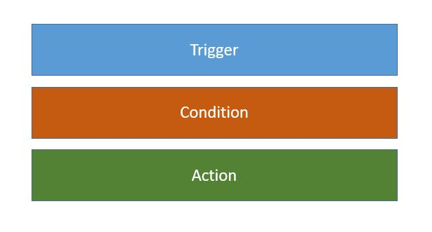

Il existe beaucoup de tutoriels sur [Home Assistant](https://www.home-assistant.io/), ce qui est parfait pour débuter. Mais comme toujours, pour pouvoir aller plus loin, créer son propre système, il est indispensable de bien s'approprier les concepts de la plateforme et la terminologie. 
C'est ce que nous proposons dans cet article.

## Pourquoi choisir Home Assistant

[Home Assistant](https://www.home-assistant.io/) (HA) est actuellement un des systèmes domotiques des plus populaires dans le **monde**, avec plus de 1 demi-million de personnes qui l'utilisent.
Les développements sont particulièrement dynamiques, et le taux d'adoption de la plateforme ne cesse de croitre.

Véritable **couteau suisse**, Home Assistant permet de connecter puis contrôler un nombre des plus importants de capteurs et systèmes en tout genre pour la maison, via l'intégration de quasi tous les principaux protocoles domotiques, en particulier [Zigbee](https://fr.wikipedia.org/wiki/ZigBee) et [Zwave](https://fr.wikipedia.org/wiki/Z-Wave), mais aussi plus récemment Matter.

Beaucoup de gens viennent à Home Assistant car ils sont frustrés par l'**interface utilisateur** (UI) de leur système domotique actuel. Et c'est vrai qu'ils sont beaux les dashboards de HA, et permettent de donner libre court à sa créativité.

Enfin, le succès de HA vient aussi du fait qu'il supporte beaucoup de machines hôtes et de systèmes d'exploitation. Il est très paramétrable et permet d'ajouter un nombre incroyable de composants complémentaires, avec environ 1 700 plugins disponibles.

Et tout cela **gratuitement** bien entendu.

## Qui développe Home Assistant

**Home Assistant** (HA) est  open source, sous licence [Apache 2.0](https://www.home-assistant.io/developers/license/).

Le système a été initié dès 2014 par **Paulus Schoutsen**, qui en 2018 fonde la société **[Nabu Casa](https://www.nabucasa.com/)**.
Depuis, l'équipe de **Nabu Casa** imprime sa vision sur l'évolution de Home Assistant, assure l'**intégrité** et la **sécurité** de la plateforme.
Et chaque **mercredi du mois**, Nabu Casa annonce immanquablement une nouvelle version. 

**Home Assistant** étant open source, ses sources sont disponibles sur [GitHub](https://github.com/home-assistant/core).
Et ce sont plus de **2 000 développeurs** à travers le monde participent aux développements via github, proposent des améliorations, de nouveaux add-ons ou intégrations.
**Une partie de ces développements sont validés par Nabu Casa**, deviennent officiels. Ils sont intégrés au cœur de Home Assistant (HA core), soit disponible à travers un magasin (store) intégré d'add-ons ou intégrations certifiées. 

Le store officiel est déjà très riche, mais ce n'est pas tout : un deuxième magasin, **[HACF](https://hacs.xyz/)** (**Home Assistant Community Store**) peut être rajouté en option et permet d'accéder gratuitement à encore plus d'extensions et de composants graphiques servants enrichir l'interface utilisateur.

Et comment se rémunère Nabu Casa nous direz-vous ? Et bien en offrant en échange d'une souscription de 75€ par an, une solution **sécure** et **simple** pour connecter à distance son instance locale Home Assistant, et intégrer des services cloud.
Mais Home Assistant reste **gratuit**, et cette souscription est **optionnelle**. Il existe d'autres manières d'accéder gratuitement à son serveur domotique (DuckDNS, proxy, VPN, etc).

## Quelle machine choisir

La plateforme de prédilection est **Raspberry PI**, idéalement le **PI4** avec 2Go de mémoire, voir 4Go. Mais HA tourne sous un **PI3**.
Il est possible de faire tourner sur une carte SD, mais pour éviter sur le long terme la corruption de la carte (oups) il est recommandé de d'adopter un disque SSD.
Un raspberry PI chauffe toujours un peu et il faudra idéamement prévoir un boitier type [Argon One M.2](https://www.amazon.fr/Argon-Bo%C3%AEtier-Raspberry-uniquement-Compatible/dp/B08MJ3CSW7) ou [Coolcase](https://www.amazon.fr/Cooler-Master-Case-programmable-dissipateur/dp/B08M6DGQ3R). 

Une autre excellente plateforme est l'[Odroid N2+](https://www.kubii.fr/nano-ordinateurs/2596-carte-odroid-n2-4gb-kubii-3272496297630.html). Il est à refroidissement passif, plus puissant que le raspberry , avec SSD intégré, boitier, 4Go. Vu le prix actuel des Raspberry, l'Odroid est un excellent choix. 
Nabu Casa propose par ailleurs un système intégré clé en main à base d'Odroid appelée [Home Assistant Blue](https://www.home-assistant.io/blue/) 

Nabu Casa développe aussi (crowdfunding) un autre système à base de raspberry micro-compute, stockage et protocole Zigbee intégré : Home [Assistant Yellow](https://www.home-assistant.io/blog/2021/09/13/home-assistant-yellow/). Il devrait sortir prochainement : à suivre de près.

D'autres ont peut-être déjà une **plateformex86-64** pour d'autres usages et préfèreront la puissance d'un **PC** (mini-PC type type Intel NUC par exemple).\
Mais Home Assistant s'installe aussi sur un **NAS Synology**, sur Mac, sur plateforme Asus et même une [box Free Delta](https://www.domo-blog.fr/comment-installer-domotique-home-assistant-sur-freebox-delta/).

## L'architecture logicielle

Il y a souvent confusion entre différents termes : HA OS, HA core, add-on, integration.... 

Essayons de comprendre un peu mieux l'architecture logicielle de Home Assistant, avec le schéma qui suit.


Home Assistant propose une configuration **clé en main** qui permet une installation rapide et simplifiée : une image est téléchargée, déployée sur son disque ou sa carte SD, puis Home Assistant pourra démarrer.

Le schéma présente les composants installés. Nous verrons au fil de la présentation qu'il est possible de choisir d'autres types d'installation.

### Le système d'exploitation

Comme tout ordinateur, un système d'exploitation permet d'offrir une brique logicielle de base pour exploiter les ressources de la machine.
Avec l'image "clé en main" de Home Assistant, un système d'exploitation spécifique pour HA est installé avec l'image : **HA OS** (Home Assistant Operating System).

Mais il est possible d'utiliser des machines ayant un autre système d'exploitation comme **Linux** (Debian en particulier), **Windows** ou encore  **MacOS**.

### HA core et integrations

**HA Core (Home Assistant Core)** est le programme de base de Home Assistant. 
Que l'on utilise l'installation clé en main avec HA OS ou pas, il est bien entendu présent. 

Une notion très importante est celle d'**integration**. Il s'agit de bibliothèques logicielles utilisées par Home Assistant, tournant dans l'instance HA core. Encore une fois, ce sont des **bibliothèques** de HA Core et pas des programmes tiers.

Certaines sont directement installées par défaut avec Home Assistant.
D'autres seront installées en se connectant au catalogue d'intégration. La liste des intégrations officielles est ici : [integrations Home Assistant](https://www.home-assistant.io/integrations/)

Pour voir les intégrations : `Paramètres` `Appareil et Service` onglet `intégrations`.

### Les add-ons

Il est très intéressant de faire tourner d'autres programmes à côté de Home Assistant : on parle alors d'**add-on** (référencés également comme "modules complémentaires dans l'interface). 

Si ces add-ons disposent d'une interface WEB, cette interface sera accessible par le menu de gauche de Home Assistant.

Citons quelques exemples d'add-ons particulièrement recommandés :

* **File Editor** : permet d'éditer les fichiers de configuration
* **Samba** : permet de voir les fichiers de HA dans le
  gestionnaire de fichier d'une machine type PC
* **Terminal SSH** : permet d'accèder à une console avec ligne de commandes

D'autres add-ons sont accompagnés d'une intégration qui s'installera dans HA core. L'integration une bibliothèque de code permettant de dialoguer avec l'add-on. Elle permet d'exposer dans HA des services et des entités.
Exemple :

* **ZWaveJS** :  permet de connecter une clé USB pour implémenter le protocole  ZWave. L'add-on vient avec une integration appelée aussi ZWaveJS.

&gt; Après cette lecture, ne confondez plus ADD-ONS (ou "modules complémentaires") et INTEGRATION.

### Gestionnaire de conteneurs

La solution Home Assistant est composée de différents programmes, comme nous l'avons vu : Le premier programme est bien entendu **HA Core**, puis différents programmes complémentaire appelés **add-ons** (ou encore "modules complémentaires" dans l'interface en français).

Certes il est possible de faire tourner ces programmes directement sous le système d'exploitation, mais sur un serveur, il est préférable pour des questions de sécurité et maintenance de les faire tourner dans des **conteneurs** .  Il faut alors un **gestionnaire de conteneurs**.

* **Avec l'installation clé en main et HA OS,** 'un gestionnaire appelé **Supervisor** est automatiquement installé. Le logiciel permet de configurer et orchestrer les différents programmes (HA Core et les add-ons), mais aussi certaines fonctions de la machine (reboot par exemple). Depuis les dernières versions de HA, les menus du supervisor sont noyés dans le menu de paramètres de HA, pour offrir une logique applicative cohérente.
* **Avec une installation manuelle**, il est possible de choisir son propre gestionnaire de conteneurs, le plus courant étant **[Docker](https://www.docker.com/)**. L'installation à la main du supervisor reste aussi possible.

### Résumé des modes d'installation de Home Assistant

Nous avons vu les différents composants logiciels de Home Assistant. 

Résumons ici les différents modes d'installation :

* **Home Assistant Operating System**  : installation clé en main avec le système d'exploitation maison HA OS. Installation conseillée pour les débutants (mais pas que).
* **Home Assistant Containers** : installation d'un OS spécifique (debian par exemple) et d'un gestionaire de conteneurs spécifique (docker par exemple).
* **Home Assistant Supervised** : installation d'un OS spécifique (debian par exemple) mais du supervisor.
* **Home Assistant Core** : installation de Home Assistant directement sur la machine, dans un environnement python.
  &gt; Les 2 dernières méthodes ne sont pas les plus conseillées.

## Principe de fonctionnement de HA

Le schéma suivant résume le principe de fonctionnement de base de Home Assistant. Nous avons pris comme exemple une prise connectée, avec l'intégration ZHA (Zigbee Home Assistant) installée.


### Théorie sur le fonctionnement du coeur du système

Intéressons nous sur le schéma à Home Assistant Core, le coeur de Home Assistant.

Certes, nous n'entrerons pas dans le détail, mais il faut comprendre que le moteur de HA fonctionne autour d'un composant central qui s'appel le **bus d'événement.** Un événement est par exemple une action à faire, un événement temporel ou un changement d'état.

Le bus reçoit du système des événements et il est capable de les transmettre aux composants qui les écoutent. Peux ceux qui connaissent MQTT, c'est le même principe dit de "publish/subscribe".

Le bus d'événement est couplé à une **machine à état fini**, qui connait les règles à appliquer. Elle est capable de recevoir des événements de changements d'états et d'appliquer des règles pour définir de nouveaux états. Et tout changement d'état génère à nouveau un événement sur le bus.

Un **timer** est lui en charge de déclencher tous les événements liés au temps.

Enfin, Home Assistant a un **registre des services**. Un appel de service de l'extérieur génère un événement sur le bus. Le bus est également capable de déclencher des actions via l'appel d'un service.

Nous avions précédemment parlé des **intégrations** : des bibliothèques logicielles ajoutées quand de nouvelles fonctionnalités sont rajoutées. Home assistant core dialogue avec les différentes intégrations installées sur notre système domotique. 

Sur le schéma est représentée l'intégration ZHA (Zigbee for Home Assistant) qui, quand elle est rajoutée à Home assistant, permet de dialoguer avec des composants zigbee, et par exemple une prise connectée.

### Les composants de base à connaitre

Une intégration (ZHA dans notre exemple) crée ce qui nous permettra d'interagir avec notre système domotique, et de ce fait expose 3 types de composants :

* Des **entités**
* Des **services**
* Des **appareils**

Ainsi, pour notre prise connectée, nous aurons un appareil appelé "prise connectée", des "entités" supportants les informations comme l'état de l'interrupteur ou la consommation de la prise, et enfin des services pour piloter l'arrêt et la marche. 

> La compréhension des entités, services et appareils est primordiale
> pour maîtriser Home Assistant. Nous les détaillons dans les chapitres
> suivants.

A noter que l'utilisation direct des **événements** dans Home Assistant est également possible, mais cependant pas usuelle. Ce sera utilisé dans quelques cas particuliers comme la demande de redémarrage de Home Assistant, ou une détection d'une personne sur une caméra.

### Les entités

Ce sont les composants de base : ils sont attachés à UNE information principale du device, complété plusieurs attributs (properties).

Pour notre prise connectée, on aura par exemple 3 entités :

* switch.ma_prise_onoff : l'état de la prise (marche ou arrêt)
* sensor.ma_prise_conso : la consommation de la prise en watt.
* sensor.ma_prise_temperature : la température interne de la prise.

Nous verrons plus loin que ces entités permettront de construire notre interface utilisateur, ainsi que des automatisations.

Chaque entité à un libellé, un ID et un icône. 
Le libellé peut être défini de manière à être convivial dans l'interface utilisateur. Idem pour l'icône.

Chaque entité appartient à un **type** (par exemple **switch** ou **sensor**) , non modifiable.

L'ID est constitué de son **type**, un point puis un nom modifiable (sans espace ou point).

Nous conseillons de renommer systématiquement les ID, en adoptant par exemple la syntaxe  : 
`XXXXX`.`[ce que c'est]`*`[ou c'est`]*`[la fonction]`

Exemple pour notre prise connectée :

* switch.prise_salon_onoff
* sensor.prise_salon_conso
* sensor.prise_buffer_temperature
  &gt; On peut retrouver les entités créées sous `paramètres` `Appareil et services` onglet  `entités`

### Les différents types d'entités

On peut en retrouver la liste des entités dans [documentation dev Home Assistant](https://developers.home-assistant.io/docs/core/entity/)
Les plus courantes sont :

* sensor
* binary sensor
* light
* switch
* camera
* cover (les ouvrants)
  Mais il y en a bien d'autres.

### Les services

Désolé pour les développeurs, mais HA n'est pas "orienté objet" et les entités n'exposent pas de "méthodes". 

Il est possible d'appeler des **services** (équivalent à des fonctions), en passant en paramètre l'ID de l'entité.
A chaque **type d'entité** (cover, switch, light, etc) est associé un ensemble de services disponibles.

Exemple : on veut mettre en marche notre prise connectée : on appela le service **switch_on** en passant en paramètre l'ID de l'entité.
&gt; Pour tester les appels de services, aller dans `Outils de Développment` puis `Service` et laissez vous guider par l'interface.

### Les appareils

Dans certains cas, les différentes entités sont regroupées au sein d'un **appareil**.
Par exemple, nous aurons un appareil pour notre prise connectée.

Pour voir les appareils définis, aller dans `Paramètres` `Appareils et services` onglet `Appareil`. 
Cliquez sur un appareil et vous verrez toutes ses entités, où elles sont utilisées dans Home Assistant.

L'utilisation d'un appareil permet de s'affranchir des entités et les services. Home Assistant le fera pour vous, et trouvera le bon service et la bonne entité. Par exemple, Home Assistant vous proposera directement les fonctions *Allumer* et *Eteindre* pour votre appareil "prise connectée". 

A noter que toutes les entités ne sont de loin pas regroupées au sein d'un appareil. Seuls les entités liés à des périphériques externes (prise, lampe, volet, etc) sont regroupées au sein d'un appareil.

### Les intégrations

Rappelez-vous, les **intégrations** sont des **bibliothèques logicielles**. A ne pas confondre avec les **add-ons** (modules complémentaires) qui sont de programmes tiers.
Elles permettent entre de créer de nouvelles entités ou appareils, et exposent des services liés. Par exemple une intégration ZHA (Zigbee Home Assistant) permet de créer les entités et les appareils zigbee.

Aller dans `Paramètres` `Appareils et services` `Intégrations` pour voir les intégrations installées, et eventuellement les appareils et entités créés par cette intégration.
De la, vous pouvez aussi installer de nouvelles intégrations.

Il faut savoir que Home Assistant possède pas mal d'intégrations pré-installées en son cœur. Historiquement, les intégrations et leurs entités devaient être déclarées dans un fichier de configuration (**configuration.yaml**), dans un langage appelé YAML. Nous reviendrons sur cette syntaxe.
Si c'est toujours le cas pour quelques intégrations, la tendance est de pouvoir tout faire depuis l'interface graphique.

### Les entrées et helpers

Si vous avez navigué sur `paramètres` `appareils et services`, vous avez surement repéré le menu **entrées** (input) dans le dernier onglet.

Il s'agit d'entités simples permettant de stocker des valeurs, mais aussi de disposer de composant graphiques comme des champs pouvant être utilisés dans l'interface.

Exemple d'entités de stockage ou affichage : 

* Nombre (input_number)
* Interrupteur (switch)
* Liste déroulante (input_select)
* Date et heure (input_datetime)

Certaines de ces entrées ont des fonctions plus complexes et sont appelées des **helpers**.

Exemple de helpers : 

* groupe : regroupe des entités, par exemple des lumières à gérer ensemble
* planification : permet de gérer un calendrier.

&gt; Amusez vous à créer une ou deux entrées, et à les utiliser dans l'interface graphique.

## L'interface utilisateur : lovelace

**Lovelace** est le nom historique de l'interface utilisateur de Home Assistant.

Par défaut, vous avez accès à un premier **tableau de bord** (**dashboard**) en cliquant sous aperçu, dans le menu de gauche.
Ensuite, vous pouvez créer des **vues**, qui sont des onglets de son tableau de bord. La création d'une vue se fait en cliquant sur le + de la barre d'onglets.
Il est aussi possible de créer des sous-vue d'une vue existante.

Dans chacune de ces vues, on peut construire une interface en rajoutant des **cartes**. Pour cela, cliquer sur modifier en haut à droite du tableau de bord.
Une fois l'interface créée, sauvez.

L'objectif de cet article est de vous présenter les concepts, donc vous découvrirez par vous-même les différents types de carte, ou via des tutos.

### Utilisation du code YAML dans Lovelace

Une force de Home Assistant est d'avoir le choix entre une représentation visuelle et une représentation YAML.
Le code YAML permet de partager son code avec la communauté, faire des copiés coller, modifier plus rapidement...

Pour voir le code d'une carte en YAML, éditez-la (`modifier` en haut à droite du tableau de bord, puis `modifier` en bas à droite de la carte) puis cliquer en bas à droite sur `Afficher l'éditeur de code`.

### Plusieurs tableaux de bord

La création de plusieurs tableaux de bord a du sens si vous avez un mobile et une tablette. Vous pouvez ainsi créer 2 tableaux de bords spécifiques.
&gt;Pour voir les tableaux de bord, cliquez sur `paramètres` `tableau de bord`. Vous pouvez alors en rajouter un.

Pour information, vous verrez ici qu'il existe un tableau de bord paramétrable, mais non modifiable graphiquement appelé **Energie**. Il permet d'avoir une vue de ses consommations et productions électriques.

## Pièces et zones

Vous pouvez définir des **pièces** (cuisine, garage, etc) et indiquer dans les paramètres des entités ou des appareils, quelle pièce est concernée.

Une **zone** est un espace permettant par exemple de déclencher l'ouverture du portail quand l'application mobile est détectée comme entrant dans la zone. Il faut par contre pour cela activer sur son portable la localisatio

## Programmer Home Assistant

### Les automatisations

Maintenant que nous avons créé des entités et des appareils, que ces entités sont utilisables dans l'interface, la puissance d'une solution domotique est de créer différents scénarios.

* Allumer une lampe si j'entre dans le salon et qu'il faut nuit
* Simuler une présence le soir, si l'alarme est mise
* etc

Il existe 2 solutions pour cela :

* Les **automatisations Home Assistant** : la solution intégrée
* **Node-Red** : un add-on et son intégration à installer séparément 

Chaque solution a ses avantages et inconvénients. En parcourant le forum, vous vous rendrez compte que le choix de l'une ou l'autre est quasi religieux.
Il faut cependant savoir que les versions avant mi 2021 de Home Assistant ne proposaient pas un système d'automatisation très performant, ce qui a incité un certain nombre de personnes à adopter Node-Red, plus visuel. 
Depuis, les automatisations Home Assistant ont évoluées, évoluent encore, et sont particulièrement faciles à utiliser. Ce serait aujourd'hui vraiment dommage de ne pas les adopter 

#### Automatisation Home Assistant.

Elles sont accessibles en cliquant sur `Paramètres` `Automatisations et Scènes`
Une automatisation est constituée de 3 blocs :



Le **trigger** va permettre d'indiquer QUAND une automatisation va se déclencher.
Par exemple :

* Au levé du soleil
* Quand la température dépasse 15°C
* Quand un capteur d'ouverture passe de fermé à ouvert....

Ensuite la **condition** va permettre de créer un **filtre**. Par exemple, si on veut créer une ouverture de volet au levé du soleil qui ne se déclenche que si l'alarme est mise, on mettra une condition sur l'état de l'alarme.

Enfin les **actions** permettent d'agir sur les entités ou les appareils. Par exemple , allumer une lampe. Dans les actions, il est possible de créer des branchements conditionnels du type si.... alors..... 
Quelques spécificités des automatisations HA :

* Il est possible d'accéder à des traces pour comprendre ce qui s'est passé
* Il est possible d'exécuter une automatisation depuis l'éditeur afin de la tester. La partie trigger n'est alors pas prise en compte.
* L'automatisation est présentée sous forme de "folders" qu'il est possible de renommer pour documenter ce que l'on a fait.
* Comme quasi partout dans Home Assistant, il est possible de passer de l'éditeur visuel au code YAML. Cela permet les copier-coller, aller plus vite dans certains cas, et surtout favorise le partage.

#### Node-Red

Node-Red n'est pas spécifique à Home Assistant, et est utilisé par d'autres solutions et pas que domotiques. Il faut donc installer un add-on complémentaire.
Le principe est de créer un flux d'actions et de conditions grace à un éditeur visuel.


Pour plus d'informations :  https://forum.hacf.fr/t/debuter-avec-node-red/334
Node-Red propose une  quantité impressionnante de fonctions. Même si on utilise les automatisations HA, il est intéressant d'utiliser Node-Red pour des applications spécifiques comme exploiter une API http ou connecter des environnements exotiques.  

### Les scripts

Il est possible de créer des scripts depuis `Paramètres` `Automatisations et Scénes` onglet `Scripts`.
Un script permet de créer une séquence d'actions. Un **service** est alors créé, pouvant être appelé ailleurs dans Home Assistant, comme n'importe quel autre service.

### Les scènes

Il est possible de créer des **scènes** depuis `Paramètres` `Automatisations et Scénes` onglet `Scènes`.
Une **scène** permet de définir et regrouper un ensemble d'états. Par exemple, une scène `Ambiance tamisée` permettra d'allumer plusieurs lampes à la fois à une intensité faible. On choisira dans la scène les lampes à allumer et leur intensité.

### Les blueprints

La liste des blueprints depuis `Paramètres` `Automatisations et Scénes` onglet `Blueprint`.

Un blueprint est un **template** (ou modèle en français) d'automatisation.

Il est possible de récupérer des **blueprints prêts à l'emploi** et mis à disposition sur github pour son auteur. Il existe également un [espace d'échange de blue print](https://community.home-assistant.io/c/blueprints-exchange/53).
Une fois le blueprint chargé, vous pourrez créer une nouvelle automatisation en prenant le blueprint comme template et en renseignant ses paramètres d'entrée.

Si vous devez répliquer plusieurs fois une même automatisation (pour piloter chaque convecteur de la maison par exemple), il est possible de créer votre propre blueprint.

## Le langage YAML

Nous avons déja évoqué le **YAML**, qui est le code de description utilisé par Home Assistant. 

YAML (Yet Another Markup Language) n'est pas une syntaxe propriétaire à Home Assistant, et est relativement standard.

Pour comprendre les bases de la syntaxe, nous vous engageons parcourir le [YAML Style Guide](https://developers.home-assistant.io/docs/documenting/yaml-style-guide/).

Et plus spécifiquement à Home Assistant la [documentation YAML](https://www.home-assistant.io/docs/configuration/yaml/) de HA.

Une des forces de Home Assistant est d'avoir en général la possibilité d'utiliser l'éditeur graphique OU le code YAML. Pour apprendre YAML, le plus simple est d'utiliser l'éditeur graphique, puis voir le code YAML généré.

### Les fichiers de configurations YAML

Il est également important de maîtriser le fichier de configuration de Home Assistant, `configuration.yaml`, présent dans le répertoire config. Utiliser les add-ons **samba**, **File Editor** ou **VS Code** pour accéder ce fichier.

Ce fichier permet d'activer certaines intégrations et définir certains paramètres que nous ne détaillerons pas ici.
Dans le cas d'un fichier de configuration trop important, il est possible de déplacer le code dans des fichiers **package**.
Enfin, un autre fichier important est le fichier **secret.yaml**, qui permet d'y stocker des mots de passe.

## Les templates - jinja2

YAML n'est pas le seul code utilisé par Home Assistant. Dans certains cas, vous aurez besoin de créer des formules. La formule sera rédigée dans un **template** écrite dans la syntaxe **[jinja2](https://jinja.palletsprojects.com/en/latest/templates/)**

Par exemple, vous avez un sensor retournant true ou false si une porte est fermée ou non. Vous voulez avoir un libellé de l'état de votre porte.

Dans votre fichier configuration.yaml (ou un package), vous pouvez recréer un sensor qui retournera un libellé "ouvert" ou "fermé". Le code **jinja2** sera mis dans la clé value_template (à la suite de la clé entre quote, ou à la ligne avec le symbole `&gt;-`.

```
-  platform:  template
		sensors:
    		garage_etat:
    			friendly_name:  'Etat Porte de Garage' 
    			device_class:  garage_door
    			entity_id:  binary_sensor.porte_ouverte,
    			value_template:  &gt;-
    				
    					fermé
    				
    					ouvert
    				
```

Vous pouvez écrire et tester du code jinja2 sur l'outil de développement `Outils de développement` onglet `Modèle`.

Par exemple, le code `{{ states("sun.sun") }}` vous retournera en journée `above_horizon`

Pour plus d'informations, voir [HA Templating](https://www.home-assistant.io/docs/configuration/templating/).

## Application mobile

Home Assistant fournit une application mobile sous Android et IOS. Elle est désignée dans Home Assistant sous le terme "**Application compagnon**".

Une fois l'application installée sur son mobile, il est possible de spécifier dans l'application quelles informations seront transmises sur Home Assistant et donc visible sous forme d'entité créée : niveau de la batterie ou type de connexion par exemple, mais aussi localisation. Désactiver ce qui n'est pas utile.


Pour accéder aux paramètres dans l'application, cliquer sur `Paramètres` `Application compagnon` puis `capteurs` ou `paramètres d'emplacement`.

La localisation est à la fois utile pour certains scénarios, mais aussi intrusive. Pensez à modifier cela en fonction de vos préférences.

## HACS

Nous avons vu que Home Assistant dispose d'un magasin d'intégrations "officielles".
Or la communauté de développeurs propose un nombre assez conséquent de composants pouvant être rajoutés grâce à un magasin, le **Home Assistant Community Store (HACS)**.

Pour accéder à ce magasin, il faut installer un add-on complémentaire HACS. L'interface de l'add-on apparaitra alors dans le menu de gauche.


De la, vous aurez accès à 2 type de composants :

* Des **intégrations**
* Des **cartes** pouvant être utilisées dans votre **interface** graphique.

## Le stockage des données

Par défaut, les données que reçoivent les entités sont stockées 30 jours. Ce paramètre peut être modifié dans le fichier configuration.yaml, avec l'intégration `record`.
L'historique peut être retrouvé depuis l'entrée `Historique` du menu de gauche.
L'entrée `journal` tient comme son nom l'indique un journal de toutes les mises à jour de valeur.

Mais Home Assistant a également une deuxième base de stockage appelé `Statistics`. Les données de certaines entités compatibles y sont stockées indéfiniment, mais au maximum 1 fois par heure.
Vous pouvez retrouver les statistiques en cliquant sur `Outils de developpement` `Statistiques`

Il est bien entendu possible d'installer d'autres bases de données via des add-ons complémentaires. 

## Gérer sa machine depuis l'interface

Depuis un certain nombre de versions, les fonctions du supervisor sont intégrées au reste du menu. Il permet de gérer sa machine.

Aller sur `Paramètres`  `Système` et naviguez dans les différents menus.
Quelques fonctions importantes :

* **Général** : bien régler entre autre le fuseau horaire et les formats
* **Mises à jour** : composants à mettre à jour
* **Sauvegardes** : faire **régulièrement** une sauvegarde complète. Cela crée un fichier compressé "tar" qui se trouve dans le sous-répertoire backup. Vous pourrez grâce à lui faire un restore. Il est aussi conseillé de recopier la sauvegarde sur une autre machine (il faut avoir l'add-on Samba installé pour voir les fichiers dans HA).
* **Corrections** : Home Assistant peut vous notifier de dysfonctionnement (composant obsolète par exemple) et comment y rémédier.
* **Journaux** : ce sont les logs qui permettent d'identifier les erreurs.

Enfin, vous pouvez gérer les droits de vos **utilisateurs** en cliquant `Paramètres` `Utilisateurs`. 

La notion de **personnes** est uniquement fonctionnelle. Elle permet de gérer la présence d'une personne, spécifier l'appartenance d'appareils (un mobile par exemple), ce pour une utilisation dans l'interface ou une automatisation.

## Accéder Home Assistant depuis l'extérieur

 Il est recommandé de prendre la souscription Nabu Casa. Vous aurez ainsi un système sécure, contribuerez au projet, et aurez plus de facilités pour configurer les assistants vocaux (Alexa ou Google Assistant).

Cliquez sur `Paramètres` `Home Assistant Cloud` pour configurer votre accès avec Nabu Casa.

Après il existe plusieurs manières d'accéder à Home Assistant, qui sont bien résumés dans cet article :
https://forum.hacf.fr/t/acceder-a-home-assistant-a-distance/2744

Ou encore une autre alternative sans avoir besoin d'ouvrir de ports sur sa box internet : https://forum.hacf.fr/t/tailscale-connecter-ha-via-un-mesh-vpn-network/15800

## Conclusion

Voilà, nous avons abordé les différents concepts de base, accèdé aux différents menus de l'application, ce qui vous permettra de plus rapidement vous approprier la plateforme et des tutos.
Nous n'avons fait qu'effleurer ce que permet Home Assistant. La plateforme peut être enrichie d'add-ons et intégrations extrêmement puissants, quand ils ne sont pas déjà intégrés.

Juste quelques exemples :

* **ESPHome** : qui permet de créer ses propres capteurs à base de micro-contrôleurs ESP8266 ou ESP32 (voir par curiosité la [liste des capteurs ESPHome)](https://esphome.io/index.html).
* **Frigate** : qui permet de rajouter de l'intelligence artificielle pour faire de la détection de personnes ou animaux sur ses caméras.
* **Alexa ou Google** et l'intégration de ces assistants vocaux.

Et tellement d'autres choses.
**Bienvenue sur notre terrain de jeu Home Assistant et la communauté HACF**