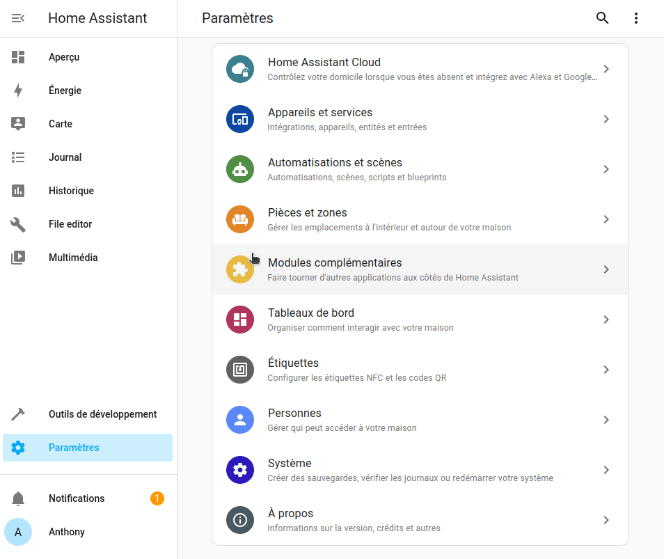

Pour préserver la carte Micro SD, tout en gardant un système rapide ou si la taille de votre mémoire interne devient trop juste, Home Assistant permet de déplacer les données utilisateurs sur un support externe (il peut être interne avec un boitier adapté).

Nous allons en conséquence voir comment effectuer cette manipulation.

> Il est conseillé de faire une sauvegarde avant d'effectuer cette manipulation, même s'il ne devrait pas avoir de problème.

* Dans `Paramètres`, `Système`, `Stockage`,
* En haut à droite, cliquer sur `...` puis appuyer sur `Déplacer le disque de données`,
* Sélectionner le disque,
* Cliquer sur `Déplacer`.

Après avoir redémarré, vos données seront sur le disque dur et les écritures ne viendront plus abimer votre carte Micro SD.

## Conclusion.

Pour une installation sur Raspberry avec Micro SD, cette méthode permet d'éviter les problèmes de détection du disque dur lié à USB3 et ceux de la carte MicroSD corrompue. Il permet aussi au système de profiter d'un démarrage rapide.

> En cas de Carte MicroSD corrompue (ce qui ne devrait plus arriver avec cette methode), il vous suffit de reinstaller Home Assistant OS sur une nouvelle carte MicroSD Classe 2 et relancer votre Raspberry Pi. Votre solution domotique se relance comme s'il ne c'estait rien passé.

## Sources.

* https://www.home-assistant.io/common-tasks/os/#using-external-data-disk