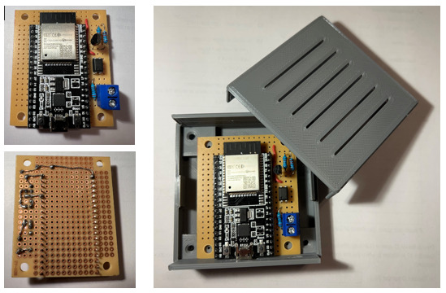
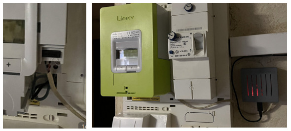
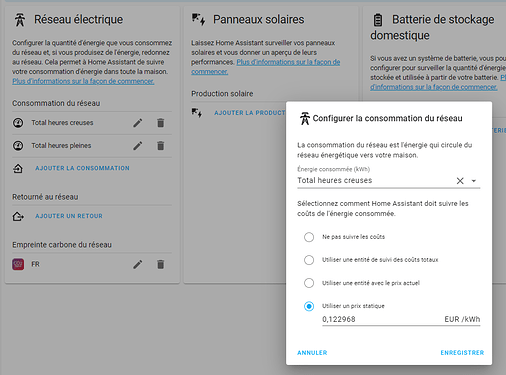

## 1.Introduction

Le module **Energy** de Home Assistant est vraiment puissant, il propose de belles cartes graphiques interactives (navigation jour-mois-année, consolidation des coûts), et il serait dommage de ne pas l'utiliser. Le module **Energy** utilise les tables "*statistics*" de HA, qui permettent de garder les données sans limite de durée, avec un seul enregistrement stocké par heure.

Certes le sujet télé-information est présent sur plusieurs sujets, mais il est proposé ici, un retour d'expérience sur une intégration complète et éprouvée, avec un coût de réalisation total inférieur à 10 €.

Les sujets traités dans cet articles sont :

* Réalisation **DIY** avec un **ESP32** et les quelques composants soudés sur une plaque de prototypage,
* Un **boitier à imprimer**, disponible dans [Cults](https://cults3d.com/fr/mod%C3%A8le-3d/outil/box-for-esp32-or-esp8266),
* Adaptation de la configuration **ESPHome** pour avoir les entités compatibles **Energy,**
* Configuration et intégration du **module energy dans le dashboard HA,**
* Suivre la consommation et les coûts.

## 2. Conception du module

Pour information, le compteur électrique interfacé ici est en mode **TIC "historique",** avec heures pleines et heures creuses. Si ce n'est pas votre cas, il faudra faire quelques adaptations.

Le choix de l'ESP32 plutôt qu'un ESP8266 a était préféré, car plus puissant, et permettant de mieux gérer le flux de données sur la liaison série et ainsi évider les erreurs (bad CRC). 

J'ai choisi une résistance de 2kOhms en entrée, qui est un bon compromis. La liaison série (disponible sur le GPIO 03) de l'ESP32 est utilisée (UART0). 

Autrement, on retrouve le schéma classique : **opto-coupleur** pour isoler le circuit et le compteur, **transistor mofset** pour ré-amplifier le signal. 

L'ESP32, alimenté par sa prise micro-usb, alimente en 3.3v le circuit.


Les quelques composants sont soudés sur une **plaque de prototypage de 5cm x 6cm**. Un bornier est rajouté.

> Certes, on peut trouver des montages tout faits, mais souder ces quelques composants n'est pas très compliqué, et le DIY est toujours tellement plus satisfaisant :smirk:.






Un boitier a été conçu sous fusion360 et mis en ligne : [Boitier ESP32 sur Cult3d](https://cults3d.com/fr/mod%C3%A8le-3d/outil/box-for-esp32-or-esp8266)

> À noter qu'il pourrait bien entendu être utilisé pour d'autres montages à base de ESP32 ou ESP8266 sur carte de prototypages. D'ailleurs, il semble susciter de l'intérêt sur Cult3D.

## 3. Paramétrage ESPHome

L'article [premiers pas avec ESPHome](/esphome_installation) vous guidera si besoin dans l'installation de ESPHome, puis dans la création initiale du composant.

Ci-dessous le fichier de configuration à recopier dans le paramétrage du composant ESPHome.

```yaml
esphome:
  name: esp-teleinfo

esp32:
  board: esp-wrover-kit
  framework:
    type: arduino

logger:
  level: debug
  baud_rate: 0

ota:

wifi:
  ssid: !secret wifi_ssid
  password: !secret wifi_password

api:


uart:
  id: uart_bus
  rx_pin: GPIO3
#  tx_pin: GPIO1
  baud_rate: 1200
  parity: EVEN
  data_bits: 7

teleinfo:
  id: esp_teleinfo
  update_interval: 60s
  historical_mode: true

binary_sensor:
  - platform: status
    id: teleinfo_status
    name: "Teleinfo Status"

sensor:
  - platform: wifi_signal
    name: "Signal wifi"
    update_interval: 60s
    unit_of_measurement: dB
    accuracy_decimals: 0
    force_update: false
    icon: mdi:wifi
    
  - platform: uptime
    id: uptime_seconds
    name: "Uptime Sensor"
    update_interval: 60s
    unit_of_measurement: s
    accuracy_decimals: 0
    force_update: false
    icon: mdi:timer
    
  - platform: teleinfo
    tag_name: "IINST"
    name: "Intensité"
    unit_of_measurement: "A"
    icon: mdi:current-ac

  - platform: teleinfo
    tag_name: "PAPP"
    name: "Puissance"
    unit_of_measurement: "VA"
    icon: mdi:flash

  - platform: teleinfo
    tag_name: "HCHC"
    id: hchc
    name: "Teleinfo index_hc_kwh"
    unit_of_measurement: "kWh"
    device_class: "energy"
    state_class: "total_increasing"
    accuracy_decimals: 3 
    filters:
      - multiply: 0.001
    icon: mdi:gauge

  - platform: teleinfo
    tag_name: "HCHP"
    id: hchp
    unit_of_measurement: "kWh"
    device_class: "energy"
    state_class: "total_increasing"
    name: "Teleinfo index_hp_kwh"
    accuracy_decimals: 3 
    filters:
      - multiply: 0.001
    icon: mdi:gauge

button:
  - platform: restart
    name: "Teleinfo Restart"

text_sensor:
  - platform: teleinfo
    tag_name: "PTEC"
    name: "Tarif actuel"
    icon: mdi:clock-time-nine-outline
  - platform: template
    name: Uptime
    update_interval: 60s
    icon: mdi:clock-start
    lambda: |-
      int seconds = (id(uptime_seconds).state);
      int days = seconds / (24 * 3600);
      seconds = seconds % (24 * 3600);
      int hours = seconds / 3600;
      seconds = seconds % 3600;
      int minutes = seconds /  60;
      seconds = seconds % 60;
      if ( days ) {
        return { (String(days) +"d " + String(hours) +"h " + String(minutes) +"m "+ String(seconds) +"s").c_str() };
      } else if ( hours ) {
        return { (String(hours) +"h " + String(minutes) +"m "+ String(seconds) +"s").c_str() };
      } else if ( minutes ) {
        return { (String(minutes) +"m "+ String(seconds) +"s").c_str() };
      } else {
        return { (String(seconds) +"s").c_str() };
      }
```

Seules les informations utiles ont été gardées (par exemple l'ID du compteur qui ne change jamais n'a pas besoin d'être lue en permanence). Une lecture toutes les minutes est suffisante.

Les `sensors` index ont des attributs compatibles avec le module Energy : `state_class` de type `total_increasing` et conversion en kWh. L'UART0 étant utilisée, il est préférable de désactiver la sortie des logs sur la liaison série (`baud_rate: 0` dans le logger). On peut enlever cela pour le premier flashage par câble, pour vérifier que tout se passe bien.

## 4. Configuration du module Energy

Ensuite, il est nécessaire de configurer le module **Energy** : il est depuis les dernières versions dans `configuration`- `tableau de bord`puis cliquer sur `Energies`. Il est conseillé de mettre les coûts en EUR/kWh.



> La section **CO2** a également été configurée : cela donne le % d'énergie carbonée utilisée par EDF. Il faut aller sur le site https://co2signal.com/, créer une clé d'API et la rentrée dans la configuration du module Energy. Cela crée une entité CO2 avec en temps réel le % d'énergie carbonée utilisée par EDF.
> La doc est ici si jamais : [CO2 Signal - Home Assistant (home-assistant.io)](https://www.home-assistant.io/integrations/co2signal).

## 5. Interface utilisateur (tableau de bord)

Reste enfin à intégrer les cartes Energy dans le dashboard (https://www.home-assistant.io/lovelace/energy/). Celui ci-après est adapté à un usage sur mobile.


Voici le code pour intégrer les six **cartes Energy** dans le dashboard :

```yaml
type: energy-date-selection
type: energy-usage-graph
type: energy-sources-table
type: horizontal-stack
cards:
  - type: gauge
    min: 0
    max: 90
    entity: sensor.teleinfo_intensite
    severity:
      green: 0
      yellow: 55
      red: 65
    needle: true
  - type: gauge
    entity: sensor.teleinfo_puissance
    min: 0
    max: 20340
    severity:
      green: 0
      yellow: 12450
      red: 14690
    needle: true
type: horizontal-stack
cards:
  - type: entity
    entity: sensor.teleinfo_index_hc_kwh
    name: Index HC
    icon: mdi:gauge
  - type: entity
    entity: sensor.teleinfo_index_hp_kwh
    name: Index HP
type: horizontal-stack
cards:
  - type: entity
    entity: sensor.teleinfo_index_hc_kwh
    name: Index HC
    icon: mdi:gauge
  - type: entity
    entity: sensor.teleinfo_index_hp_kwh
    name: Index HP
type: entities
entities:
  - entity: sensor.teleinfo_tarif_actuel
  - entity: sensor.fr_grid_fossil_fuel_percentage
    name: Energie fossile / EDF
  - type: section
    label: Gestion du module teleinfo
  - entity: sensor.teleinfo_uptime
    name: Temps de fonctionnement
    secondary_info: last-updated
  - entity: button.teleinfo_restart
    name: Redémarrage
```

Une suite logique sera d'intégrer les consommations des différents appareils de la maison : chauffage, chauffe-eau…

## Conclusion

Vous pouvez suivre votre **consommation journalière, mensuelle ou annuelle**, ainsi que le coût électrique en heure pleine et heure creuse.

L'étape suivante sera de détailler les **consommations de chaque appareil** de votre réseau électrique.
Pour cela, il y a différentes solutions :

* Intégration d'objets connectés exposant leurs consommations,
* Capteur de mesure, avec pince ampèremétrique, dans le tableau électrique (type Owon PC321, PZEM)
* Ajout de prises électriques connectées avec mesure de la consommation (machine à laver, réfrigérateur)

  > Notez que souvent la prise connectée utilise une tension fixe de 230v ou 250v, ce qui peut fausser les calculs (P=UI=230\*2 ou 250\*2 ce n'est pas pareil).
* Estimation de la consommation : calcul du temps de fonctionnement X puissance de l'appareil.

N'hésitez pas à faire vos retours ou propositions.

## Sources

* Teleinfo DIY : [Connaitre sa conso... de GammaTroniques](https://gammatroniques.fr/connaitre-sa-consommation-electrique-avec-home-assistant/)
* [Monitorer votre électricité pour moins de 15 euros (sans soudure)](https://www.youtube.com/watch?v=76uxjZLqePA)
* [Monitorer plusieurs sources AC](https://www.youtube.com/watch?v=O6QESZfJMcM).