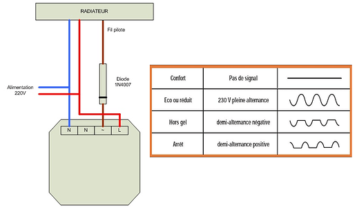
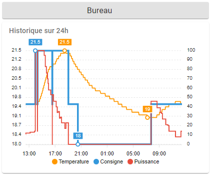

## Avant propos

Cet article traite de l'implémentation d'un thermostat plus efficient que le thermostat virtuel de HA, une solution de planification du chauffage suivant des plages horaires, la gestion de différents modes de chauffage(manuel, éco, confort...), et enfin un exemple de carte lovelace pour afficher le tout.

Ce post s'adresse tout particulièrement aux personnes **n'utilisant pas un thermostat physique** (type nest, heatit, netatmo ou même celui intégré au chauffage) et ayant un **mode de chauffage pilotable en on-off** (typiquement des convecteurs avec module on-off ou fil pilote).
L'implémentation fait appel à pas mal de concepts, ce qui peut s'avérer complexe pour les personnes débutants avec HA.

## 1. Le chauffage dans Home Assistant

S’il y a un domaine source de confort et d’économie dans une maison domotisée, c’est bien le chauffage. Home Assistant est un système domotique incroyable, offrant énormément de possibilités. Et pourtant, le sujet du chauffage est plutôt mal traité (pour l’instant).

Un thermostat générique (intégration et carte lovelace) est proposé par HA pour piloter un chauffage en ON-OFF, mais il est de type **hystéresis** : il chauffe a 100% jusqu’a atteindre la température + un seuil, puis arrête. Le convecteur sera alors soit bouillant, soit froid, ce qui crée des **oscillations de température** et des **chaud-froid** inconfortables, et cela consomme plus. C’est probablement adapté aux climatiseurs réversibles américaines mais pas du tout à nos convecteurs et autres modes de chauffage. La **température extérieure** n’est même pas prise en compte, pas plus que la coupure du chauffage quand une **fenêtre est ouverte**.

De plus, il n’y a pas de gestion des **plages horaires** permettant de définir les périodes de chauffe. Il faut alors faire appel à des intégrations de la communauté, ou alors pour les plus courageux tout redévelopper avec des automatisations et champs inputs (oups !!). Les 2 principales intégrations sont schedy et le scheduler. Schedy est un daemon qui permet de planifier dynamiquement des événements, mais bien que très puissant il n’a pas d’interface et son intégration est relativement complexe. Je vous proposerai d’utiliser l’autre intégration : le scheduler.  

Pour gérer les différents modes, par exemple pour moduler la température sur les périodes de présences et absences, il n’y a donc pas d’autres choix que de redévelopper des automations. 

> **Automatisation HA ou Node-RED ?**\
> Comme pour tout développement d'automatisations, le choix entre node red ou les automatisations HA. Les 2 méthodes se discutent et ont chacune leurs avantages et inconvénients. Personnellement j’utilise les 2 : node red pour les flux (http et mqtt en particulier) ou pour bénéficier de nœuds spécifiques, et les automatisations HA pour la manipulation d’entités et des logiques type si-alors. L’avantage de ce dernier choix est d’être très bien intégré à HA, d’avoir avec les traces une capacité de contrôler ce qui se passe (mis en place depuis 2 mois et très puissant), d’avoir une forme YAML compact et facilement partageable. Mais un gros avantage est l’utilisation de blueprints : une automatisation de chauffage est créée dans un modèle, puis réutilisée pour chaque radiateur ou pièce de la maison. C’est ce que je vous propose d’utiliser ici.

## 2. Proposition d’implémentation

L’article qui suit propose de mettre en place :

* Un **thermostat de type TPI** (Time Propostional &amp; Integration) basé sur les températures intérieure et extérieure, avec arrêt quand une fenêtre est ouverte.
* Une **gestion des modes** : auto-confort, auto-éco, manuel, hors gel, arrêt, absences.
* Une gestion des **plages horaires** pour les modes auto-confort et auto-eco.
* Une **carte lovelace** permettant de gérer le tout, dont l’affichage de la puissance en cours.
* L'affichage de **graphiques** permettant de contrôler les paramètres

J’utilise ce type de thermostat TPI pour 8 convecteur et depuis 5 ans (avec une autre box) et c’est vraiment très performant, avec une chaleur très douce de la pièce et des radiateurs, sans grandes variations.

## 3. Le thermostat TPI

### 3.1 Le principe

L’objectif du thermostat est de calculer une **puissance de chauffe** en fonction d’une **consigne** donnée, de la **température intérieure** et de la **température extérieure**.
La puissance doit être de 100% quand la température de la pièce est loin de la consigne, puis baisser doucement jusqu’à atteindre la consigne. Ensuite le radiateur doit rester légèrement tiède pour compenser les pertes thermiques, ce en fonction de la température extérieure.

**Tout d'abord, on calcul la puissance en pourcentage**

Le calcul de la puissance en %, est assuré par la formule :

> Puissance = coeff_c * *(T consigne - T intérieure) + coeff_t*   (T consigne - T extérieure) 

 avec un min a 0% et un max a 100%

* **coeff_c** est un coeff qui dépend de la puissance du chauffage et de la surface.
* **coeff_t** dépend lui de l’isolation de la pièce et des pertes thermiques.

Pour une installation standard au norme on a coeff_c = 0,6 et coeff_t = 0,01

> Exemple : Tint = 19°C Text = 10°C et consigne a 20°C alors puissance = 70%

Le fait de considérer la température extérieure est donc indispensable pour compenser les pertes de chaleur et garder une température très constante, ce qui n'est pas assuré par le thermostat standard de HA.

**Ensuite, on transforme la puissance exprimée en % par une séquence de ON-OFF de notre chauffage.**

L’implémentation proposée ici est pour des convecteurs avec un fil pilote (Qubino). Mais une adaptation est possible pour d’autres types de chauffage.

Pour nos convecteurs, **la puissance nécessaire est recalculée toutes les 10 mn**, ce qui donne le temps de marche sur la période. Avec une puissance calculée de 70%, le convecteur sera alors sur ON 7mn puis sur OFF 3mn.

La périodicité dépend de l’inertie : 30mn à 1 heure pour une chaudière, 10mn pour un convecteur on/off (fil pilote). Pour un poêle a granule, la puissance devrait être recalculée toutes les 30mn par exemple.

Le thermostat prend en charge la fenêtre et il coupe le radiateur quand cette dernière est ouverte.

### 3.2 Code du thermostat

Le code du thermostat est dans un **blueprint** qui peut être téléchargé via cette url :
https://github.com/argonaute199/chauffage-home-assistant/blob/main/blueprint/thermostat_tpi.yaml

Pour le charger dans Home Assistant, aller dans configuration, blueprints puis cliquer sur le bouton "importer un blueprint" en bas à droite. et recopier l'url précédente.
Ensuite une automatisation « thermostat » peut être facilement créée pour chaque radiateur (j’en ai 8 à la maison) en cliquant sur le  bouton "créer une automatisation".

La puissance et la consigne sont dans des input number définis spécifiquement et utilisés dans la carte lovelace. Les 2 températures sont dans des sensors et la fenêtre un binary sensor. Enfin le radiateur est piloté par un switch.

La création ou édition d’un nouveau thermostat revient alors à renseigner les paramètres suivants :


Si on a des radiateurs avec vanne thermo (pas en mode ON OFF mais injection de la puissance), il faudrait reprendre le calcul de puissance et le blueprint devrait être adapté.

> **Attention** : si le format des nombres sur votre système est avec des virgules et non des points, il faut changer dans le blueprint les valeurs min - max - step de coeff_c et coeff_t, et remplacer les points en virgules.

## 4. La carte lovelace

Une carte assez basique permet de visualiser pour chaque radiateur le mode de chauffage, la température de consigne, de la pièce, la puissance et l’état de la fenêtre.

Elle remplace la carte thermostat de HA.


Voici les différents modes proposés (champs de type input select):


* **Mode « auto-confort » :** quand la pièce est occupée. Ajuste automatiquement la température suivant des plages horaires définies dans le scheduler (planification « auto-confort »)
* **Mode « auto-eco » :** quand la pièce est inoccupée (par exemple la semaine ou quand l’alarme est mise). Ajuste automatiquement la température suivant des plages horaires défini dans le scheduler (planification « auto-eco »). 
  Une solution simple pour définir les températures du mode ECO sera de prendre les heures et les températures de CONFORT en les abaissants de 2 degrés.
* **Mode « manuel » :** la consigne est gérée manuellement et non par une planification du scheduler. Dans ce mode, la carte affiche une ligne supplémentaire permettant d’ajuster la consigne.
* **Mode « hors gel » :** règle la consigne sur une température donnée (en fait 10°C pour moi)
* **Mode « stop » :** tout est arrêté, y compris le thermostat. C’est le mode été.
* **Mode « absent » :** n’est pas censé être sélectionné manuellement, mais automatiquement mis quand une personne est absente et que le chauffage était en CONFORT. Met alors le chauffage en mode ECO. Le fait d’avoir un état dédié permet de remettre en CONFORT quand la pièce est de nouveau occupée.

La carte utilise plusieurs cartes de la communauté, qu’il faut installer au préalable : button-card, hui-element et number-box.
<https://www.home-assistant.io/lovelace/button/>
<https://github.com/thomasloven/lovelace-hui-element>
[Input Number - Home Assistant (home-assistant.io)](https://www.home-assistant.io/integrations/input_number/)

Voici le code de la carte

```yaml
type: entities
entities:
  - type: 'custom:button-card'
    color: '#D1DBAE'
    name: Salon
    styles:
      card:
        - background-color: '#E2E2E2'
        - height: 25px
      name:
        - font-size: 18px
  - entity: input_select.chauffage_salon_mode
    name: Mode
  - type: conditional
    conditions:
      - entity: input_select.chauffage_salon_mode
        state: Manuel
    row:
      entity: input_number.chauffage_salon_consigne
      type: 'custom:numberbox-card'
      name: Réglage consigne
  - type: 'custom:hui-element'
    card_type: glance
    show_name: false
    style: |
      ha-card {
        background: var(--background-card-color);
        box-shadow: none;
        font-size: 20px;
        top: -10px;
        margin: -20px
      }
    entities:
      - entity: sensor.oregon_thermometre_salon_temperature
      - entity: input_number.chauffage_salon_consigne
      - entity: input_number.chauffage_salon_puissance
      - entity: binary_sensor.aqara_fenetre_salon_onoff
        icon: 'mdi:window-closed-variant'
```

## 5. La planification (scheduler)

La planification est basée sur le scheduler proposé dans HACS, composé d'un composant et une carte.
<https://community.home-assistant.io/t/scheduler-card-custom-component/217458>

Une vue principale permet de voir les différents thermostats. L’interface présentée ici est pour un mobile. L’entête de la vue a un icone « outils » à sa droite qui permet d’accéder à une deuxième vue de réglages des radiateurs, qui contiendra alors la scheduler card.


La vue réglage contient une seule scheduler card affichant la planification de tous les radiateurs. 

Chaque radiateur a 2 planifications : une CONFORT et une ECO. Malheureusement, la scheduler card les affichent ici dans le désordre (en fait en fonction des plages horaires).


La planification sera bien entendue active ou non en fonction du mode choisi dans le thermostat. La température de consigne va automatiquement changer en fonction de l’heure et du programme quand la planification est activée (le scheduler gère cela automatiquement pour nous).

Il est possible si on est administrateur d'éditer chaque planification, puis sélectionner la température de consigne par plage horaire.


Voici le code de l'implémentation de la scheduler card

```yaml
type: 'custom:scheduler-card'
include:
  - input_number.chauffage_*_consigne
time_step: 15
title: ''
show:
  labels: true
  labels_secondary: false
display_options:
  primary_info: name
  secondary_info: ' '
style: |
  .card-header {
    font-size: 18px;
  }
discover_existing: false
```

Une fois la carte scheduler créée, elle est vide. Il faut utiliser l'interface pour créer les différentes planifications (type schema - 2 planifications : auto-eco et auto-confort pour chaque radiateur). 

Ci-dessous également le code du bandeau d'entête de la vue principale, avec l'icone pour accéder à la vue de paramétrage.

```yaml
type: 'custom:vertical-stack-in-card'
horizontal: true
cards:
  - type: 'custom:button-card'
    color: '#D1DBAE'
    icon: 'mdi:close'
    styles:
      card:
        - height: 40px
        - width: 50px
        - padding: 0px 0px
        - background-color: '#FFC0BF'
      icon:
        - left: 8px
        - width: 70%
        - color: var(--primary-text-color)
    tap_action:
      action: navigate
      navigation_path: accueil
  - type: 'custom:button-card'
    name: Chauffage
    color: '#D1DBAE'
    styles:
      card:
        - height: 40px
        - padding: 0px 0px
        - background-color: '#FFC0BF'
      icon:
        - left: 10px
        - width: 18%
        - color: var(--primary-text-color)
      name:
        - position: absolute
        - left: 22px
        - top: 10px
        - font-size: 20px
  - type: 'custom:button-card'
    color: '#D1DBAE'
    icon: 'mdi:tools'
    styles:
      card:
        - height: 40px
        - width: 50px
        - padding: 0px 0px
        - background-color: '#FFC0BF'
      icon:
        - left: 10px
        - width: 55%
        - color: var(--primary-text-color)
    tap_action:
      action: navigate
      navigation_path: chauffage-config
```

**Avertissement** : sur certains devices, la carte numberbox-card peut mal fonctionner : Il faut alors cliquer au dessus et non sur les + et -. Si cela arrive, il est possible de juste supprimer la ligne *type: 'custom:numberbox-card'* pour revenir au champs input-number standard.

## 6. L’automatisation des modes

La sélection du mode doit activer ou désactiver les 3 automatisations : **thermostat** (notre premier blueprint), **auto-confort** et **auto-eco** (les 2 automatisations créées par le scheduler). 

La consigne est changée pour une valeur en dure si le mode n’est pas auto-eco ou auto-confort (par exemple pour le hors-gel).
Pour ce faire, une dernière automatisation, codée également dans un blueprint, permet de prendre en charge cette sélection du mode par chaque radiateur. Elle prend en entrée le mode de chauffage désiré, la consigne et les 3 automatisations à piloter (thermostat, auto-confort et auto-eco).

Le code du blueprint de gestion des modes peut être téléchargé via cette url :
<https://github.com/argonaute199/chauffage-home-assistant/blob/main/blueprint/chauffage_pilotage.yaml>

Pour le charger dans Home Assistant, comme précédemment, aller dans configuration, blueprint puis cliquer sur le bouton "importer un blueprint" en bas à droite. et recopier l'url précédente.

Ensuite une automatisation peut être facilement créée pour chaque radiateur en cliquant sur le  bouton "créer une automatisation". Il faut alors renseigner chaque valeur en entrée du blueprint.


**Point important** : comme déjà évoqué, si par exemple on passe du mode confort au mode eco, le scheduler ajuste automatiquement la consigne en fonction de sa planification et de l’heure qu’il est. Cela permet de se passer d’un deamon dynamique comme shedy.

Enfin le thermostat met la consigne à 0 si la fenêtre est ouverte, et remet la bonne valeur une fois fermée.

Voyons maintenant chacun des modes, et comment le changement de mode active ou désactive les 3 automatisations thermostat, auto-confort, auto-eco :

**Mode "auto-confort"**

* Automatisation thermostat : ON
* Automatisation auto-confort : ON
* Automatisation auto-eco : OFF

**Mode "auto-eco"**

* Automatisation thermostat : ON
* Automatisation auto-confort : OFF
* Automatisation auto-eco : ON

**Mode "Hors-gel"**

* Automatisation thermostat : ON
* Automatisation auto-confort : OFF
* Automatisation auto-eco : OFF
* Consigne forcée à 10°C (bon un peu plus qu’un hors gel…"

**Mode "Manuel"**

* Automatisation thermostat : ON
* Automatisation auto-confort : OFF
* Automatisation auto-eco : OFF

**Mode "Arrêt"**

* Automatisation thermostat : OFF
* Automatisation auto-confort : OFF
* Automatisation auto-eco : OFF
* Consigne et puissance a 0.

**Mode "Absence"**

* Automatisation thermostat : ON
* Automatisation auto-confort : OFF
* Automatisation auto-eco : ON

Le thermostat fonctionne en ECO. Le mode absence n’est pas censé être activé manuellement, mais automatiquement par la détection d’une absence (l’alarme mise dans mon cas).

Voici le code du blueprint de gestion des modes.

```yaml
blueprint:
  name: Pilotage chauffage
  description: Gestion des différents modes de chauffage - Stop  Hors-gel  Auto confort Auto eco 
  domain: automation

  input:
    entity_consigne:
      name: Consigne
      description: Champs d'entrée de la température de consigne (input number).
      selector:
        entity:
          domain: input_number
    entity_mode:
      name: Sélection du mode
      description: Entité de gestion du mode de gestion du chauffage (input_select)
      selector:
        entity:
          domain: input_select
    entity_schedule_confort:
      name: Schedule mode confort
      description: Entité générée par schedule pour la planification du mode confort (switch)
      selector:
        entity:
          domain: switch
    entity_schedule_eco:
      name: Schedule mode eco
      description: Entité générée par schedule pour la planification du mode eco (switch)
      selector:
        entity:
          domain: switch
    entity_thermostat_tpi:
      name: Thermostat
      description: Entité de gestion du thermostat TPI (automation)
      selector:
        entity:
          domain: automation


# Température pour le hors gel
variables:
  temperature_hg: 10

alias: Pilotage chauffage bureau Patrick
description: ''
trigger:
  - platform: state
    entity_id: !input entity_mode
condition: []
action:
  - choose:
      # ----- Mode Stop
      - conditions:
          - condition: state
            entity_id: !input entity_mode
            state: Stop
        sequence:
          - service: input_number.set_value
            data:
              value: 0
            target:
              entity_id: !input entity_consigne
          - service: switch.turn_off
            target:
              entity_id:
                - !input entity_schedule_eco
                - !input entity_schedule_confort
          - service: automation.turn_off
            target:
              entity_id: !input entity_thermostat_tpi
      # ----- Mode Hors-gel
      - conditions:
          - condition: state
            entity_id: !input entity_mode
            state: Hors-gel
        sequence:
          - service: automation.turn_on
            target:
              entity_id: !input entity_thermostat_tpi
          - service: input_number.set_value
            data:
              value: '{{temperature_hg}}'
            target:
              entity_id: !input entity_consigne
          - service: switch.turn_off
            target:
              entity_id:
                - !input entity_schedule_eco
                - !input entity_schedule_confort
      # ----- Mode Auto - confort
      - conditions:
          - condition: state
            entity_id: !input entity_mode
            state: Auto - confort
        sequence:
          - service: automation.turn_on
            target:
              entity_id: !input entity_thermostat_tpi
          - service: switch.turn_on
            target:
              entity_id: !input entity_schedule_confort
          - service: switch.turn_off
            target:
              entity_id:
                - !input entity_schedule_eco
      # ----- Mode Auto - eco ou absent
      - conditions:
          - condition: or
            conditions:
              - condition: state
                entity_id: !input entity_mode
                state: 'Auto - eco'
              - condition: state
                entity_id: !input entity_mode
                state: 'Absent'
        sequence:
          - service: automation.turn_on
            target:
              entity_id: !input entity_thermostat_tpi
          - service: switch.turn_off
            target:
              entity_id:
                - !input entity_schedule_confort
          - service: switch.turn_on
            target:
              entity_id: !input entity_schedule_eco
    # ----- Mode manuel
    default:
      - service: switch.turn_off
        target:
          entity_id:
            - !input entity_schedule_eco
            - !input entity_schedule_confort
      - service: automation.turn_on
        target:
          entity_id: !input entity_thermostat_tpi
mode: single
```

## 7. Gestion des absences

J’utilise actuellement le marche-arrêt de l’alarme pour détecter les absences. Pour information, j’ai une alarme MyFox qui voit HA comme un actionneur 433MHz (type Chacon). Cela permet d’avertir HA quand l’alarme est mise ou enlevée sans avoir à passer par une API web..

La gestion de l’alarme est :

* Si **alarme mise**, mettre les chauffages qui sont en mode auto-confort en absence.
* Si **alarme enlevée**, mettre les chauffages qui sont en mode absence en auto-confort.

En général, pour faire simple, les températures du mode ECO sont en général les températures du mode confort mois 1.5 degrés.

> L’automatisation n’a pas été reportée ici, mais elle est basique. Il est également possible de gérer la présence de chaque membre de la famille par son portable.

## 8. Quel matériel utiliser

La première chose est le pilotage du chauffage lui même (typiquement les convecteurs). Le chauffage sera mis à une température un peu haute (24°C par exemple) et le thermostat TPI va générer une succession de on-off (typiquement 1 toutes les 10 minutes), la période de chauffe étant proportionnelle à la puissance. Il est plus que déconseillé d'allumer-couper l'alimentation électrique du convecteur car cela endommagerait l'électronique du chauffage. Il est donc impératif d'utiliser le fil pilote des convecteurs, ou le système intégré d'arrêt-marche pour les autres type de chauffage.

J'utilise personnellement des qubino zwave ZMNHJD1 spécialement faits pour le fil pilote, qui sont très fiables, petits, ne chauffent pas. Et pour une chambre, il  n'y a surtout pas ce "click" bruyant à chaque démarrage que l'on trouve dans les modules bon marché. Certes un peu cher, mais c'est quand même pour du chauffage..... Il existe aussi une version à mettre dans le tableau électrique.
Le module Fil Pilote Wifi - Heatzy est interessant et peut se trouver dans des magasins de bricolage.

Mais en fait tout module on-off type SonOff ZBMini ou Xiaomi Aqara SSM-U02 en Zigbee pourra convenir pour gérer le fil pilote. Mais il faut mettre en série une diode : 



La diode n'a pas à supporter une grand puissance, car l'intensité du fil pilote est faible. 

Il est aussi possible de faire des on-off avec un thermostat physique (type heatit pilotant des cables chauffants électrique par exemple).  Ci-dessous le template pour transformer le thermostat en switch.

```yaml
switch:
  - platform: template
    switches:
      thermostat_bureau_onoff:
        value_template: "{{ is_state('climate.heatit_thermostat_bureau', 'heat') }}"
        turn_off:
          service: climate.turn_off
          target:
            entity_id: climate.heatit_thermostat_bureau
        turn_on:
          service: climate.turn_on
          target:
            entity_id: climate.heatit_thermostat_bureau
```

Le même principe de template peut être utilisé si un micromodule nécessite d'inverser la commande : "on" pour éteindre et "off" pour allumer.

Pour les capteurs de température, j'utilise et recommande des capteurs zigbee aqara ( WSDCGQ11LM) : ils sont fiables, petits et peu chers. Pour ceux qui veulent un afficheur, les capteurs Orvibo sont aussi très bien.\
J'ai aussi historiquement des capteurs avec afficheurs Oregon THGR228N en 433mhz, très précis et dont les piles AAA tiennent 4 ans. Mais ils sont maintenant difficilement trouvables, ce qui est dommage.

Pour les capteurs de fenêtre, la aussi je recommande les Xiaomi aqara ( MCCGQ11LM). 

Le thermostat TPI demande un capteur d'ouverture que l'on a pas forcément : il est possible de le simuler avec le code suivant :

```yaml
# Fenêtre virtuelle toujours fermée, pour chauffage
binary_sensor:
  - platform: template
    sensors:
      fenetre_virtuelle_onoff:
          friendly_name: Fenetre vituelle
          value_template: off
          device_class: opening
```

## 9. Afficher des courbes de suivi

Il est pertinent de contrôler le fonctionnement et éventuellement affiner les paramètres.  Voici à titre indicatif le code pour afficher des graphiques du fonctionnement de thermostat.



```yaml
type: custom:apexcharts-card
header:
  show: true
  title: Historique sur 24h
graph_span: 24h
update_interval: 15 min
yaxis:
  - id: temperature
  - id: pourcentage
    opposite: true
    decimals: 0
series:
  - entity: sensor.oregon_thermometre_salon_temperature
    name: Temperature
    stroke_width: 2
    group_by:
      duration: 1 min
    show:
      extremas: true
      legend_value: false
    yaxis_id: temperature
  - entity: input_number.chauffage_salon_consigne
    name: Consigne
    stroke_width: 4
    curve: stepline
    yaxis_id: temperature
    show:
      extremas: true
      legend_value: false
  - entity: input_number.chauffage_salon_puissance
    name: Puissance
    stroke_width: 2
    curve: stepline
    yaxis_id: pourcentage
    show:
      legend_value: false
```

## 10. Pour aller plus loin

Il serait possible d'avoir 2 planifications "confort". Une pour la **semaine** et une pour le **week-end**, en spécifiant les jours dans le scheduler. Il faut alors modifier le blueprint pour piloter non pas une mais les 2 planifications.

Le thermostat peut être utilisé pour des **chaudières ou poëles à granul**e. Mais il serait recommandé d'augmenter la période de chauffe (plutôt 20mn) et ne pas démarrer la chaudière si la puissance est de moins de 5% et la laisser tourner si la puissance est plus de 95% pour éviter les cycles courts. Cela demande une petite adaptation du thermostat TPI.

Le problème d’un pilotage de convecteur par fil pilote est qu’il n’y a pas de **mesure de consommation**. Il est possible de calculer le temps de fonctionnement avec un history_stat. Puis calculer via un template la puissance consommée en multipliant par la puissance du convecteur. Enfin envoyer cela dans un utility meter pour avoir la donnée toute les heures. Cela peut se faire avec d’autres modes de chauffage comme les granules.

Pour information, @djal a proposé dans ses posts sur le forum l’**affichage de beaux graphiques ApexChart**. Il propose également une belle amélioration de ma carte initiale. Ses posts sont très bien détaillés.
https://forum.hacf.fr/t/gestion-de-bout-en-bout-du-chauffage/4897/125

Enfin, le bon fonctionnement des thermostats implique le bon fonctionnement des sondes. Avec mon ancienne box, j’avais un **« sanity check »** toutes les 2 heures pour vérifier que les sondes rafraichissaient toujours bien leurs données. Le chauffage coute trop chère pour ne pas avoir ce type de vérification, et ne pas se contenter de la vérification de la pile des capteurs. Il faudra utiliser l'entité status (valeur "alive" si tout va bien) si l'on a des module zwave.