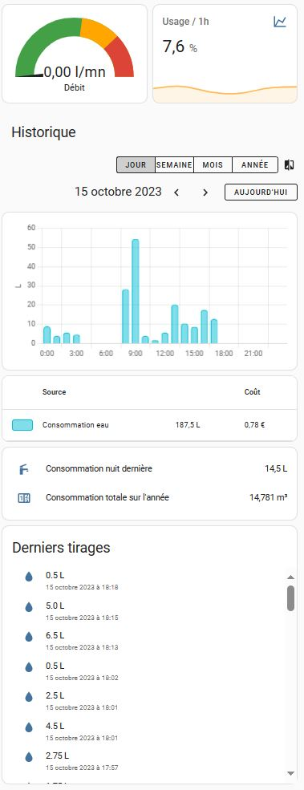
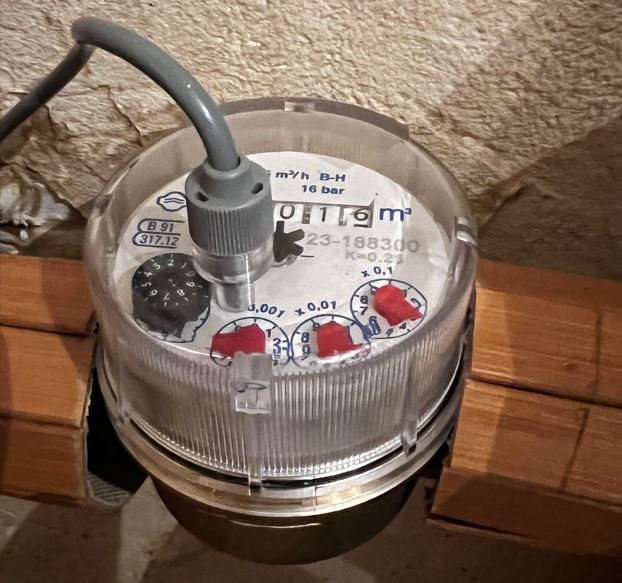
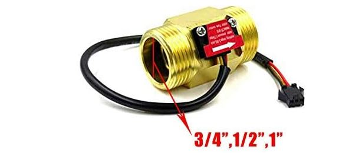
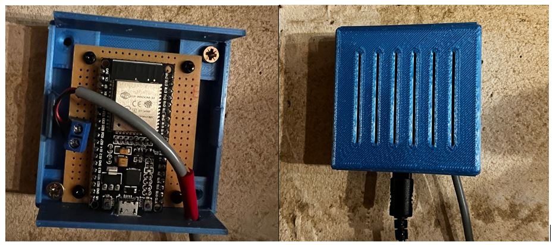
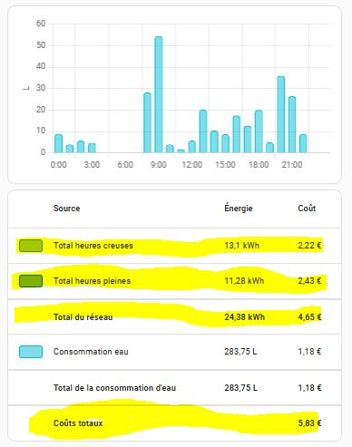
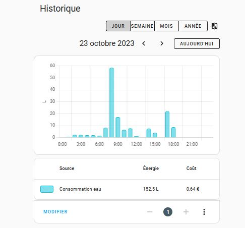
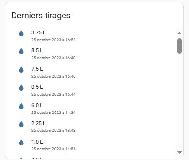
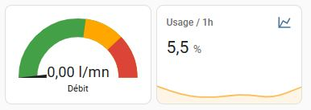
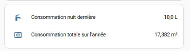

Beaucoup d'entre nous mesurent les consommations d'électricité, que ce soit par la connexion de son compteur par la prise télé-information, des prises ou modules connectées ou tout être dispositif.

Mais **maîtriser sa consommation d'eau** est bien autant essentiel, d'autant dans le contexte de pénurie actuel et d'augmentation du prix de l'eau. Et les conséquences d'une fuite, ou même un simple chasse d'est qui coule des jours, un robinet extérieur mal fermé, peut d'avérer lourd de conséquences.

Cet article explore les solutions pour connecter et exploiter un compteur d'eau. Nous détaillerons une solution avec un compteur à impulsion **Gianola** et un **ESP32**. Enfin, nous verrons comment afficher les **consommations et les coûts** associés, comprendre les **origines des tirages d'eau**, et **détecter les éventuelles fuites**.

L'interface qui est implémentée permet de voir :

- Le débit d'eau instantané
- Le pourcentage d'usage sur la dernière heure (100% si l'eau coule en permanence)
- Les consommations et coûts par jours / mois / année
- La consommation la nuit dernière
- La valeur totale du compteur (remis à 0 en début d'année)
- L'historique des 50 derniers tirages d'eau effectué



## Connecter son compteur

La solution sera bien entendu différente suivant si vous êtes propriétaire ou locataire, suivant où se situe le compteur de votre fournisseur, quel est son type, et où arrive la conduite d'eau dans votre logement.

### Installer un compteur connecté

Dans mon cas, le compteur de la maison est à l'extérieur, très peu accessible. J'ai donc opté pour l'installation d'un nouveau compteur à l'intérieur de la maison, en aval de celui du fournisseur d'eau, mais avant le réducteur de pression.

On ne plaisante pas avec l'eau, ainsi, j'ai préféré une marque italienne reconnue : Gianola. Il a l'avantage d'avoir un affichage de la consommation, et une sortie contact sec pour mesurer les impulsions : 1 impulsion tous les  0.25 l dans mon cas (mais il existe aussi en 1l / impulsion).

> ❣️ `C'est la solution que j'ai testée et que je recommande.`



Vous pouvez trouver ce compteur chez des fournisseurs comme Domadoo :

[GIOANOLA - Compteur d'eau avec sortie contact sec pour comptage d'impulsion (1 imp/ 0.25 l) - 3/4p](https://www.domotique-store.fr/domotique/usages/mesure-de-consommation-energetique-domotique/mesure-de-consommation-d-eau/1009-gioanola-compteur-d-eau-avec-sortie-contact-sec-pour-comptage-d-impulsion-1-imp-025-litre-34p.html)

Il y a assez peu de compteurs connectés sur le marché. Une alternative assez courante est d'utiliser un compteur à effet hall. Lui aura besoin d'être alimenté en 5v par contre, ce qui n'est pas forcément un problème car cette tension est disponible sur l'ESP.

> ⚠️ N'ayant pas moi même testé cette solution, je ne peux conseiller un modèle, mais évitez un modèle premier prix non CE acheté en Chine.



### Se connecter à un compteur existant

Beaucoup ne pourront ou voudront installer un nouveau compteur. Voici quelques solutions de connexion à un compteur existant et références de personnes qui les ont implémentées :

- **Installer un capteur de proximité type LJ18A3** au-dessus de la petite roue qui tourne (si celle-ci est bien métallique) : c'est ce qui est proposé dans le [blog de Bujarra](https://www.bujarra.com/leyendo-el-contador-de-agua-de-casa-con-esphome-y-home-assistant/?lang=fr) (blog traduit en français)
- **Capter les impultions radios** pour certains types de compteurs, proposé par @journaldeThomas : [Suivre sa consommation d'eau sous Home Assistant avec une simple clé USB FM TV !](https://www.youtube.com/watch?v=m5R6sfsGmvE)
- **Mettre une caméra ESPCam avec de l'IA** pour lire le compteur, proposé par GammaTronniques : [Suivre sa consommation d'eau avec Home Assistant](https://www.youtube.com/watch?v=1uwoAWvP6f8)

## Intégration avec ESPHome

Le compteur fourni des impulsions (1 tous les 0.25 litre dans notre cas) qu'il faut maintenant traiter. Pour cela, nous utilisons un ESP32 alimenté par sa prise USB.


Ci-dessus l'ESP32 soudé sur une plaque de prototypage, avec un connecteur pour relier le compteur, et dans un boitier à imprimer en 3D que vous pouvez retrouver sur [Boitier ESP32 sur Cult3d](https://cults3d.com/fr/mod%C3%A8le-3d/outil/box-for-esp32-or-esp8266).

Le raccordement est très simple :

- GPIO25 connecté à une entrée du compteur
- GND connecté à l'autre entrée

En prérequis, il faut avoir installé ESPHome et téléchargé le code qui suit. Pour cela, je vous renvoie à l'article sur ESPHome : [Vos premiers pas avec ESPHome](https://hacf.fr/blog/esphome-introduction/).

Ensuite créer un nouveau device ***esp-eau***, rajoutez le code suivant et téléversé le sur votre ESP :

```yaml
switch:
  - platform: restart
    name: "esp_eau_reboot"

sensor:

# Débit d'eau instantané (0 après 10s)
  - platform: pulse_meter
    name: "Debit eau froide"
    pin:
      number: GPIO25
      inverted: true
      mode:
        input: true
        pullup: true
    internal_filter: 50ms
    icon: mdi:water
    timeout: 4s
    unit_of_measurement: 'l/mn'
    filters:
      - multiply: 0.25
# Consommation Totale d'Eau depuis démarrage
    total:
      name: "Consommation eau froide"
      icon: mdi:water
      device_class: water   
      state_class: total_increasing
      unit_of_measurement: 'm³'
      accuracy_decimals: 5
      filters:
        - multiply: 0.00025
```

2 entités vont être créées dans Home Assistant :

- ***esp_eau_debit_eau_froide*** : mesure le **débit instantané**. Si au bout de 4s il n'y a plus d'impulsion le débit se met à 0. C'est un choix : les débits faibles seront mesurés en effectuant des différences de compteurs sur de longues périodes, et donc pas avec l'entité débit. Un `filter` permet de multiplier la valeur pas 4 pour obtenir des litres/mn (nous avons 1 impulsion tous les 0.25l).
- ***esp_eau_consommation_eau_froide*** : est un compteur en m3 qui calcul la consommation depuis le dernier démarrage de l'ESP. Le filter là encore permet de faire la conversion.

> **ℹ️ Remarque** : il existe sous ESPHome 2 manières de traiter les impulsions:
> `- pulse_counter :` envoie les infos à intervale régulier.
> `- pulse_meter` : envoie les infos à chaque impulsion, ce qui est plus précis pour avoir le débit instantané. Pas d’infos envoyées si on ne tire pas d’eau. C'est ce que nous utilisons ici.

Pour tester notre compteur, je conseille d'afficher les 2 entités ***debit_eau_froide*** et ***consommation_eau_froide*** dans un dashboard de test sous Home Assistant. Le débit doit augmenter quand on tire de l'eau puis se remettre à 0. La consommation doit augmenter.

Essayez de tirer un litre d'eau et vérifier que le compte s'incrémente correctement.

## Gestion de la consommation sous HA

### Compteur de la consommation annuelle

Le compteur exposé par ESPHome sous Home Assistant sera remis à 0 chaque fois que l'ESP redémarre. Pour éviter cela et avoir un compteur qui s'incrémente toujours, nous devons utiliser un [utility meter](https://www.home-assistant.io/integrations/utility_meter/).

Certes, il peut être créé dans le fichier de configuration YAML, mais Home Assistant permet l'utilisation de helper : aller dans `Paramètres` - `Appareils` et `Services` - `Entrées` puis créer un `Compteur de Services` appelé ***eau_froide_annuel***`.`

- ID de l'entité : `eau_froide_annuel`
- `Nom : consommation eau froide annuelle`
- Le capteur d'entrée est l'entité fournie par ESPHome `consommation_eau_froide.`
- Le compteur sera remis à 0 chaque début d'année. Le cycle de remise à 0 est annuel.
- Laisser les autres informations par défaut

### Affichage dans un graphique

Idéalement, je conseille de créer une vue dédiée à la gestion de l'eau.

Ensuite, je propose d'utiliser le module **Energie**, qui gère aussi l'eau. Nous afficherons ensuite les très jolies cartes du module Energie, mais en restraignant l'affichage à l'eau.

Aller dans le menu sous `Paramètres` - `Tableaux de Bord` - `Energie` puis renseigner une source d'eau dans “consommation d'eau”. Préciser l'entité de consommation ***esp_eau_consommation_eau_froide*** (ou ***eau_froide_annuel***`` qui marche aussi) et renseignez un tarif (par exemple 4.2 €/m3, qui est le tarif ici à Annecy).

Ensuite, insérer dans votre vue les cartes suivantes dans une `vertical card` :

```yaml
type: vertical-stack
title: Historique
cards:
  - type: energy-date-selection
  - type: energy-water-graph
  - type: energy-sources-table
```

Vous devez alors obtenir un graphique qui vous donne la gestion de l'eau.

Bizarrement, Home Assistant mélange les énergies et la gestion de l'eau Dans la troisième carte (`source-tab`), si vous utilisez le module Energie pour l'électricité, vous aurez aussi les données relatives à l'électricité.



Nous allons donc utiliser le composant HACS `card-mod` pour supprimer ces lignes. En pré-requis, il faut avoir installé HACS, la bibliothèque de composants de la communauté HACS.

Si vous n'avez pas déja **card-mod**, allez sous HACS, cliquer “explorer et télécharger des nouveaux dépôts”, rechercher **card-mod** et télécharger le. Raffraichissez ensuite votre navigateur.

`**card-mod**` permet de rajouter du code javascript qui va permettre de modifier une carte du dashboard. Rajouter alors le code javascript suivant :

```yaml
type: vertical-stack
title: Historique
cards:
  - type: energy-date-selection
  - type: energy-water-graph
  - type: energy-sources-table
    card_mod:
      style: |
        ha-card > div > div > table > tbody > tr:nth-child(1) {
          display: none
        }
        ha-card > div > div > table > tbody > tr:nth-child(2) {
          display: none
        }
        ha-card > div > div > table > tbody > tr:nth-child(3) {
          display: none
        }
        ha-card > div > div > table > tbody > tr:nth-child(5) {
          display: none
        }
        ha-card > div > div > table > tbody > tr:nth-child(6) {
          display: none
        }

```

**Le paramètre tr:nth-child(1) indique la ligne à supprimer**. Dans mon cas, j'ai supprimé la ligne 1, 2, 3, 5 et 6. Les lignes à supprimer peuvent être différentes chez vous.

Au final, nous nous retrouvons bien avec un graphique ne présentant que la consommation d'eau.



> ⚠️ **IMPORTANT** - Si vous avez une autre vue avec l'électricité et que vous ne voulez pas mélanger avec l'eau, il vous faudra appliquer le même principe.

## Afficher les 50 derniers tirages

Il est maintenant très intéressant de savoir quel appareil utilise de l'eau. Pour cela, nous allons afficher une l**iste avec les derniers tirages d'eau**.

**Le principe est le suivant :** un tirage est caractérisé par un débit qui passe de 0 à une certaine valeur, puis revient à 0. A chaque passage du débit à 0 (fin d'un tirage), nous enregistrons la valeur du compteur. Puis quand le compteur repasse à 0 une nouvelle fois (fin d'un nouveau tirage), il suffit alors de faire la différence entre la valeur du compteur courante et la valeur précédemment enregistrée pour connaitre la quantité d'eau tirée.

Nous allons utiliser un **capteur de seuil** pour savoir s'il y a tirage ou non, et 2 variables (des `input_text`) pour mémoriser la valeur du compteur à chaque fin de tirage, ainsi que la valeur du dernier tirage.

Créer un capteur de seuil **eau_froide_tirage_actif** qui sera vrai (activé) quand de l'eau sera tirée et faux quand le débit d'eau sera à 0.

Aller dans paramètres - appareils et services - entrées, créer un capteur de seuil, puis renseigner les infos suivantes :

- Nom : eau_froide_tirage_actif
- Capteur d'entrée : sensor.esp_eau_debit_eau_froide
- Hysteresis : 0
- Type : upper
- Upper : 0.2

Créer ensuite un input_text appelé ***eau_froide_memo*** pour mémoriser la valeur du compteur entre chaque tirage.

Enfin, créer un deuxième input_text appelé ***eau_froide_tirage*** pour mémoriser la valeur du dernier tirage.

Créer ensuite une automatisation (sous paramètres - automatisations et scène) avec le code YAML suivant :

```yaml
alias: Eau froide - enregistrement tirages
description: ""
trigger:
  - platform: state
    entity_id:
      - binary_sensor.eau_froide_tirage_actif
    from: "on"
    to: "off"
    for:
      hours: 0
      minutes: 0
      seconds: 2
condition: []
action:
  - service: input_text.set_value
    target:
      entity_id: input_text.eau_froide_tirage
    data:
      value: >-
         
          {{ vol | round(2) }} L
        
          {{ vol | round(0) }} L
        
  - service: input_text.set_value
    target:
      entity_id: input_text.eau_froide_memo
    data:
      value: "{{ states('sensor.eau_froide_annuel')|float(0)*1000|round(2) }}"
mode: single
```

Si vous testez, vous devriez avoir dans le champ ***eau_froide_tirage*** un texte avec la valeur du dernier tirage en litres.

Il ne reste plus qu'à afficher la liste des tirages. Pour cela, nous allons télécharger un nouveau composant sous HACS appelé [Logbook Card](http://192.168.5.30:8123/hacs/repository/216008446).

Insérer ensuite cette carte dans votre vue de gestion d'eau :

```yaml
type: custom:logbook-card
entity: input_text.eau_froide_tirage
max_items: 50
show:
  state: true
  duration: false
  start_date: true
  end_date: false
  icon: true
  separator: false
title: Derniers tirages
no_event: Aucun
```

Vous obtiendrez ainsi la liste de vos tirages d'eau, et pourrez mieux comprendre quelle est la source d'un tirage et le volume d'eau ponctuellement consommée.



## Détecter les fuites importantes

**Si une chasse d'eau coule constamment par exemple, il est important d'être alerté**. Pour cela, nous allons calculer l'usage de l'eau sur la dernière heure. Un usage de 100% signifie que l'eau coule constamment. Un usage de 0% signifie que l'eau ne coule pas (ou infiniment peu).

Rajouter dans votre fichier YAML un sensor ***eau_froide_ratio_usage*** de type history_stats, avec le code suivant, puis redémarrer Home Assistant

```yaml
sensor:
# Ratio d'usage de l'eau sur la dernière heure
  - platform: history_stats
    name: Ratio usage eau froide
    unique_id: "eau_froide_ratio_usage"
    entity_id: binary_sensor.eau_froide_tirage_actif
    state: "on"
    type: ratio
    start: "{{ now() - timedelta(hours=1) }}"
    end: "{{ now() }}"

```

Vous aurez ainsi une entité ***eau_froide_ratio_usage*** vous donnant le % de temps pendant lequel de l'eau a coulé sur la dernière heure.

Reste à créer une automatisation qui enverra une notification si de l'eau a coulé durant plus de 80% du temps sur la dernière heure (on peut mettre plus ou moins).

Voici le code YAML de cette automatisation :

```yaml
alias: Eau froide - alerte fuite
description: ""
trigger:
  - platform: numeric_state
    entity_id: sensor.ratio_usage_eau_froide
    above: 80
condition: []
action:
  - service: notify.telegram_maison
    data:
      message: ALERTE - usage d'eau supérieur a la normale. Fuite possible !
    alias: Envoyer un message dans telegram "Alerte fuite d'eau"
mode: single

```

J'ai choisi d'utiliser une notification sur Telegram. Voir l'article [Dialogue avec telegram](https://hacf.fr/blog/ha_integration_telegram/) pour mettre en place ce type de notifications. À défaut, vous pouvez utiliser les [notifications de home assistant.](https://www.home-assistant.io/integrations/notify/)

Il est pratique d'afficher dans le dashboard, en début de la vue de gestion de l'eau, une carte qui présente le débit instantané et l'usage :



```yaml
type: horizontal-stack
cards:
  - type: gauge
    min: 0
    max: 83
    severity:
      green: 0
      yellow: 45
      red: 63
    needle: true
    entity: sensor.esp_eau_debit_eau_froide
  - graph: line
    type: sensor
    detail: 1
    entity: sensor.ratio_usage_eau_froide
    name: Usage / 1h
    hours_to_show: 6
```

## Détecter les micro fuites

Un robinet qui goutte est difficile à détecter. Le plus simple est de faire cette détection à un moment où on n'est pas censé tirer de l'eau : **la nuit ou durant une absence**.

Personnellement, je fais une mesure systématique la nuit. Pour cela, on mémorise la valeur du compteur d'eau en début de nuit (dans un input_text), et en fin de nuit, on enregistre (dans un autre input_text) la différence entre la valeur courante du compteur et la valeur en début de nuit.

Pour cela, ont créé 2 input_text :

- ***input_text.eau_froide_compteur_debut_nuit***
- ***input_text.eau_froide_conso_fin_nuit***

Créer une première automatisation pour mémoriser la valeur du compteur en début de nuit (ici à 1h du matin), et le stocker dans ***input_text.eau_froide_compteur_debut_nuit*** :

```yaml
alias: Eau froide - conso nuit - enregistrement debut
description: ""
trigger:
  - platform: time
    at: "01:00:00"
condition: []
action:
  - service: input_text.set_value
    target:
      entity_id: input_text.eau_froide_compteur_debut_nuit
    data:
      value: "{{ states('sensor.eau_froide_annuel')|float(0) }}"
mode: single
```

Et enfin créer une deuxième automatisation pour effectuer le calcul de consommation nocturne et le stocker dans ***input_text.eau_froide_conso_fin_nuit*** (ici à 7h du matin) :

```yaml
alias: Eau froide - conso nuit - calcul fin
description: ""
trigger:
  - platform: time
    at: "07:00:00"
condition: []
action:
  - service: input_text.set_value
    target:
      entity_id: input_text.eau_froide_conso_fin_nuit
    data:
      value: >-
        
        
          {{ vol | round(2) }}
        
          {{ vol | round(0) }}
        
mode: single
```

Reste ensuite à afficher la valeur contenue dans ***input_text.eau_froide_conso_fin_nuit*** dans le dashboard pour contrôle.

On en profite pour afficher ici également le compteur ***sensor.eau_froide_annuel*** qui permettra de vérifier que Home Assistant reporte bien la valeur du compteur d'eau.



Voici le code de la carte :

```yaml
type: entities
entities:
  - entity: sensor.eau_froide_conso_nuit
    name: Consommation nuit dernière
    icon: mdi:faucet
  - entity: sensor.eau_froide_annuel
    name: Consommation totale sur l'année
    secondary_info: none
```

## Pour aller plus loin

Bien entendu, la suite logique serait de gérer sa **consommation d'eau chaude**.

Nous avons vu comme avoir la liste des tirages. Après le Graal serait **d'identifier et nommer quel appareil a tiré de l'eau** en fonction du débit, du volume et éventuellement de capteurs supplémentaires : prise sur la machine à laver, capteur de lumière dans les toilettes, capteur de présence dans la salle de bain, heure de la journée….

Certes, on pourrait utiliser de l'IA avec une phase d'apprentissage. Mais Home Assistant fournit un sensor extrêmement puissant et relativement méconnu, le [bayesian sensor](https://www.home-assistant.io/integrations/bayesian/).

Le **bayesian sensor** permet de spécifier une liste d'états constatés (une présence, une consommation, une heure, une plage de volume d'eau tiré, etc) et d'associer des probabilités que ces événements soient les causes d'un événement : le tirage d'eau d'une douche ou d'une chasse d'eau typiquement.

Ainsi, il serait possible de créer autant de bayesian sensor que de source de tirage (douche, toilettes…). Chaque baysian sensor deviendrait vrai en fonction des pondérations sur les entités mises en entrées.

Je n'ai pas testé cela, mais ce serait une belle fonctionnalité, et permettant de maîtriser cette fonction à la fois puissante et méconnue de Home Assistant. Avis à ceux qui voudraient tester cela 😊

## En conclusion

Cet article permet de traiter au mieux l'important sujet de sa **maîtrise de consommation d'eau**. Vous devriez en particulier pouvoir détecter un appareil qui a une consommation trop importante, et être averti d'une fuite comme une chasse d'eau ou le robinet extérieur qui est resté ouvert.

N'hésitez pas à faire vos commentaires ou vos suggestions d'améliorations.
