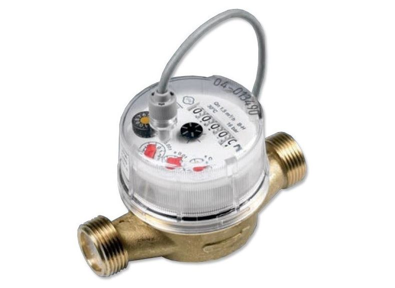

Beaucoup d'entre nous mesurent les consommations d'électricité, que ce soit par la connection de son compteur par la prise téléinformation, des prises ou modules connectées ou tout être dispositif.

Mais **maîtriser sa consommation d'eau** est bien autant essentiel, d'autant dans le contexte de pénurie actuel et d'augmentation du prix de l'eau. Et les conséquences d'une fuite, ou même un simple chasse d'est qui coule des jours, peut d'avérer très génant.

Cet article explore les solutions pour mettre en place un compteur connecté. Nous détaillerons une solution avec un compteur à impulsion **Gianola** et un **ESP32**. Enfin, nous verrons comment afficher les consommations et les coûts associés, et **détecter les éventuelles fuites**.

L'interface qui est implémentée permet de voir :

- Le débit d'eau instantanné
- Le pourcentage d'usage sur la dernière heure (100% si l'eau coule en permanence)
- Les consommations et coûts par jours / mois / année
- La consommation la nuit dernière
- La valeur totale du compteur (remis à 0 en début d'année)
- L'historique des 50 derniers tirages d'eau effectué


## Connecter son compteur

La solution sera différente suivant si vous être propriétaire ou locataire, suivant ou se situe le compteur de votre fournisseur, quel est son type, et ou arrive la conduite d'eau.

### Installer un compteur connecté

Dans mon cas, le compteur de la maison est à l'extérieur, très peu accessible. J'ai donc opté pour l'installation d'un nouveau compteur à l'intérieur de la maison, en aval de celui du fournisseur d'eau.

On ne plaisante pas avec l'eau, donc j'ai préféré une marque italienne reconnue : Gianola. Il a l'avantage d'avoir un affichage de la consommation, et une sortie contact sec pour mesurer les impulsions : 1 impulsion tous les  0.25l dans mon cas (mais il existe aussi en 1l / impulsion).

> `C'est la solution que j'ai testée et que je recommande.`



Vous pouvez trouver ce compteur chez des fournisseurs comme Domadoo :

[GIOANOLA - Compteur d'eau avec sortie contact sec pour comptage d'impulsion (1 imp/litre) - 3/4p](https://www.domotique-store.fr/domotique/modules-domotiques/detecteurs-capteurs-mesure/mesure-de-consommation-d-eau/434-gioanola-compteur-d-eau-avec-sortie-contact-sec-pour-comptage-d-impulsion-34p-1-implitre.html)

Il y a assez peu de compteurs connectés sur le marché. Une alternative assez courante est d'utiliser un compteur à effet hall. Lui aura besoin d'être alimenté en 5v par contre, ce qui n'est pas forcément un problème. N'ayant pas moi même testé cette solution, je ne peux conseiller un modèle, mais évitez un modèle premier prix non CE acheté en Chine.


### Se connecter à un compteur existant

Beaucoup ne pourront ou voudrons un nouveau compteur. Voici quelques solutions et références de personnes qui les ont implémentées :

- Installer un capteur effet hall de type LJ18A3 au dessus de la petite roue qui tourne.
- Capter les impultions radios pour certains type de compteurs, proposé par @journaldeThomas : [Suivre sa consommation d'eau sous Home Assistant avec une simple clé USB FM TV !](https://www.youtube.com/watch?v=m5R6sfsGmvE)
- Mettre une caméra ESPCam avec de l'IA pour lire le compteur, proposé par GammaTronniques : [Suivre sa consommation d'eau avec Home Assistant](https://www.youtube.com/watch?v=1uwoAWvP6f8)

## Intégration avec ESPHome

Le compteur fourni des impulsions (1 tous les 0.25 litres dans notre cas), et il faut maintenant les traiter. Pour cela, nous utilisons un ESP32 alimenté par sa prise USB.

Le raccordement est simple :

- GPIO25 connecté à une entrée du compteur
- GND connecté à l'autre entrée

En prérequis, il faut avoir installé ESPHome et télécharger le code qui suit. Pour cela, je vous renvoie à l'article sur ESPHome : [Vos premiers pas avec ESPHome](https://hacf.fr/blog/esphome-introduction/).

Ensuite créer un nouveau device esp-eau, rajoutez le code suivant et téléversé le sur votre ESP :

```
switch:
  - platform: restart
    name: "esp_eau_reboot"

sensor:

# Débit d'eau instantané (0 après 10s)
  - platform: pulse_meter
    name: "Debit eau froide"
    pin:
      number: GPIO25
      inverted: true
      mode:
        input: true
        pullup: true
    internal_filter: 50ms
    icon: mdi:water
    timeout: 4s
    unit_of_measurement: 'l/mn'
    filters:
      - multiply: 0.25
# Consommation Totale d'Eau depuis démarrage
    total:
      name: "Consommation eau froide"
      icon: mdi:water
      device_class: water   
      state_class: total_increasing
      unit_of_measurement: 'm³'
      accuracy_decimals: 5
      filters:
        - multiply: 0.00025
```

2 entités vont être créées dans Home Assistant :

- esp_eau_debit_eau_froide : mesure le débit instantané. Si au bout de 4s il n'y a plus d'impulsion le débit se met à 0. C'est un choix et le débit faibles seront mesurés en faisant des différences de compteur sur de longues période, pas avec le débit. Un `filter` permet de multiplier la valeur pas 4 pour obtenir des litres/mn (nous avons 1 impulsion tous les 0.25l).
- esp_eau_consommation_eau_froide : est une compteur em m3 qui calcul la consommation  depuis le dernier démarrage de l'ESP. Le filter la encore permet de faire la conversion.

> **Remarque** : il existe sous ESPHome 2 manières de traiter les impulsions:
> `- pulse_counter :` envoie les infos à intervale régulier.
> `- pulse_meter` : envoie les infos à chaque impulsion, ce qui est plus précis pour avoir le débit instantané. Pas d’infos envoyées si on ne tire pas d’eau. C'est ce que nous utilisons ici.

Pour tester notre compteur, afficher les 2 entités debit_eau_froide et consommation_eau_froide dans un dashboard de test sous Home Assistant. Le débit doit augmener quand on tire de l'eau puis se remettre à 0. La consommation doit augmenter. Essayez de tirer un litre d'eau et vérifier que le compte s'incrémente correctement.

## Gestion de la consommation sous HA

### Compteur de la consommation annuelle

Le compteur ramené par ESPHome sera remis à 0 chaque fois que l'ESP redémarre. Pour éviter cela et avoir un compteur qui s'incrémente toujours, nous devons utiliser un [utility meter](https://www.home-assistant.io/integrations/utility_meter/).

Certes, il peut être créé dans le fichier de configuration YAML, mais Home Assistant permet l'utilisation de helper : aller dans `Paramètres` - `Appareils` et `Services` - `Entrées` puis créer un `Compteur de Services` appelé `eau_froide_annuel.`

- ID de l'entité : `eau_froide_annuel`
- `Nom : consommation eau froide annuelle`
- Le capteur d'entrée est l'entité fournie par ESPHome `consommation_eau_froide.`
- Le compteur sera remis à 0 chaque début d'année. Le cycle de remise à 0 est annuel.
- Laisser les autres informations par défaut

### Affichage dans un graphique

Idéalement créer une vue dédiée à la gestion de l'eau. Pour cela, nous proposons d'utiliser le module energie, qui gère aussi l'eau.

Aller dans le menu sous Paramètres - Tableaux de Bord - Energie puis renseigner une source d'eau dans consommation d'eau. Préciser l'entité de consommation esp_eau_consommation_eau_froide et renseignez un tarif (par exemple 4.2 €/m3).

Ensuite, insérer dans votre vue les cartes suivantes dans une `vertical card` :

```
type: vertical-stack
title: Historique
cards:
  - type: energy-date-selection
  - type: energy-water-graph
  - type: energy-sources-table
```

Vous devez alors obtenir un graphique qui vous donne la gestion de l'eau.

Bizarrement, Home Assistant mélange les énergies et la gestion de l'eau Dans la troisième carte (source-tab), si vous utilisez le module Energy pour l'électricité, vous aurez aussi les données relatives à l'électricité.


Nous allons donc utiliser le composant HACS `card-mod` pour supprimer ces lignes. En pré-requis, il faut avoir installer HACS, la bibliothèque de composants de la communauté HACS.

Si vous n'avez pas déja card-mod, allez sous HACS, cliquer “explorer et télécharger des nouveaux dépôts”, rechercher `card-mod` et télécharger le. Raffraichissez ensuite votre navigateur.

`card-mod` permet de rajouter du code javascript qui va permettre de modifier une carte du dashboard. Rajouter le code javascript suivant :

```
type: vertical-stack
title: Historique
cards:
  - type: energy-date-selection
  - type: energy-water-graph
  - type: energy-sources-table
    card_mod:
      style: |
        ha-card > div > div > table > tbody > tr:nth-child(1) {
          display: none
        }
        ha-card > div > div > table > tbody > tr:nth-child(2) {
          display: none
        }
        ha-card > div > div > table > tbody > tr:nth-child(3) {
          display: none
        }
        ha-card > div > div > table > tbody > tr:nth-child(5) {
          display: none
        }
        ha-card > div > div > table > tbody > tr:nth-child(6) {
          display: none
        }

```

Le paramètre tr:nth-child(1) indique la ligne à supprimer. Dans mon cas, j'ai supprimé la ligne 1, 2, 3, 5 et 6.

Au final, nous nous retrouvons bien avec un graphique ne présentant que la consommation d'eau.


> IMPORTANT - Si vous avez une autre vue avec l'électricité et que vous ne vouliez pas mélanger avec l'eau, il faudra appliquer le même principe.

## Afficher les 50 derniers tirages

Il est maintenant trés intéressant de savoir quel appareil utilise de l'eau. Pour cela, nous allons afficher une liste avec les derniers tirages d'eau.

Le principe est le suivant : un tirage est caractérisé par un débit qui passe de 0 à une certaine valeur, puis revient à 0. Il suffit alors de faire la différence entre la valeur du compteur courante et la valeur précédemment enregistrée pour connaitre la quantité d'eau tirée.

Nous utiliser un capteur de seuil pour savoir si il y a tirage ou non, et 2 variables (des `input_text`) pour mémoriser la valeur du compteur à chaque fin de tirage, et la valeur du dernier tirage.

Créer un capteur de seuil **eau_froide_tirage_actif** qui sera vrai (activé) quand de l'eau sera tirée et faux quand le débit d'eau sera à 0.

Aller dans paramètres - appareils et services - entrées, créer un capteur de seuil,puis renseigner les infos suivantes :

- Nom : eau_froide_tirage_actif
- Capteur d'entrée : sensor.esp_eau_debit_eau_froide
- Hysteresis : 0
- Type : upper
- Upper : 0.2

Créer ensuite un input_text appelé `**eau_froide_memo**` pour mémoriser la valeur du compteur entre chaque tirage.

Enfin, créer un deuxième input_text appelé `**eau_froide_tirage**``` pour mémoriser la valeur du dernier tirage.

Créer ensuite une automatisation (sous paramètres - automatisations et scène) avec le code YAML suivant :

```
alias: Eau froide - enregistrement tirages
description: ""
trigger:
  - platform: state
    entity_id:
      - binary_sensor.eau_froide_tirage_actif
    from: "on"
    to: "off"
    for:
      hours: 0
      minutes: 0
      seconds: 2
condition: []
action:
  - service: input_text.set_value
    target:
      entity_id: input_text.eau_froide_tirage
    data:
      value: >-
         
          {{ vol | round(2) }} L
        
          {{ vol | round(0) }} L
        
  - service: input_text.set_value
    target:
      entity_id: input_text.eau_froide_memo
    data:
      value: "{{ states('sensor.eau_froide_annuel')|float(0)*1000|round(2) }}"
mode: single
```

Si vous testez, vous devriez avoir dans le champs `**eau_froide_tirage**` un texte avec la valeur du dernier tirage.

Il ne reste plus qu'à afficher la liste des tirages. Pour cela, nous allons télécharger un nouveau composant sous HACS appelé [Logbook Card](http://192.168.5.30:8123/hacs/repository/216008446).

Insérer ensuite cette carte dans votre vue de gestion d'eau :

```
type: custom:logbook-card
entity: input_text.eau_froide_tirage
max_items: 50
show:
  state: true
  duration: false
  start_date: true
  end_date: false
  icon: true
  separator: false
title: Derniers tirages
no_event: Aucun
```

Vous obtiendrez ainsi la liste de vos tirages d'eau, et mieux comprendre ce qui consomme.

## Les détections de fuites importantes

Si une chasse d'eau coule constamment par exemple, il est important d'être alerté. Pour cela, nous allons calculer l'usage de l'eau sur la dernière heure. Un usage de 100% signifie que l'eau coule constament. Un usage de 0% signifie que l'eau ne coule pas (ou infiniement peu).

Aller dans paramètres - appareils et services - entrées, créer un **capteur de dérivée**, puis renseigner les infos suivantes :

- Nom :
- Capteur d'entrée :
- Précision :
- Période :
- Préfixe : none
- Unité de temps : heures


