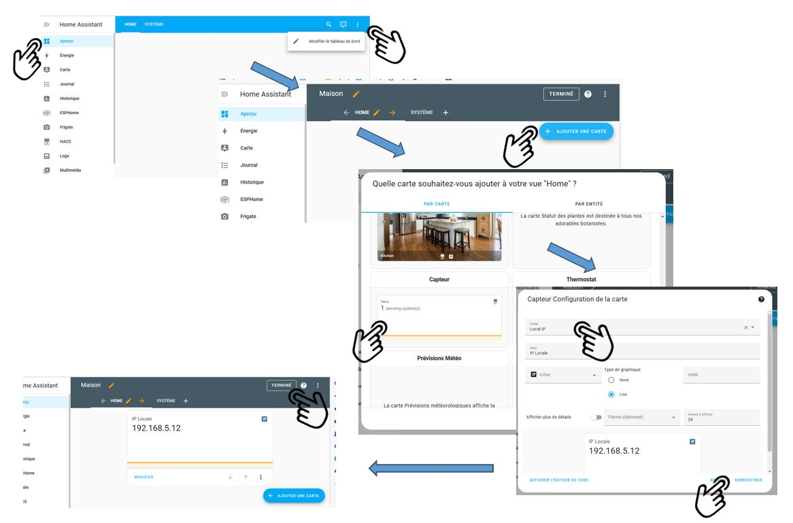
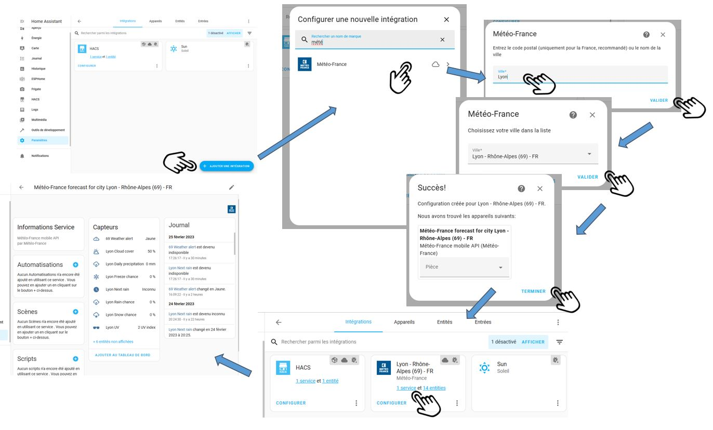
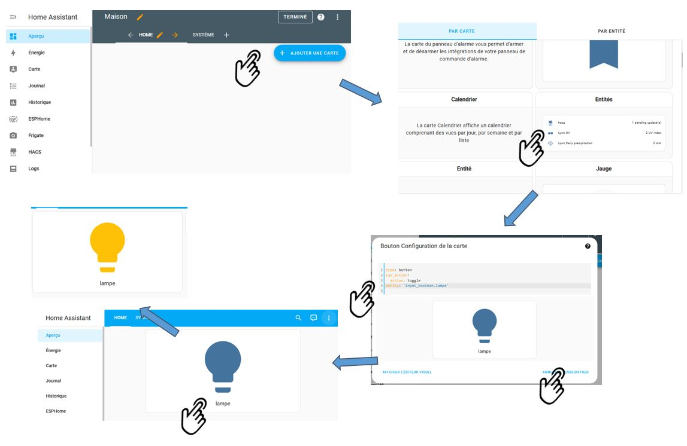
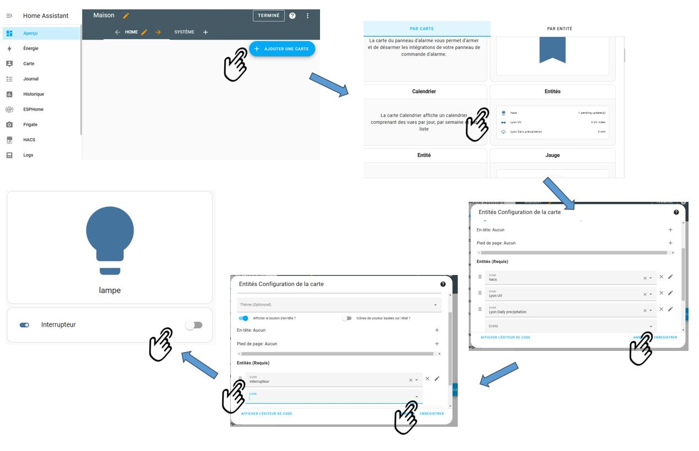
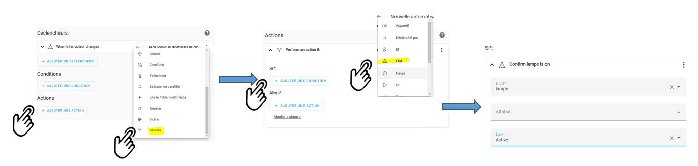
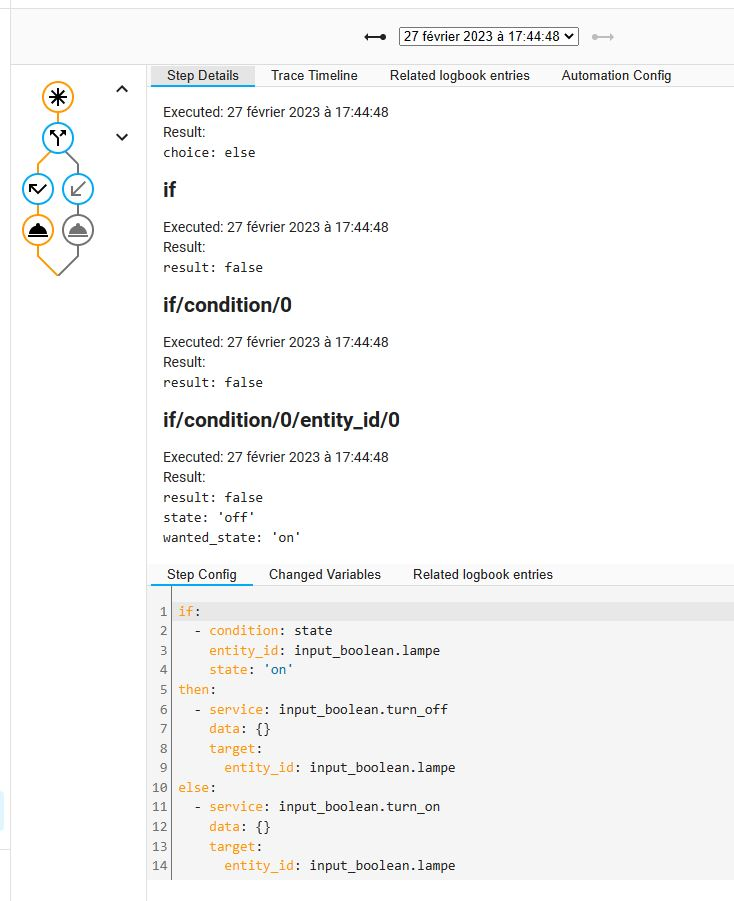
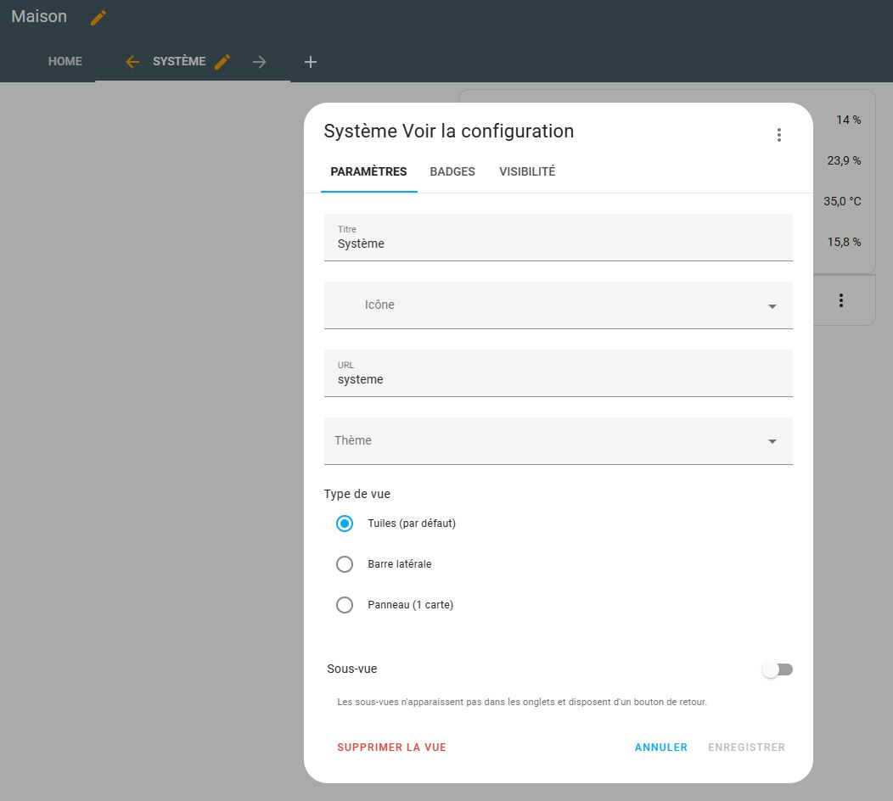

Vous avez **installé Home Assistant** et il est temps pour vous de découvrir par vous-même ses possibilités. Mais vous n'avez pas forcément d'**objets connectés** compatibles ou de clés type **zigbee** permettant de les intégrer.
Cet article vous propose de créer vos premiers projets pour commencer à appréhender les concepts, mais **sans avoir besoin d'objets connectés** à votre nouveau serveur domotique.

Nous vous proposons les mini-projets suivants :

1. Affichage de l'**IP locale** de votre machine.
2. Installation de l'intégration **Météo France** et affichage dans l'interface utilisateur.
3. Création d'une **lumière** et d'un **interrupteur** virtuel
4. Développement de votre première **automatisation** pour les connecter
5. **Monitoring** de votre machine

## 1. Afficher l'IP locale de votre machine

### Créer l'entité "IP Local"

Le principe de base d'un serveur domotique est d'intégrer :

* des **capteurs** ("sensor" en anglais), qui retourne des informations
* des **actionneurs**, soit des composants que l'on peut "actionner" : lumières, volets roulants, prises connectées, etc.

Nous vous proposons de créer ici votre premier **capteur** qui affiche l'adresse IP locale de votre machine.

Aller dans le menu de gauche sous `Paramètres`, puis `Appareil et services`, et enfin onglet `Intégration`.

On va rajouter une **intégration**, c'est-à-dire une nouvelle bibliothèque de fonctions, à Home assistant. 

* Cliquer en bas à droite sur `Ajouter une intégration`, 
* Rechercher `Adresse IP locale` et installer l'intégration. 

L'intégration `local_ip` apparait dans les intégrations et vous pouvez accéder à la nouvelle entité créée `sensor.local_ip`. L'entité contient l'information de l'adresse IP que l'on veut.

Cliquer sur l'entité. Sous l'onglet `paramètres`, on peut voir différents champs :

* Un **nom utilisateur** libre, modifiable,
* Une icône de type "material design" (mdi:xxx), également modifiable,
* Un **identifiant unique** constitué du type (`sensor` ici) et d'un ID modifiable constitué de mots séparés par des "_". 

> A terme, vous devrez adopter une politique de nommage rigoureuse de ces ID.

* Une éventuelle **pièce** où se trouve le capteur (sous `Avancé`),
* L'**état** de l'entité (peut être cachée ou désactivée),
* Un (ou plusieurs) alias permettant de lui spécifier un nom convivial pour les assistants vocaux.

Sous l'onglet `Information`, sont affichés la valeur de l'entité et l'historique des valeurs.


### Afficher l'IP local dans le dashboard.

Le **dashboard**, appelé historiquement **"lovelace"**, est l'interface utilisateur de Home Assistant.
Il est possible de créer plusieurs onglets dans son dashboard, et de créer plusieurs dashboard (par exemple pour les dédier à un type d'interface).

* Cliquer sur `Aperçu` dans le menu de gauche,
* Cliquer sur les **trois points** en haut à droite, puis `modifier le tableau de bord`,
* Cliquer sur le bouton `+ Ajouter une carte`. 

Vous voyez ici toutes les cartes graphiques disponibles.

* Sélectionner **Entité** (sans S), 
* Supprimer l'entité existante,
* Sélectionner votre entité Local IP, puis `enregistrer`.

Dans le bandeau, cliquer sur `Terminer` pour sortir du mode d'édition Vous avez alors votre première carte affichant l'adresse IP de votre machine.



## 2. Intégration Météo France.

### Création des entités

Voici une autre intégration, permettant d'afficher cette fois non pas une mais plusieurs entités relatives à la météo. Elle est également utilisée par la carte standard **météo** de Home Assistant.

Cliquez sur `Paramètres` puis `Appareil et services`, et enfin `Ajouter une intégration`. Rechercher `Meteo France` (HACF Power), renseigner votre ville (Lyon dans l'exemple), et validez.

C'est bon, votre intégration de gestion de la météo est installée. 14 "capteurs" ("sensor") ont été créés. Vous pouvez les voir en cliquant sur `service` depuis l'intégration **Météo France**. **Une entité pour chaque capteur a été créée.**

Toutes ces entités sont regroupées sous un **appareil** (en fait ici un service), que vous pouvez retrouver sous l'onglet `Appareils`. 

En cliquant sur la ligne **Météo France**, vous pouvez voir les entités (différents capteurs) mais aussi où ces entités sont utilisées ainsi qu'un journal historique. 

Certaines entités sont désactivées par défaut. Activez celles qui vous intéressent : par exemple température, pression et vent.

Les entités créées sont visibles sous l'onglet `entités`.



### Afficher la météo dans le dashboard

Comme tout à l'heure, aller sous `Aperçu`, mettez votre dashboard en `édition` (trois points et `Modifier le dashboard`). Ajouter la carte **prévisions météos**. Vous avez alors les prévisions de votre ville.


La carte est aussi modifiable dans le langage de description **YAML**. Pour voir et éditer la description de la carte en YAML, mettre la carte en mode édition, et cliquer sur `Afficher l'éditeur de code`.

> Beaucoup de choses sont visuelles, mais pas tout. **Comprendre et utiliser YAML vous permettra de décupler les possibilités de votre système domotique.**

La **documentation de Home Assistant** est très bien faite (mais en anglais) : cliquer sur le point d'interrogation en haut à droite de la carte pour y accéder.

À noter qu'il existe une multitude d'autres cartes dont une de nos développeurs (une carte graphique dédiée à Météo France). Pour cela, il vous faudra à terme [installer la bibliothèque de la communauté HACS.](/hacs_installation)

## 3. Un interrupteur et une lumière

Nous avons joué dans les deux premiers chapitres avec des capteurs ("sensors"). Nous vous proposons ici de créer deux "actionneurs" (sur lesquels on peut faire des actions) : un interrupteur et une lumière.

Nous considérons dans cet article que **vous n'avez pas encore d'objets connectés.** Nous allons simuler la lampe et l'interrupteur par des entités de type **input_boolean**.

> Si vous avez une **clé Zigbee**, une **lumière connectée** et un **interrupteur connecté** couplé avec une intégration comme **ZHA** (celle par défaut de Home Assistant) ou **zigbee2mqtt** (très puissante et populaire) vous pouvez les utiliser.

### Création des entités

Cliquez dans le menu de gauche sur `Paramètres`, puis `Appareils et Services`, et enfin sur l'onglet `Entrées`.

> Les entrées sont des entités utiles pour l'interface, mais aussi des entités de calculs, de regroupement d'objets. Les entrées sont aussi utilisées comme variable permettant de stocker une donnée.

Cliquer sur le bouton en bas à droite `+ créer une entrée` puis `interrupteur`. Donner le nom ***Interrupteur*** et l'icône ***mdi:toggle-switch***, puis cliquer sur `Créer`. Recréer une deuxième entrée `interrupteur`, en lui donnant le nom ***lampe*** et l'icône ***mdi:lightbulb***. Deux entités de type `input_boolean` sont créées.

")

### Affichage dans le dashboard

Cliquer dans le menu de gauche sur `Aperçu`, puis mettre le dashboard en édition (3 points en haut à droite). Ajouter une carte de type `entités` (avec un S => affiche une liste d'entités), supprimer dans la liste les entités existantes, et rajouter l'entité ***Interrupteur*** précédemment créé. 



Ajouter ensuite une carte de type `bouton`. Préciser cette fois l'entité ***lampe***. Si vous n'avez pas encore de switch, l'éditeur visuel ne s'affiche pas et il vous faut saisir l'identifiant de la lampe dans le code YAML qui s'affiche. Cliquer sur `terminer` pour quitter le mode édition.



Vous pouvez maintenant jouer avec la lampe et l'interrupteur dans votre interface.

## 4. Première automatisation

### Création de l'automatisation

Maintenant que vous avez un interrupteur et une lampe, vous pouvez vouloir **allumer la lampe quand l'interrupteur est actionné**. C'est l'objectif de cette **automatisation**.

Une automatisation est constituée de 3 grands blocs : 
**\- Déclencheur(s)** : les événements qui vont déclencher l'automatisation. Ce peut être un changement d'état d'une entité, une heure, le levé du soleil, une expression qui devient vraie, etc.... 
**\- Condition(s) :** une ou plusieurs conditions qui doivent être vraies pour passer à la suite et exécuter les actions.
**\- Actions :** les actions que l'on va exécuter.

* Cliquer dans le menu de gauche `Paramètres`, 
* `Automatisations et scènes,`
* Cliquer sur `créer une automatisation`, 
* Puis `commencer par une automatisation vide.`


On va créer l'automatisation suivante :

* **Déclencheur** : changement d'état de notre interrupteur (1)
* **Condition** : aucune
* **Action** : si interrupteur à on (2), alors allumer la lampe (3), autrement l'éteindre (4).

(1) Cliquer sur `Ajouter un déclencheur` puis `Etat` et sélectionner l'entité ***Interrupteur***.


(2) Cliquer sur `Ajouter une action` puis `Si-alors`. Cliquer sur `Ajouter une condition` , puis `Etat`, renseigner votre entité ***Interrupteur*** dans le champ `entité` et ***Activé*** dans le champ `Etat`.



(3) Sous `Alors`, cliquer sur `Ajouter une action`, `appeler un service` puis `input_boolean.turn_on`, et renseigner l'entité ***Lampe***.

")

(4) Cliquer sous `Ajouter Sinon`. Cliquer sur `Ajouter une action`, `appeler un service` puis `input_boolean.turn_off`, et renseigner l'entité ***Lampe***.

Cliquer enfin sur enregistrer et donner un nom ***Gestion lampe*** à votre automatisation.

Retourner sur votre dashboard et tester l'automatisation. 

Quand vous actionnez l'interrupteur, la lampe doit s'allumer ou s'éteindre.

")

Chaque ligne de votre automatisation peut être **renommée** pour mieux documenter votre processus. Pour cela, cliquer sur les 3 points à droite de chaque traitement, puis cliquer sur `renommer`. 

### Édition en YAML.

Si vous devez partager votre automatisation, elle est visible en **YAML**, très compact. Retourner sous `paramètres` - `automatisations et scènes`, éditer l'automatisation en cliquant dessus et sur les 3 points à droite, cliquer sur `Modifier en YAML`. Quand vous maitriserez la syntaxe, il sera très rapide de modifier une automatisation existante via le YAML.

Vous devriez avoir ce code, qui sera rapide à modifier, et surtout facile à partager (sur le [forum HACF](https://forum.hacf.fr) par exemple).

```yaml
description: ""
trigger:
  - platform: state
    entity_id:
      - input_boolean.interrupteur
condition: []
action:
  - if:
      - condition: state
        entity_id: input_boolean.lampe
        state: "on"
    then:
      - service: input_boolean.turn_off
        data: {}
        target:
          entity_id: input_boolean.lampe
    else:
      - service: input_boolean.turn_on
        data: {}
        target:
          entity_id: input_boolean.lampe
mode: single
```

### Debugging

Il est également possible d'avoir des **traces** pour vérifier comment une automatisation s'est exécutée. Pour cela, cliquer sur `traces.`



Vous pouvez aussi voir une **représentation graphique** des dernières exécutions. Le graphique montre quel nœud a été exécuté (quelle a été le résultat d'un test). Si vous cliquez sur un nœud, vous pouvez enfin voir le traitement fait. 

Enfin, il est possible de **forcer une exécution**. Le trigger (déclencheru) est by-passé, et l'automatisation vérifie les conditions, puis exécute les actions. Pour déclencher l'automatisation et la tester, cliquer sur `exécuter` en haut à droite.

Voilà, **vous avez développé votre première automatisation**. Pour aller plus loin, n'hésitez pas à supprimer le trigger sur l'interrupteur, pour le remplacer sur une trigger sur le soleil (levé ou coucher du soleil), sur une heure précise (à telle heure), ou sur un modèle de temps (toutes les x minutes par exemple)...

Vous pouvez aussi essayer de rajouter dans votre automatisation une condition (par exemple sur un intervalle de temps) qui devra être vérifiée avant de passer à l'action.

> **Ne confonder pas déclencheur et condition, qui est une erreur courante quand on débute.**

## 5. Monitoring de sa machine

Ce chapitre est l'occasion d'utiliser du **YAML** dans le **fichier de configuration de Home Assistant**.

Home Assistant dispose d'une interface graphique qui permet de faire un maximum de chose. Cette interface s'enrichit un peu plus à chaque mise à jour mensuelle (en général le premier mercredi de chaque mois). Mais un certain nombre d'intégrations doivent être définies dans le fichier de configuration de Home Assistant : **configuration.yaml**.

Un prérequis est que vous avez installé votre machine avec un des modules complémentaires vous permettant de **voir et d'éditer les fichiers de Home Assistant**.

Éditer le fichier **configuration.yaml** de Home Assistant et recopier le code suivant :

```yaml
sensor:
  # SYSTEME - Monitoring du serveur
  - platform: systemmonitor
    resources:
      - type: disk_use_percent
        arg: /home
      - type: memory_use_percent
      - type: processor_use
      - type: processor_temperature
```

> Attention à bien respecter les tabulations : ce sont 2 espaces pour chaque niveau et pas de TAB.

Cliquer sur le menu de gauche sous Home Assistant, `Outils de Développement,` onglet `YAML`, puis cliquer sur `Vérifier votre configuration`. 

Votre configuration va être vérifiée et vous devez avoir le message ***La configuration ne fera pas échouer le démarrage de Home Assistant !***. Si ce n'est pas le cas, il y a une erreur dans le fichier de configuration.

Vous devez ensuite cliquer sur le bouton `Redémarrer` pour redémarrer votre système.

Toujours dans `outils de développement`, cliquer sur l'onglet `Etats` : c'est l'occasion d'utiliser cet outil pour retrouver les entités créer. Saisir par exemple **Processor** dans le champ de filtre pour retrouver vos entités et voir leurs valeurs.


Il est maintenant temps d'afficher le monitoring dans votre dashboard.
Cette fois, on va créer un nouvel onglet dédié appelé ***Système***. Cliquer sur Aperçu puis mettre le dashboard en édition. Cliquer dans la barre du haut sur + renseigner le titre ***Système*** puis enregistrer. Vous avez un nouvel onglet dans votre dashboard.



Créer sous la nouvelle vue de cet onglet une carte `Entités` (vous devriez savoir faire maintenant), et rajouter les quatre entités créées. Vous devriez obtenir ce résultat :


Vous pouvez aussi vous amuser à utiliser une autre carte appelé Coup d'œil, qui présente les résultats en ligne. Il est préférable de personnaliser les noms et mettre des noms courts.

## 6. Pour aller plus loin

Voilà, ce tuto touche à sa fin. Vous avez probablement des **objets connectés que votre système a automatiquement découverts**. Retourner sous `paramétres`, `Paramétres et Services` et `Intégrations` : ils apparaitront ici. Essayez de les configurer (si vous ne l'avez pas déjà fait car vous êtes très curieux... sic ) .

Enfin, pour vraiment bâtir un système domotique, il vous faut des objets connectés et un moyen pour interagir avec eux. Si vous n'en avez pas, l'idéal est d'acquérir une clé USB permettant d'utiliser le protocole **Zigbee** : une clé **Sonoff**, **Conbee II** ou la nouvelle clé USB **Matter Sky Connect**. Le choix d'objet connecté zigbee est immense.