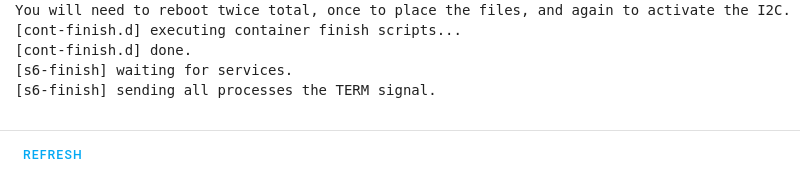

{{< quote "I2C (Inter-Integrated Circuit) est un bus informatique qui a émergé de la « guerre des standards » lancée par les acteurs du monde électronique. Conçu par Philips pour les applications de domotique et d’électronique domestique, il permet de relier facilement un microprocesseur et différents circuits, notamment ceux d’un téléviseur moderne : récepteur de la télécommande, réglages des amplificateurs basses fréquences, tuner, horloge, gestion de la prise péritel, etc. " "[Wikipédia](https://fr.wikipedia.org/wiki/I2C)" >}}

En gros, il a l'avantage de pouvoir faire passer plusieurs capteurs ou infos sur un nombre de fils restreint et c'est le protocole qui gère l'ordre d'envoi des capteurs pour éviter que deux capteurs parle en même temps. Cela a l'avantage de ne nécessiter que deux câbles :

* Un SDA (Serial Data) pour les datas,
* Un SCL (Serial Clock) pour l'horloge plus bien sur l'alimentation.

Il est présent aussi sur certain boitier de Raspberry (Ex: Argon One) mais vous pouvez aussi vous en service pour récupérer les infos d'un montage sur votre Raspberry exécutant Home Assistant OS.

### Activer l'I2C

 nous a concocté un add-on simplifiant grandement l'activation de la liaison I2C, nommé HAOS i2C Configurator. Il est disponible à partir d'[un dépôt externe](./../ha_addon/).

* Ajouter le dépôt externe via  ou [manuellement](./../ha_addon/) (url du dépot : https://github.com/adamoutler/HassOSConfigurator).
* Recharger les dépôts ou faites `F5`,
* Installer l'add-on HAOS i2C Configurator,
* Désactiver le `Protection Mode`
  
* Une alerte apparait, c'est normal,
  
* Cliquer sur `DEMARRER`.
* Vérifier les logs de l'add-on et du superviseur.
  
* Redémarrer deux fois l'hôte.
  
* Vérifier la présence d'I2C dans la liste de matériel `Configuration'->`Modules complémentaires, Sauvegardes et Superviseur`-> Onglet`Système`-> Fenêtre`Host...`en bas à droite->`Matériel`.
  

Vous pouvez redémarrer l'add-on pour confirmer.

Vous pouvez maintenant désinstaller l'add-on.

### Sources

* [Sujet HA Off addon Hassos I2C Configurator](https://community.home-assistant.io/t/add-on-hassos-i2c-configurator/264167)
* [GitHub Hassos I2C Configurator](https://github.com/adamoutler/HassOSConfigurator)