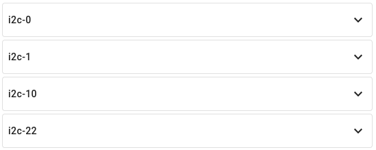
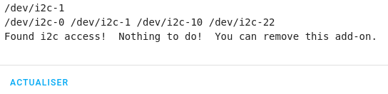
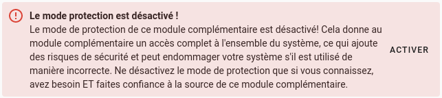

Pré-requis :

* Boitier Argon One ou Argone ONE extension
* [Activer mode Avancé](/blog/ha_installation_supervised_raspberry/#activer-les-paramètres-avancés) (pour installer l'add-on Terminal & SSH)

### Activer l'I2C

@adamoutioer nous a concocté un add-on simplifiant grandement l'activation de la liaison I2C, nommé `HAOS i2C Configurator`. Il est disponible à partir d'\[un dépôt externe](https://github.com/adamoutler/HassOSConfigurator).

* Ajouter le dépôt externe (Adresse du dépôt https://github.com/adamoutler/HassOSConfigurator)
* Recharger les dépôts ou faites `F5`,
* Installer l'add-on HAOS i2C Configurator,
* Cliquer sur `DEMARRER`.
* Vérifier les logs de l'add-on et du superviseur.
  
* Redémarrer deux fois l'hôte.
  
* Vérifier la présence d'I2C dans la liste de matériel `Configuration`-> `Modules complémentaires, Sauvegardes et Superviseur` -> Onglet `Système` -> Fenêtre `Host` `...` en bas à droite-> `Matériel`.
  

Vous pouvez redémarrer l'add-on pour confirmer.

Il faut ajouter un nouveau `repositories` puis installer l'add-on.

Dans Home Assistant, cliquer sur `Configuration`-> `Modules complémentaires, Sauvegardes et Superviseur` -> `Boutique des modules complémentaires` ->`...` en haut à droite-> `Dépots`. 
Ajouter ce `repositories`.



Puis installer l'add-on **HassOS I2C Configurator**

Il n'y a pas de configuration, juste le besoin de désactiver le `Protection Mode`

### Sources

[Argon One Add-on](https://community.home-assistant.io/t/argon-one-active-cooling-addon/262598)
[Sujet HA Off addon Hassos I2C Configurator](https://community.home-assistant.io/t/add-on-hassos-i2c-configurator/264167)
[GitHub Hassos I2C Configurator](https://github.com/adamoutler/HassOSConfigurator)
