Vous avez une machine avec un peu de puissance, comme un mini PC, et vous souhaitez faire tourner Home Assistant, mais pas que ?
Vous voulez une solution, à la fois simple et évolutive, supportant l’installation clé en main de Home Assistant OS ?
Alors [Proxmox](https://www.proxmox.com/en/) est fait pour vous.

## Proxmox, qu'est-ce que c'est ?

[Proxmox](https://www.proxmox.com/en/) est un **hyperviseur open source**, en d'autre terme, c'est une **solution** qui permet de faire de la **virtualisation**.

Un serveur Proxmox va pouvoir : 

* Faire fonctionner une ou plusieurs **machines virtuelles** (**VM**) ayant chacune son propre **système d’exploitation** (OS) et ses différents programmes installés. Exemple : plusieurs VM avec des OS Linux et des OS Windows
* Utiliser les **LXC** (des **conteneurs**), pour exécuter un "**service**" utilisant les ressources matérielles de l'OS hôte dans un environnement isolé, (les puristes m'excuseront pour le raccourci, mais c'est un peu comme docker
  qui d'ailleurs peut être lancé dans un conteneur ou dans un OS dédié)

**Exemple**
Une machine physique peut faire tourner **simultanément** :

* une VM avec une instance Windows,
* une VM avec une instance Home Assistant OS de production,
* une VM avec une instance Home Assistant OS de test,
* un conteneur avec un service EMBY ou PLEX,
* un conteneur avec le service MQTT,
* un conteneur avec un service de gestion d'onduleur,
* etc.

> **Nous décrivons dans cet article, l’installation de Proxmox et d’une machine virtuelle (VM) avec Home Assistant OS.**

## Prérequis

Disposer d'une machine type PC avec :

* Un CPU 64 bits compatible virtualisation ([Intel®](https://ark.intel.com/content/www/fr/fr/ark.html#@Processors) ou AMD)
* 4 Go de RAM **minimum** (8 Go recommandé quand on commence à accumuler les VM et/ou les conteneurs)
  128 Go de stockage **minimum** (plus si besoin).

> **NOTE** - Des micro PC d'occasion à base de I3/I5, comme les [HP EliteDesk G3 mini](https://amzn.to/41hEPwt) par exemple, font très bien l'affaire.
>
> Il y a par exemple de très bonnes affaires sur les sites qui font du recyclage de parc informatique comme [Amazon](https://amzn.to/41hEPwt), [PCPack](https://pcpack.fr/), [AFBShop](https://www.afbshop.fr/), [BlackMarket](https://www.backmarket.fr/) tout en offrant une garantie, mais aussi sur les sites de petite annonce ou Ebay.

**Mon conseil**

* Allouer 2 Go de mémoire pour l'hyperviseur et autant affectée pour chacune des machines virtuelles et conteneurs.
  Une machine virtuelle aura généralement besoin de plus de ressources  (CPU, espace disque et Mémoire) qu'un conteneur.

> **Important -** Il n'est **pas possible** de partager le même périphérique (USB comme dongle Zigbee) sur plusieurs machines virtuelles simultanément.

## Installation de Proxmox.

* Télécharger la dernière version de [Proxmox sur le site officiel](https://www.proxmox.com/en/downloads/category/iso-images-pve) (Version 7.4 à date).
* Créer une clé "bootable" [Balena Etcher](https://www.balena.io/etcher) ou de [Ventoy](https://www.ventoy.net/en/index.html).
* Démarrer votre machine dédiée sur votre clé USB, chaque machine étant spécifique, je vous laisse chercher un peu (ESC, F2, F8, F10, SUPPR).

Au démarrage, vous devriez avoir ceci :

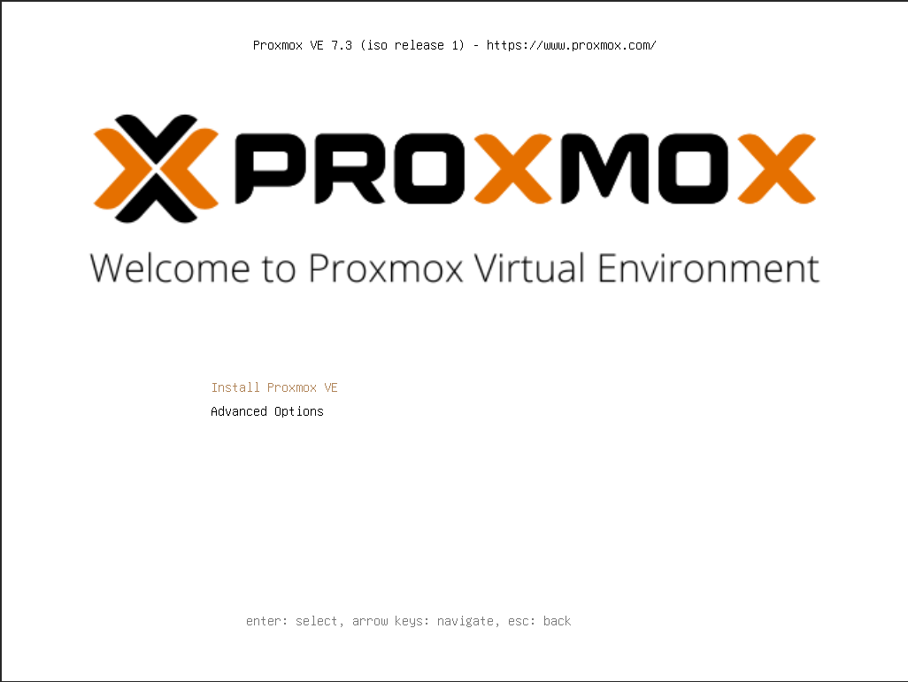

* Cliquez sur  **"install proxmox**", (*exécution un peu longue en mode terminal*),
* Cliquer sur "***I agree***",
* Sélectionner le disque dur où sera installé Proxmox.

> **ATTENTION** Si votre machine a plusieurs disques dur, choisissez le bon, c'est **irréversible** !
>
> (*Personnellement, je choisis le mode automatique*)

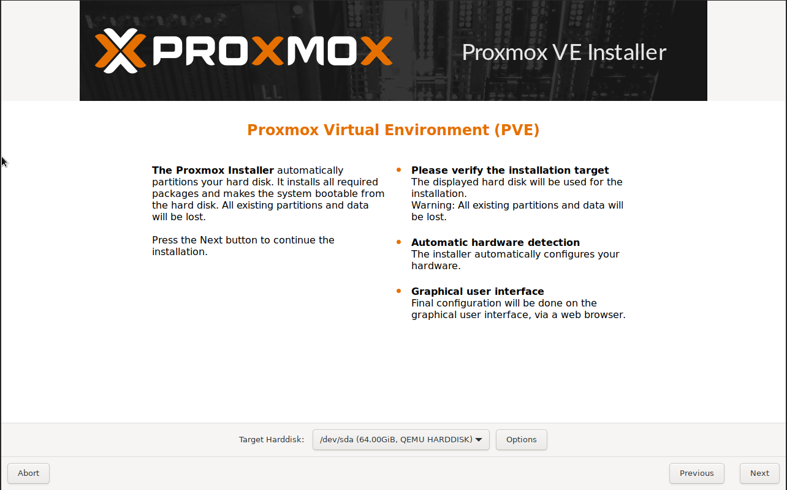

Donner ensuite :

* un nom a votre machine,
* le fuseau horaire,
* la disposition de votre clavier

Sur la page suivante :

* Renseigner un mot de passe **FORT** et une adresse email **VALIDE**,

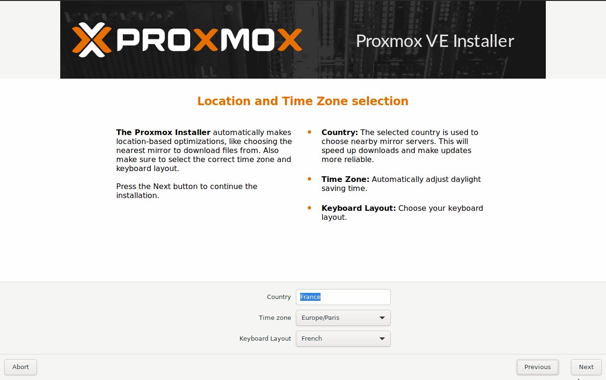

Passons aux réglages réseau :

* Sélectionner votre carte réseaux (si plusieurs, **éviter le Wi-Fi**),
* Vérifier et noter l'adresse IP affectée à votre serveur (il est possible de la changer, mais n'oubliez pas d'affecter cette adresse sur votre routeur/box),
* Cliquer sur **"INSTALL"**.

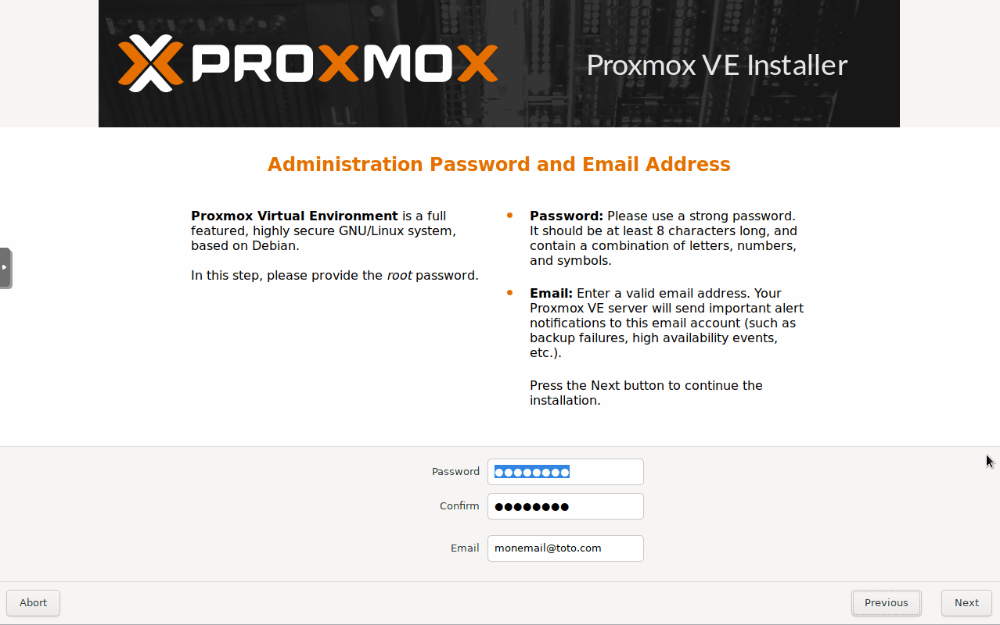

Si tout va bien, après redémarrage de la machine, on arrive sur un terminal, l'installation de Proxmox est alors fini.
Maintenant que votre serveur Proxmox est installé, normalement tout va se passer sur votre ordinateur principal.

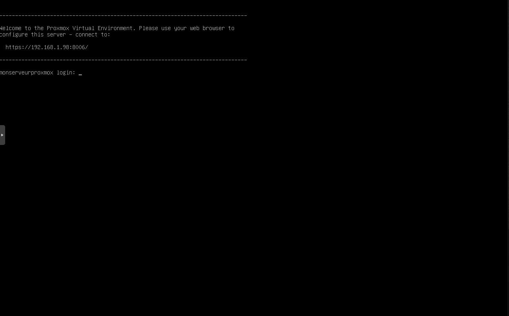

## Démarrage de Proxmox

Depuis votre navigateur préféré, 

* Connectez-vous à l'adresse suivante `https://adress_ip_proxmox:8006`

> Si vous avez oublié l'adresse IP de votre serveur, pas de panique, consultez les adresses actives sur votre routeur.

* Connectez-vous avec le login `root` et le mot de passe saisi lors de l'installation. À noter que vous pouvez aussi choisir de mettre en français et enregistrer le nom d'utilisateur.

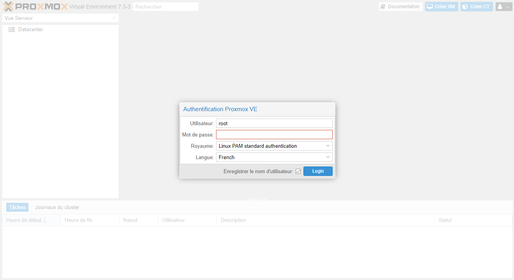

Une fois les identifiants saisis, vous devriez avoir cette boite d'information.

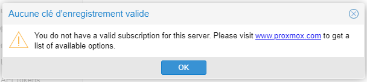

> Pas de panique, Proxmox est bien une solution de virtualisation opensource gratuite. Mais si vous souscrivez, vous avez accès à une hotline complémentaire, ce qui est le mode de rémunération de la société.

## Home Assistant

Nous voila enfin arrivé à l'installation de notre système domotique préfère (ou bientôt préfère si vous débutez).

La procédure officielle se trouve sur le [site de Home Assistant](https://www.home-assistant.io/installation/linux), mais nous allons utiliser un script qui simplifie grandement l'installation.

Rendez-vous sur le [site de tteck](https://tteck.github.io/Proxmox/).

### Mise à jour de Proxmox

Pour mettre à jour Proxmox :

* Cliquez sur **Proxmox tools**,
* Puis **Proxmox VE 7 Post Install**,
* Copiez la ligne de code affichée,

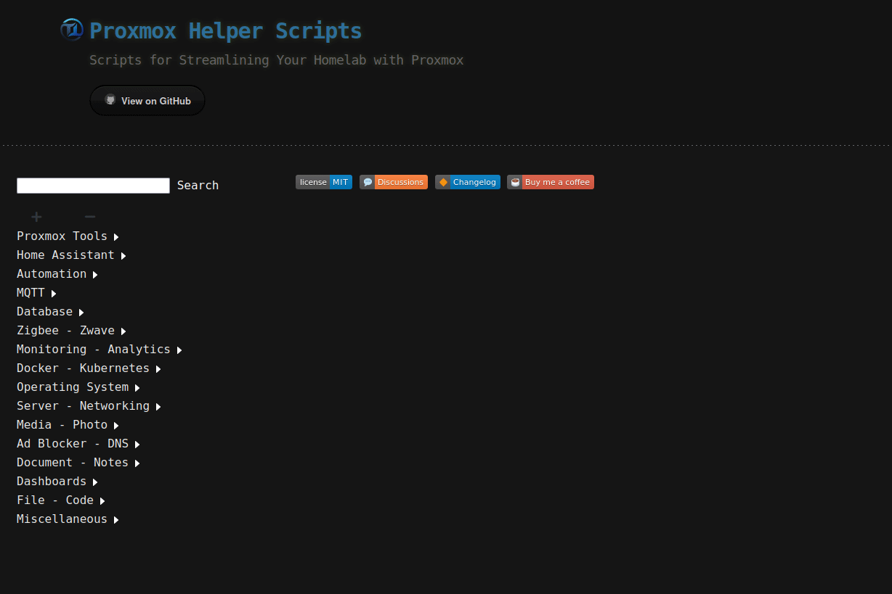

* Rendez-vous dans le Shell de Proxmox,
* Coller le code,
* Collez-la et appuyer sur **entrer**.

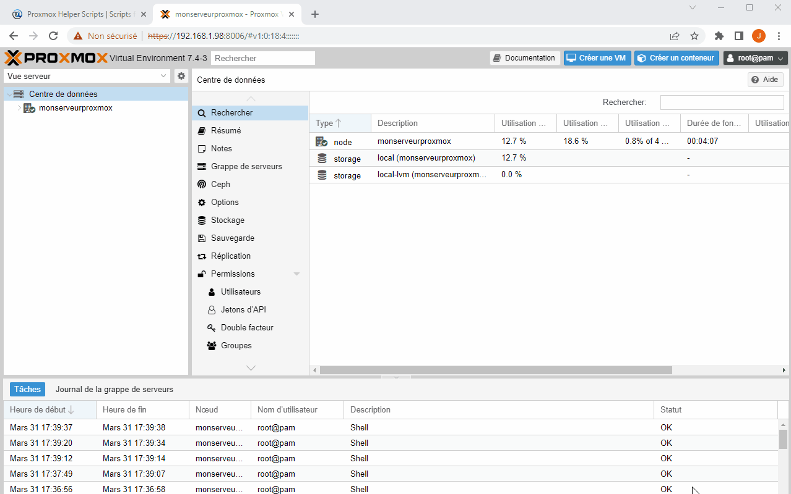

Cette étape permet de mettre à jour les dépôts permettant de maintenir Proxmox et d'enlever le popup disgracieux au login de Proxmox.

### Installation de Home Assistant

Toujours dans la page de scripts du [site de TTECK](https://tteck.github.io/Proxmox/) :

* Choisir **Home Assistant**, 
* Puis **Home Assistant OS VM**,
* Copiez la ligne de code affichée,
* Rendez-vous dans le Shell de Proxmox,
* Collez-la et appuyer sur **entrer**,
* Suivez les étapes.

  > Vous pouvez laisser les paramètres par défauts ou bien les modifier.

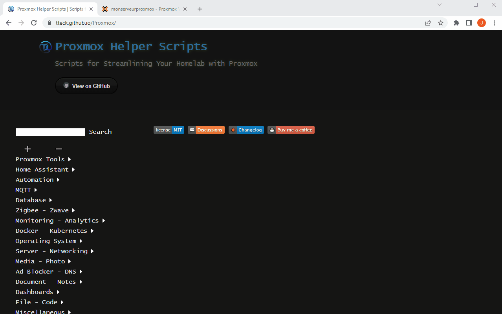

Une fois le déroulement du script terminé, retourner sur l'interface principale de Proxmox.

Vous devez voir une machine virtuelle (HA OS 9.5 à ce jour) qui doit être créée.
Cliquer sur cette machine virtuelle, vous pouvez soit consulter la page de résumé, soit accéder au Shell de la machine virtuelle (VM). Dans les deux cas, récupérer l'adresse IP de la VM qui est celle de votre Home Assistant.

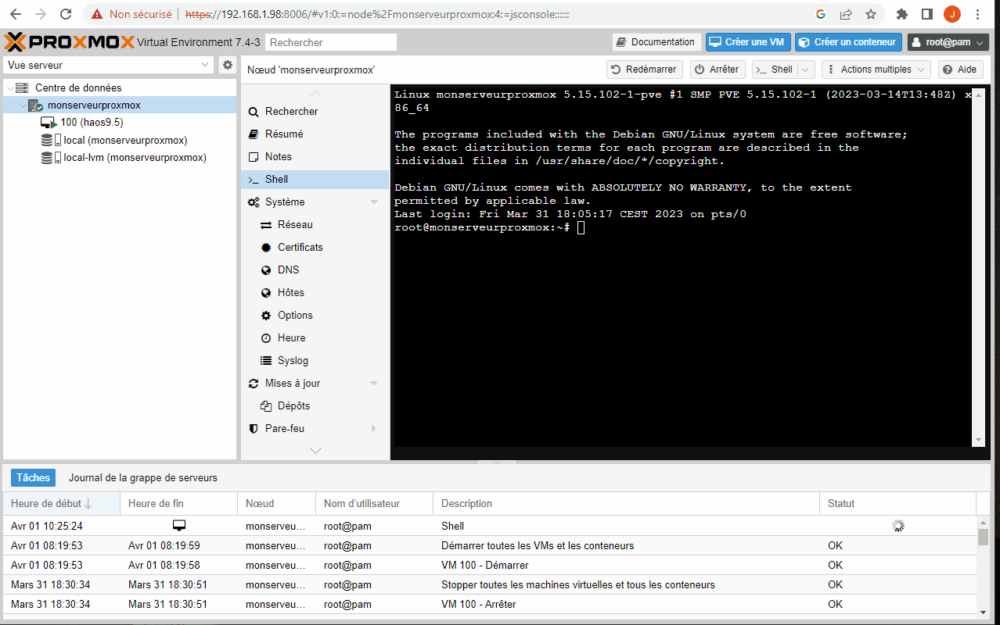

Il vous suffit de saisir cette adresse, suivie du port 8123 pour accéder au premier lancement de Home Assistant ( exemple : http://192.168.1.158:8123 ).

Continuer la configuration grâce à l'article [Premier lancement et configuration de Home Assistant](/ha_installation_premier_lancement)

## Périphériques USB

**Pour connecter votre clé USB sur votre Serveur Proxmox** :
Dans la barre verticale de gauche, choisissez la VM sur laquelle vous voulez affecter votre clé USB, puis : 

* Aller dans matériel,
* Ajouter,
* Périphérique USB,
* Utiliser les identifiants USB du fabricant et du périphérique,
* Choisir le périphérique à inclure.

Cette opération est à faire autant de fois qu'il y a de clé à inclure

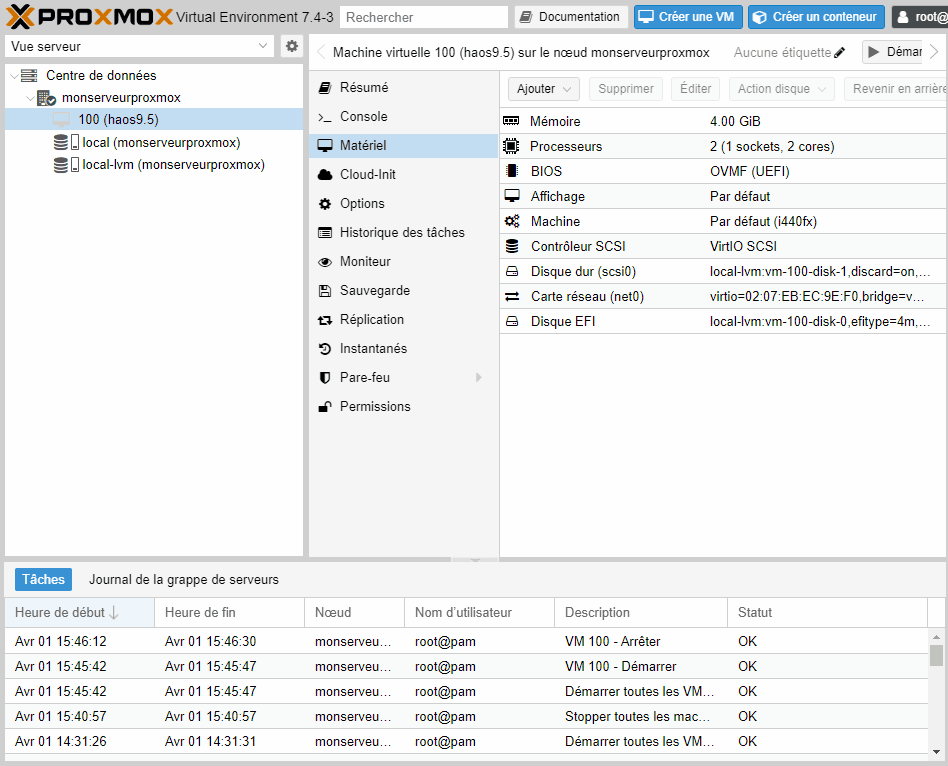

> **REMARQUES**
>
> * Un périphérique USB peut etre partagé seulement sur **une VM a la fois**.
> * Brancher et inclure une clé à la fois sur votre serveur.
> * L'association d'un périphérique peut être faite à n'importe quel moment, mais la prise en compte de ce dernier, n'aura lieu qu'après un redémarrage complet de la VM.

**Vérifier la présence de vos devices USB dans Home Assistant.**

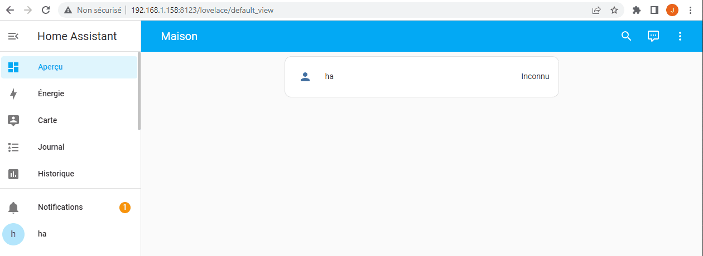

**Limitation a quatre USB.**
Une limitation de quatre périphériques peut être outrepassée via la [méthode suivante](https://forum.proxmox.com/threads/limit-for-usb-devices.89774/)

## Conclusion

L'installation de Home Assistant OS sur un serveur Proxmox vous permet de bénéficier de la version la plus complète de Home Assistant (HA OS) tout en pouvant utiliser votre matériel pour d'autres applications/services.

Vous disposez ainsi d'un système évolutif qui n'est pas dédié à Home Assistant.