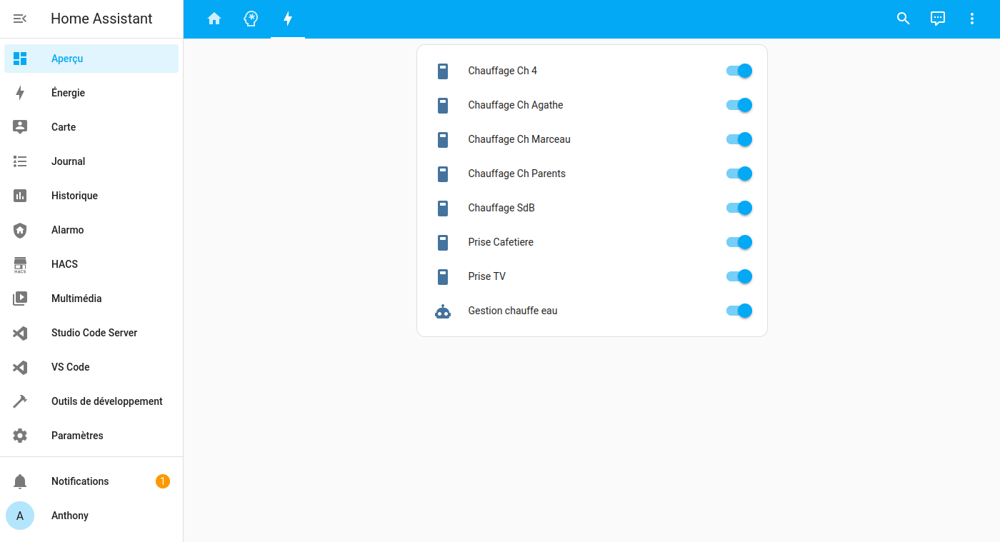
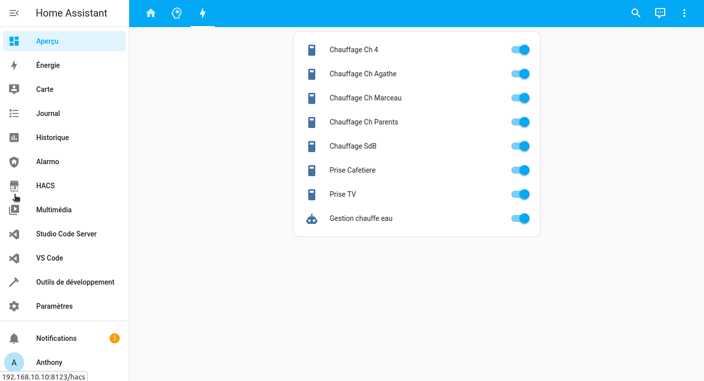
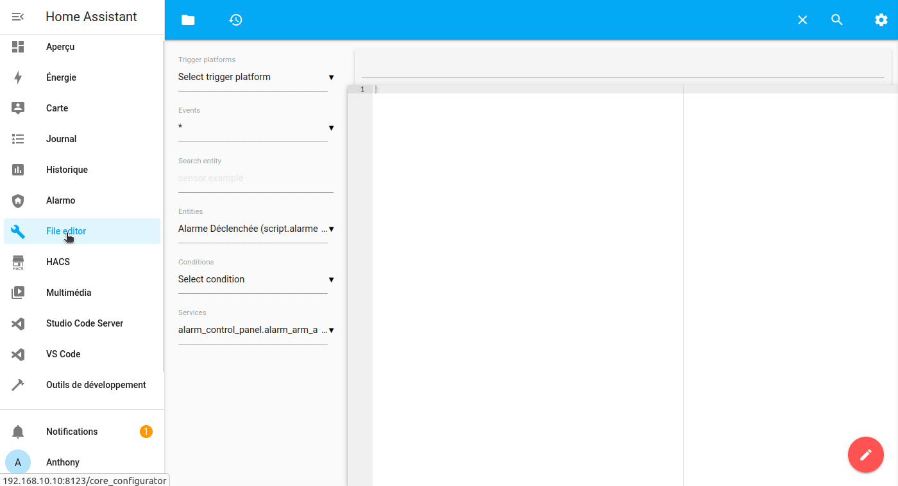

Les intégrations vous permettent d’ajouter facilement du matériel, des capteurs, des fonctions au sein de votre système domotique.

Il existe plusieurs manières d’ajouter des intégrations.

## La découverte automatique

C'est la plus simple, vous n'avez rien à faire, comme à l’installation, Home Assistant est capable de trouver automatiquement certains matériels, équipements comme les matériels compatible Home Kit, Xiaomi, Yeelight, ESPHome, Google Cast et pleins d'autres encore.

Une fois détecté, il apparaîtra dans `Notifications`, il vous suffit de cliquer dessus et de suivre la configuration à l'écran.

## L'ajout via l'interface.

Malheureusement, tout ne peut pas être détecté automatiquement, mais il y a un grand nombre d'intégrations qui peuvent être faites via l'UI de Home Assistant. Rendez-vous dans `Configuration` puis `Intégrations`, en cliquant sur le plus, en bas à droite, une liste d’intégrations s'affiche, rechercher celle que vous souhaitez et suivez les instructions à l'écran.

## L'ajout en manuel.

Pour les autres qui ne sont ni détecté automatiquement ni via l'UI, il reste la configuration manuelle via le fichier `configuration.yaml`. Même si elle fait peur, elle n'est pas vraiment plus compliquée, car les exemples donnés sur le site officiel sont simples et très explicites. Les intégrations utilisant cette dernière sont, au fil des mises à jour, intégrées vers l'UI.

> NOTA : Sur la méthodes manuelle, nous vous recommandons de lire l'articles sur l'organisation du fichier `configuration.yaml`.

## Les intégrations de HACS.

**HACS** (Home Assistant Community Store) vous permet d'ajouter des intégrations développées par la communauté **mondiale** des développeurs/utilisateurs de Home Assistant. Ces intégrations sont non officielles et leur utilisation est sous votre responsabilité.

**HACS** permettant de gérer bien plus que les intégrations, il dispose de [son propre article](/hacs_installation).

## Conclusion.

Il n'y a rien de compliqué, mais quand on débute, ce n'est jamais très évident.

### Sources.

* [Liste des intégrations de Home Assistant](https://www.home-assistant.io/integrations/).