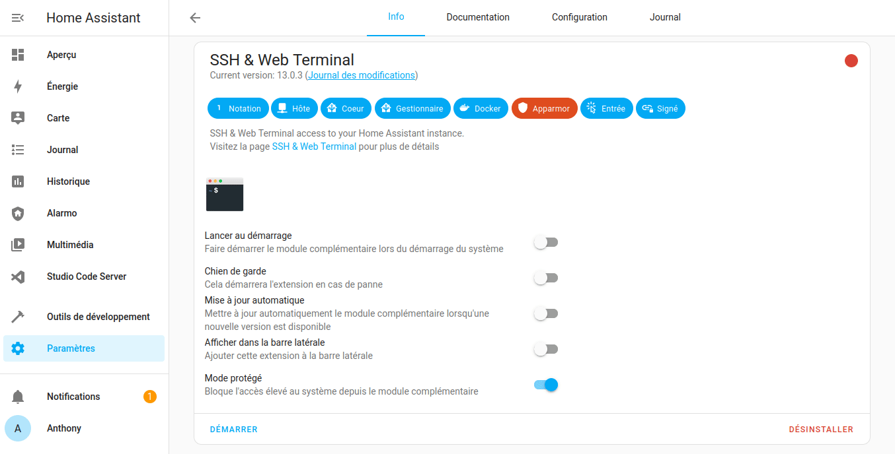
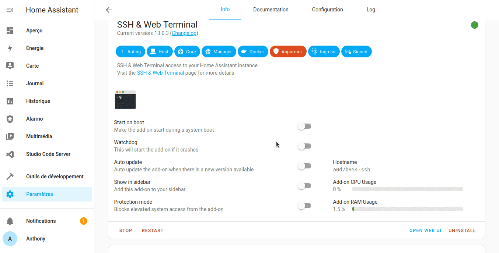
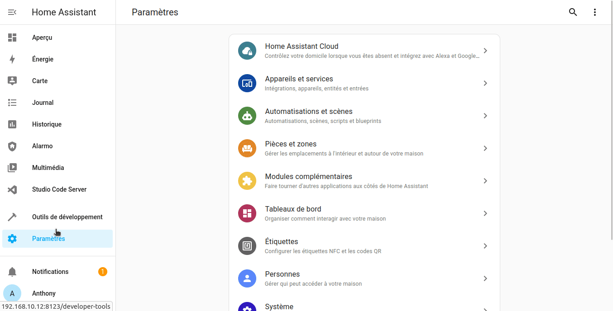
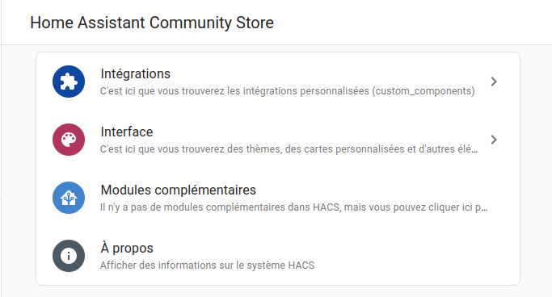

Malgré les multitudes d'intégrations, d'add-ons ou de thèmes disponibles en natif dans Home Assistant, il y a une communauté qui en développe d'autres. Parfois, lorsqu'elles sont très utilisées et utiles, elles peuvent se retrouver intégrés dans le core de Home Assistant.

Cette communauté, c'est HACS, pour Home Assistant Community Store (ne pas confondre avec HACF votre communauté Francophone préférée :wink:). 
Elle vous permet d’augmenter le nombre de matériels intégrables dans Home Assistant, à l’image d’un magasin d’intégration, de cartes, de thèmes et de scripts, d'automatisations et simplifier leurs installations.

Le travail d'une communauté mondiale au profit de tous les utilisateurs de Home Assistant, c'est la promesse de HACS. 

**Prérequis**

* Un compte [GitHub](https://github.com/),
* Avoir [installé l'add-on](/ha_addon_installation) `SSH Web Terminal`,
* Avoir `default_config` dans votre`configuration.yaml` *(par défaut normalement) sinon voir [ici](https://www.home-assistant.io/integrations/my/)*,
* Version de Home Assistant supérieure à 2022.11.0.

> *Article rédigé avec Home Assistant OS 9.5 et version Core 2023.3.2, SSH Web Terminal 13.0.2 et HACS Version 1.31.0.*

## Installation SSH Web Terminal.

Pour [installer un add-on](/ha_addon_installation), il y a déjà un article, mais je vais juste ajouter quelques informations spécifiques à `SSH Web Terminal`.

Cet add-on nécessite une petite configuration et la désactivation du mode protégé.

Après avoir téléchargé l'add-on :

* Rendez-vous dans l'onglet Configuration,
* Dans Options, renseigner un Mot de passe et un utilisateur,
* Enregistrer,
* Rendez-vous dans l'onglet infos et désactiver le mode protégé
* Démarrer l'add-on.

> Vous pouvez désactiver le lancement au démarrage si vous l'utiliser seulement pour installer HACS, sinon ne pas hésiter à mettre un mot de passe fort si vous le laisser toujours activé.



## Installation de HACS.

Ouvrir SSH & Web Terminal puis lancer la commande suivante 

```bash
    wget -O - https://get.hacs.xyz | bash -
```




Vous pouvez maintenant arrêter l'add-on Web Terminal SSH et réactiver le mode protégé.

Ensuite :

* **Vider le cache** de votre navigateur ou effectuer un rafraichissement complet (*sinon HACS n'apparaitra pas.* S'il n'apparait toujours pas, redémarrer)
* Se rendre dans `Paramètres` ->  `Appareils et services` ->  `AJOUTER L'INTEGRATION` ->  Rechercher `HACS`,
* Cliquer dessus et accepter en cochant les cases de première page,
* Cliquer sur le lien GitHub et connectez-vous,
* Saisir le code d'autorisation affiché, au moment où GitHub vous le demande,
* Cliquer sur `Authorize hacs`
* Sélectionner la pièce dans laquelle vous souhaitez ajouter HACS.



* Retourner dans `Paramètres` ->  `Appareils et services` 
* Cliquer sur `CONFIGURER` de l'intégration HACS,
* *Facultatif* Configurer votre intégration*, possibilité d'activer AppDaemon, NetDaemon (Déprécié) et les choses experimentales*

Vous devez avoir dans votre bandeau latéral, HACS de disponible et une tuile dédié dans les intégrations.

Vous avez à présent accès à plusieurs intégrations et composants d’interface supplémentaires.



## Ajouter une intégration, une interface ou une automatisation.

* Ouvrir HACS, 
* Choisir entre Intégrations, Interface ou Automatisation,
* Cliquer sur le`+ EXPLORER ET TÉLÉCHARGER DES DEPOTS' 
* Rechercher l’intégration, le thème, la carte ou l'automatisation que vous souhaitez,
* Cliquer dessus, lire le descriptif puis `TELECHARGER`,
* Vérifier votre configuration et redémarrer Home Assistant.

> Il est possible de choisir une version précise ou d'essayer une version bêta lors de l'installation d'un dépôt, bien sûr, cela est à vos risques.

## Conclusion

Vous avez à présent la possibilité d’ajouter encore plus de matériels via les intégrations de HACS, des custom cards, des thèmes grâce à la formidable communauté de Home Assistant.

### Sources

* [Site officiel](<* https://hacs.xyz/>) (EN)
* [Dernière version à télécharger si installation manuelle](https://github.com/hacs/integration/releases).