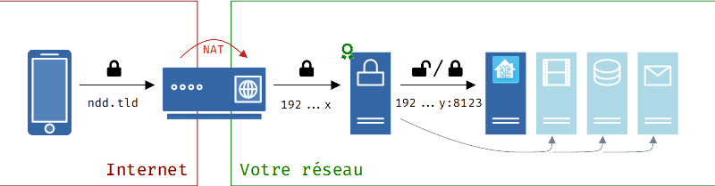

Dans cet article, nous allons essayer d'aborder tous les \*\*points important\*\* vous permettant de vous lancer avec une base solide dans Home Assistant.

Il y aura des points de réflexions vous permettant de choisir les solutions les plus adaptées à votre utilisation, vos connaissances et vos besoins dans les domaines suivants :

* Installation, 
* Add-ons indispensables, 
* Accès depuis l'extérieur,
* Les sauvegardes.

> Un article sur les concepts, plus théorique mais trés interessant, de Home Assistant est disponible [ici](/ha-concepts).

## L’installation de Home Assistant

> Ce guide est une base de réflexion sur le choix de votre installation. Ce dernier dépendra de vos connaissances, de votre matériel et du temps que vous voulez consacrer à sa gestion (hors domotique).

Il existe deux méthodes principales :

* **Home Assistant OS (HA-OS)** : Composé du Système d'exploitation (OS) **dédié** et **optimisé** pour Home Assistant et de la couche **Superviseur**.
* **Home Assistant Container (HA-container)** : Installation sur une machine possédant déjà son système d'exploitation et un système de gestion de conteneur (exemple : docker). Cette dernière installe la version **core** de Home Assistant. Tous les add-ons seront à installer et à configurer indépendamment.

Deux méthodes d'installation alternatives sont disponibles pour les **utilisateurs expérimentés** :

* **Home Assistant Supervised** : Installation manuelle de home Assistant avec le Superviseur.
* **Home Assistant Core** : Installation manuelle à l'aide de l'environnement virtuel Python.

> La version **Core** est très peu utilisée et s'adresse à des personnes **expérimentées,** de profil développeur ayant une bonne connaissance de l'environnement python. Cette solution ne sera pas abordée.

### Home Assistant OS ou HAOS.

Cette méthode d'installation implique l’utilisation de votre matériel pour une unique tâche. L’image d’installation contiendra l’OS dédié clé en main avec Home Assistant et le Superviseur.
Elle a l’avantage d’être la moins gourmande en ressources et la plus simple d’utilisation. Les mises à jour concerneront Home Assistant, mais aussi l'OS. Son installation tient du seul transfert de l'image vers un support (MicroSD, Mémoire Flash ou SSD).



En choisissant HAOS, vous débuterez, sans vous soucier d'autres choses. C'est une version **clé en main**. 
Elle permet un accès simple aux modules complémentaires (add-ons) et aux services [Nabu Casa](https://www.nabucasa.com/) de Home Assistant. C'est la méthode d'installation recommandée pour profiter pleinement de Home Assistant.

>Cette méthode est officiellement supportée pour les Raspberry, Odroid, Asus Thinkerboard et Generic X86-X64 (Intel NUC). Au vu de la penurie de ce premier, n´hesitez pas a vous orienter vers d'autres machines si vous n'en avez pas en stock.

**Article concernant l'installation de Home Assistant OS**
* [Comment installer Home Assistant OS sur Raspberry, Odroid ou autre SBC](/installation_haos)

>Enfin, si vous ne voulez pas dédier votre système à Home Assistant (sur un mini PC par exemple), vous pouvez faire une installation "Home Assistant OS" dans un **système virtualisé**. Le plus courant est **Proxmox**.

**Nous n'avons encore rien écrit sur l'installation avec Proxmox, mais si vous souhaitez le faire c'est avec plaisir.**

### Home Assistant Container.

Cette autre solution permet d'utiliser votre matériel pour Home Assistant, mais aussi d'autres services, sur l'OS de votre choix (Linux, Windows, Mac OS, Synology DSM).

Un gestionnaire de conteneur (typiquement Docker et Portainer) fera office de "superviseur", non présent par défaut dans cette installation, permettant d'installer Home Assistant **container**, mais aussi les services annexes (comprenez les add-ons) qui devront être configurés par vos soins.

> **ATTENTION :** Ce choix d'installation vous contraint à maintenir vous-même votre environnement à jour.

Home Assistant tourne alors comme un service à côté d'autres services comme MQTT, une base de donnée, un gestionnaire multimédia, etc.

**Nous n'avons encore rien écrit sur l'installation de Home Assistant Container, mais si vous souhaitez le faire c'est avec plaisir.**

### Home Assistant Supervised.
Une solution alternative, un peu particulière, permet l’utilisation de votre matériel, **avec son système d'exploitation initial**, pour différentes utilisations. Il contient Home Assistant accompagné de son superviseur et un gestionnaire de conteneur (Docker). C'est un "mélange" des deux méthodes d'installations.

> Linux est particulièrement adapté à une [installation supervised](https://github.com/home-assistant/supervised-installer). Cette façon de gérer Home Assistant est celle qui exige le plus de vous. Elle a également des exigences strictes que vous devez respecter. À moins que vous n'ayez vraiment besoin de ce type d'installation, vous devriez installer Home Assistant OS (qui peut aussi être une machine virtuelle), ou Home Assistant Container.

### Résumé des installations
| Fonctions                                                                             | HA OS  | HA Container | HA Core    | HA Supervised |
| ------------------------------------------------------------------------------------- | ------ | ------------- | ---------- | ------------- |
| [Automations](https://www.home-assistant.io/docs/automation)                          | **OK** | **OK**        | **OK**     |               |
| [Dashboards](https://www.home-assistant.io/dashboards)                                | **OK** | **OK**        | **OK**     | **OK**        |
| [Intégrations](https://www.home-assistant.io/integrations)                            | **OK** | **OK**        | **OK**     | **OK**        |
| [Blueprints](https://www.home-assistant.io/docs/blueprint)                            | **OK** | **OK**        | **OK**     | **OK**        |
| Utilise les Containeurs                                                               | **OK** | **OK**        | **X**      | **OK**        |
| [Superviseur](https://www.home-assistant.io/docs/glossary/#home-assistant-supervisor) | **OK** | **X**         | **X**      | **OK**        |
| [Add-ons](https://www.home-assistant.io/addons)                                       | **OK** | **X**         | **X**      | **OK**        |
| [Sauvegardes](https://www.home-assistant.io/common-tasks/os/#backups)                 | **OK** | **OK** *1*    | **OK** *1* | **OK**        |
| Gestion de l'OS                                                                       | **OK** | **X**         | **X**      | **X**         |

1 : Les sauvegardes pour Home Assistant Core et Home Assistant Container sont fournies par l'[intégration de la `sauvegarde`](https://www.home-assistant.io/integrations/backup).

### Nos conseils pour l'installation.

* **Si vous êtes débutant, choisissez HA OS** pour vous concentrer sur la domotique de votre logement, plutôt que la mise en place et le maintien de votre système. Allez au plus simple et, une fois la prise en main effectuée, vous pouvez changer de type d'installation (tout ne sera pas à refaire).
* **Si vous ne voulez pas dédier une machine à Home Assistant, envisagez une virtualisation Proxmox.**
* **Si vous découvrez Linux, docker, les VMs, partez sur des installations préconfigurées,** vous les trouverez disponibles pour NUC, Raspberry, Odroid, etc. Par image préconfigurée, j'entends, une image faite pour votre matériel, comprenant l'OS (système exploitation) et Home Assistant avec le Superviseur.

> **Attention**. Si vous envisagez un jour une migration, il faut savoir, que lors du passage d'un type d'installation a un autre, la partie **core** (entités, automatisations, intégrations, *backup*) sera facilitée par les sauvegardes de Home Assistant, mais pas les add-ons par exemple.

## Les add-ons.
Les add-ons permettent d’ajouter des fonctions, services ou autres à votre système domotique.
Des services très connus et reconnus (comme VSCode, MariaDB, Node-Red, Grafana, InfluxDB, DuckDNS, etc.) sont quasi configurés pour communiquer simplement avec votre Home Assistant.

Il existe plusieurs façons d'ajouter un add-on :

* Les officiels : installable via les modules complémentaires,
* Les non-officiels : installable via les modules complémentaires, mais nécessitant l’ajout du dépôt GitHub en manuel,
* Via [HACS (Home Assistant Community Store)](https://hacs.xyz/) : HACS est une bibliothèque d'add-ons, de thèmes, de cartes personnalisée (Custom Card) développé par des membres de la communauté, permettant à chacun de rendre son travail accessible à tous. Ces add-ons, cartes, thèmes ne sont pas officiels, vous êtes donc seul responsable de leurs installations.

* [Comment installer un add-on officiel, non officiel](/ha_addon_installation)
* [Comment installer HACS](/hacs_installation)

>Home Assistant a mit à disposition des développeurs un script générant un bouton (pour les BluePrint, Dépots, etc) qui, d’un simple clique, fait les actions à votre place. Cela nécessite simplement de saisir l’adresse de votre instance.
> 

### Quels sont les add-ons indispensables ? 
Même si cette question reste très subjective, voici une liste non exhaustive des add-ons les plus communs est utiles :
* *File Editor ou VSCode* : Permet l'édition des fichiers de configuration.
* *Terminal* : Permet de lancer des commandes via un Terminal intégré directement dans votre interface (évite l'ouverture de l'accès SSH) et d'installer HACS.
* *Samba* : Permet de rendre accessible les dossiers de configuration sur votre réseau local.



## L'accès l'extérieur.
Accéder à son système domotique depuis n'importe où dans le monde est primordial, mais il faut prendre conscience que cela peut ouvrir une brèche de sécurité sur votre système domotique et aussi sur votre réseau interne. Il convient donc de faire attention à ce que l'on fait.

Il y a plein de solutions différentes avec des avantages, des inconvénients et des limitations qui ne sont pas toujours faciles d’appréhender quand on a une expérience limitée en réseau.

Nous allons traiter ici les solutions pouvant être directement intégrées à Home Assistant.

Ces solutions sont :
* Via Nabu Casa,
* Via accès direct en HTTP,
* Via accès direct en HTTPS,
* Via des services externes,
* Via une Box qui permet le "Loopback" ou un service DNS local,
* Via un proxy inversé (reverse proxy),
* Via un VPN, * Via un prestataire tiers de services réseaux.

Passons en revue ces différentes solutions.

> **Avant toute chose :** N'imaginez pas un accès vers votre réseau avec des communications NON chiffrées, nous parlerons donc ici uniquement d’accès via HTTPS!

### Nabu Casa (Home Assistant Cloud)
>[Nabu Casa](https://www.nabucasa.com/) est la société créée par les fondateurs de Home Assistant.

Sûrement la solution la plus simple, mais sécurisé, permettant de se connecter à son instance depuis n'importe où. Elle permet aussi de soutenir le projet lui-même pour 7.50 euros/mois ou 75 euros/an en plus de faciliter l'utilisation des assistants vocaux (Google Assistant et Alexa).

#### Principe
Fonctionnant sur le même principe que Cloudflare ou Zerotier (mais sans add-on), le service fournit un accès depuis leur serveur vers votre serveur HA, vous avez uniquement besoin de configurer votre HA avec ce service.

**Avantage(s)**
* Pas besoin d'un Nom de domaine,
* Facilité de mise en œuvre,
* Pas de ports à ouvrir sur votre Box,
* Sécurité (dépend de la sécurité de Nabu Casa),
* Un essai de 31 jours.

**Inconvénient(s)**
* Un abonnement mensuel ou annuel,
* Accès seulement à HA depuis l'extérieur.

**Nous n'avons encore rien écrit sur l'accès avec Nabu Casa, mais si vous souhaitez le faire c'est avec plaisir.**

### L'accès direct en HTTP.

L’accès direct est le plus simple en terme d’architecture, mais pas forcément le plus souple et le plus sécurisé.

#### Principe.
Le principe est de rediriger les requêtes de votre client (app mobile/navigateur) qui arrivent sur votre Box (via un nom de domaine ou votre IP) vers l’IP interne (ex :192.x.x.x:8123) de votre Home Assistant.

> Voir le shéma en HTTPS, ci-dessous, en supprimant les échanges sécurisés.

**Avantage(s)**
* Peu d'éléments à configurer : la Box et HA

**Inconvénient(s)**
* Peu sécurisé : HA est directement exposé via votre Box et cette dernière n'a pas de Pare-feu très développé,
* Besoin de configuration dans le fichier `config.yaml`
* Association exclusive d'un port de l'IP publique de votre Box à HA (vous pouvez évidemment utiliser d'autres ports pour d'autres services).

**N'étant pas une solution sécurisée et recommandée, nous ne pensons pas écrire dessus**

### L'accès direct en HTTPS.
Cela reprend le principe de l'accès direct, mais en y ajoutant une **petite** couche sécurité via un certificat SSL.

#### Principe.
Avec un nom de domaine (NDD) ou via un prestataire externe (DuckDNS) et en s'appuyant sur des add-ons (Let's Encrypt, DuckDNS, ...), vous allez rediriger les requêtes de votre client (app mobile/navigateur) vers votre box qui redirigera vers votre Home Assistant. Cette fois l'échange d'information sera chiffré, mais toujours sans protection d'un pare-feu autre que celui intégré votre box.

**Avantage(s)**
* Pas de NDD à acheter (si prestataire externe comme DuckDNS),
* Un peu plus sécurisé que l'accès HTTP,
* (En fonction du service) Validation des certificats et régénération automatique.

**Inconvénient(s)**
* Peut rendre plus compliqué l’accès en local (passage par le NDD),
* Ouverture du port de votre Box,
* Pas de pare-feu digne de ce nom,
* Problème de connexion avec certaine box via le NDD en local "loopback" (Orange).

**Nous n'avons encore rien écrit sur l'accès avec en HTTPS sur le site, mais certains existe sur le [forum](https://forum.hacf.fr).**

### Via un proxy inversé
La mise en place d'un proxy inversé via Home Assistant (Ex : Nginx Proxy Manager) peu être un peu plus complexe, mais elle peut permettre de sécuriser un peu plus que la solution précédente.

La mise en place d'un proxy inversé sur une autre machine Home Assistant (Ex : Swag) est aussi plus complexe, mais elle permet de sécuriser encore plus votre installation.

#### Principe
Le principe ici est de mettre ce proxy inversé entre votre Box et votre serveur Home Assistant. De ce fait, c'est votre proxy inversé qui prend en charge la connexion sécurisée avec votre client. Le reste de la communication vers votre serveur Home Assistant peut rester non chiffrée (HTTP).

**Avantage(s)**
* Sécurité accrue avec l'ajout d'un service intermédiaire et des fois d'un pare-feu,
* Possibilité d'exposer d'autres services que HA sur l'extérieur (Grafana, Synology, etc) sur le même port que HA
* Configuration SSL automatisé ou plus souple suivant le produit de proxy inversé
* Validation des certificats et régénération automatique.

**Inconvénient(s)**
* Complexification : configuration d'un service intermédiaire et sa compréhension dans l'architecture.

**Nous n'avons ps encore tout réécrit sur le site donc certains sont sur le site et d'autres existe sur le [forum](https://forum.hacf.fr).**

* [Accès de l’extérieur en HTTPS avec Nginx Proxy Manager](/ha_acces_ext_npm)

### 4. Via un opérateur tiers de services réseaux (autre que Nabu Casa)

Cette solution fait appel à un opérateur tiers (Cloudflare, Zerotier) pour se connecter à son réseau. Cela peut être gratuit ou payant et pourrait nécessiter l'installation d'un module complémentaire (add-on). *Elle peut aussi être associée à un accès externe via VPN*.

#### Principe
Le principe est le même qu'avec [Nabu Casa](#Nabu Casa (Home Assistant Cloud)), mais via un autre prestataire.

**Avantage(s)**
* Accès via un tiers de confiance qui gère une partie de la sécurité et parfois le NDD,
* Pas besoin d’ouvrir de port sur votre box.

**Inconvénient(s)**
* Un service et add-on supplémentaire.

### 5. Via un VPN
Cette solution, à but informatif, est réservé aux personnes ayant des compétences en réseaux, car c'est bien plus ardu et complexe.

#### Principe
Le schéma présente de façon très simplifiée le principe. Via un client VPN installé sur votre mobile ou PC distant, vous aurez un accès à votre réseau local directement (moyennant quelques contraintes dépendantes de routage).

> **Nota :** Une offre (gratuite à date) de la société [ZeroTier](https://www.zerotier.com/) permet de créer un VPN sans avoir besoin de toucher à sa Box internet, un plus indéniable, d'autant qu'[un add-on Home Assistant](https://github.com/hassio-addons/addon-zerotier) existe !

**Avantage(s)**
* Accès direct à tout votre réseau (pas seulement Home Assistant et pas uniquement en HTTPS),
* Accès sécurisé.

**Inconvénient(s)**
* Être un utilisateur très averti,
* Client VPN à installer sur son mobile ou PC distant.

### Solution / conseil ??
Comme vous pouvez vous en douter, il y a plein de solution adapté à différent niveau de compétence. Même si nos articles essai de rendre tout ça le plus simple possible, ne vous lancez pas dans des solutions complexes que vous ne comprenez pas.

Le meilleur rapport facilité sécurité est [Nabu Casa](#Nabu Casa (Home Assistant Cloud)) même si elle est payante. Les autres solutions recommandées sont, soit le passage par un prestataire externe vous évitant d'ouvrir les ports de votre box internet ou alors l'utilisation d'un reverse proxy.

## La sauvegarde.
Dernières étapes avant de commencer à jouer avec votre solution domotique, la sauvegarde.
Une étape **très importante**, que l'on soit débutant ou confirmé, et qui devrait toujours être votre première préoccupation lorsque vous testez ou utilisez un service ou une app.

Il est primordial d'effectuer des sauvegardes régulières, mais aussi de les disperser à plusieurs endroits).

>**La règle du 3-2-1, qu'est-ce que c'est ? :** 3 sauvegardes. 1 sauvegarde sur 2 supports differents et 1 sauvegarde a l'exterieur.

Il y a plusieurs moyens de faire des sauvegardes :
* En manuelle ou automatique, qui reste sur votre système et récupérable via l'UI ou alors via un partage avec l'add-on Samba Share,
* Un envoi vers un espace cloud (Ex : Google Drive),
* Un envoi vers un NAS sur le réseau local.

Il n'y a pas de méthode à privilégier, car il faut mélanger les sauvegardes locales et distantes.

En cas de soucis, il est possible de restaurer une sauvegarde via l'UI (`Paramètres->`Système`->`Sauvegardes`) ou alors dès le premier lancement en cas de crash total. 
>La gestion des sauvegardes est maintenant disponible sur HAOS et HA Container.

**Nous n'avons encore rien écrit sur les sauvegardes sur le site, mais certains existe sur le [forum](https://forum.hacf.fr).**

## Conclusion.
Nous touchons à la fin de cet article assez généraliste, mais vous permettant d'approfondir et de vous orienter vers des articles adaptés à vos besoins et vos demandes.

Il n'est pas un guide **ultime**, mais bien une aide dans la compréhension et la prise de vos décisions.

N'hésitez pas à nous faire remonter les erreurs ou partager vos trouvailles sur le forum.

### Sources
* [Home Assistant Installation Officiel (EN)](https://www.home-assistant.io/installation/)
* [Home Assistant Backup Officiel (EN)](https://www.home-assistant.io/integrations/backup/)
* [Home Assistant Add-ons Officiel (EN)](https://www.home-assistant.io/addons)
