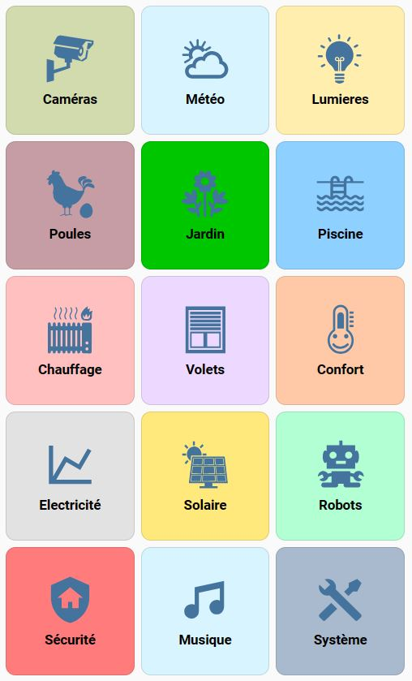

Cet article propose comment réaliser une interface conviviale pour mobile (iPhone, Android).

**Le mobile est LA "zappette" de votre système domotique**. C'est lui qui permet d'interagir avec votre maison en déplacement, et l'interface doit être traitée avec le plus grand soin. La taille réduite de l'écran fait que l'interface dédiée à une tablette ou un ordinateur n'est pas appropriée, et il est préférable d'en recréer une spécifiquement.

Cet article vous présente comment concevoir une page d'accueil avec un menu en tuiles, donnant accès via des sous-vues aux différentes fonctions de son système domotique. 

Les éléments à afficher sont regroupés par catégorie (ou cas d'usage) : sécurité, météo, électricité, lumière... Un page (une sous-vue) est dédié à chaque catégorie. Le menu du haut par défaut est supprimé, la navigation étant assurée par la page d'accueil avec son menu en tuiles. Enfin, chaque page relative à une catégorie a un bouton de retour vers le menu d'accueil.

Dans mon cas, ayant beaucoup, mais vraiment beaucoup d'éléments à afficher, j'ai fait le choix de répartir les éléments importants pour ma famille dans **15 pages dédiés**, regroupées par principaux cas d'usage. Les éléments non importants pour la famille sont eux "cachés" dans des pages annexes (de niveau 2) accessibles depuis les pages principales. Le menu d'accueil est donc constitué de **15 tuiles** donnant accès à 15 pages principales de niveau 1. 15 est d'ailleurs probablement le maximum pour garantir une bonne expérience utilisateur.




> **CONSEIL** Pour une bonne expérience utilisateur, les catégories doivent être logiques pour votre famille et correspondre aux grands cas d'usage. Affichez dans les pages principales (niveau 1) les éléments les plus utilisés en premier, cacher les éléments qui ne sont utilisés que par vous dans une vue système ou dans des pages annexes de niveau 2.
>
> **Pré-requis** : avoir installé  installé [Home Assistant Community Store (HACS)](https://hacs.xyz/). Ce tuto utilise 2 intégrations de la communauté (card-mod et layout-card).

## Le menu en tuiles

Voyons ici comment créer la page d'accueil et son menu en tuiles.

**Installer card-mod**

Ouvrir HACS puis installer [card-mod](https://github.com/thomasloven/lovelace-card-mod), une librairie qui permet de faire du CSS et changer les couleurs des textes et des polices des boutons. 

Dans HACS, cliquer sur Interface, puis bouton "Explorer et télécharger des dépôts", et enfin rechercher "card-mod" et installez-le. Pensez à faire un rafraîchissement du navigateur.

**Créer une vue dédiée pour le menu**

Tout d'abord, créer une nouvelle vue qui sera dédiée à votre menu :

* Aller dans votre dashboard, puis mettez-le en mode édition, via le menu avec 3 points en haut à droite.
* Renommez le dashboard en "Maison" (ou tout autre nom pertinent pour vous), en cliquant sur le symbole à droite de son nom.
* Dans la barre d'entête de la vue, cliquer sur le bouton + tout à droite
* Renseignez le nom de la vue (mettre "Menu") et l'URL (mettre "Home").

Mettez maintenant cette vue en premier dans vos vues pour qu'elle s'affiche quand vous lancerez votre dashboard. Pour cela, vous avez des flèches permettant de déplacer la vue active et la déplacer en premier. 

**Créer la grille de boutons**

Maintenant la vue étant créée, il faut ajouter une carte grille. 

* Cliquer "Ajouter carte" en bas à droite, puis choisissez la carte Grille. Laissez coché "Rendre les cartes sous forme de carrés"
* Laisser la valeur par défaut "Nombre de colonnes" à 3.
* Ajouter autant de bouton que votre menu en contiendra en cliquant sur + dans le paramétrage de la grille.
* Vous pouvez rajouter des boutons en cliquant sur + jusqu'à obtenir toutes les entrées du menu. Mais il peut être plus simple de passer la carte en mode YAML. Pour cela, cliquer sur "Afficher l'éditeur de code" dans la configuration de la carte. 
* Remplacer le code YAML par le code suivant, qui va créer 2 boutons. Vous pourrez en ajouter d'autres ultérieurement.

```yaml
type: grid
cards:
  - type: button
    tap_action:
      action: navigate
      navigation_path: /lovelace/cameras
    name: Caméras
    icon: mdi:video-outline
    style: |
      ha-card {
        background: #CDC2EE;
        font-weight: bold;
      }
  - type: button
    icon: mdi:weather-partly-cloudy
    tap_action:
      action: navigate
      navigation_path: /lovelace/meteo
    name: Météo
    style: |
      ha-card {
        background: #BAE0F1;
        font-weight: bold;
      }
```

Vous devriez obtenir une grille basique avec 2 boutons, textes en gras et les couleurs spécifiées.


Restera à ajouter les autres boutons. Chaque bouton a une URL qui permettra de naviguer vers les sous-vues dont la création est décrite ci-après.

Ci-dessous différentes couleurs qui m'ont été proposées par un graphiste pour leur cohérence. J'ai déporté les **couleurs**  dans un thème, mais vous pouvez mettre les codes couleur directement dans le code YAML de votre grille.

```yaml
camera-color: '#CDC2EE'
meteo-color: '#BAE0F1'
lumieres-color: '#FDF4B7'
poules-color: '#EED7BD'
jardin-color: '#CDF0C1'
piscine-color: '#C9FFF3'
chauffage-color: '#FCCFDA'
volets-color: '#F1FFFA'
confort-color: '#FFDFAF'
solaire-color: '#FCFFAD'
robots-color: '#AFFFBE'
securite-color: '#FFB8B8'
medias-color: '#E8D7FF'
consos-color: '#C9FFE1'
system-color: '#D9FFFB'
```

Pour les **icônes**, vous pouvez utiliser des icônes *Material Design* (MDI) par défaut. Mais je vous conseille de créer vos propres icônes, ou récupérer des icônes toutes faites, en suivant l'excellent tuto de @clemalex ([Ajouter ou créer des icônes](https://forum.hacf.fr/t/ajouter-creer-des-icones/4190)).

## Créer les différentes pages

Les différentes pages sont des vues du dashboard avec l'option "sous-vue" activée.

Voici une illustration de l'utilisation du menu et l'accès à 2 pages ou sous-vues (catégories Météo et Electricité).


Pour cela, on va créer autant de vues que l'on a de boutons (15 vues dans mon cas). Pour cela, mettre le tableau de bord en mode édition, et dans la barre de menu appuyer sur `+` pour créer une nouvelle vue.

Renseigner le nom de la vue, mettez une icône, mais surtout :

* Renseigner une URL (ci-dessous) : elle sera à utiliser dans le menu tuile pour le bouton qui appelle la vue
* Activer "sous-vue". Aussi, vous aurez en haut à gauche une flèche de retour permettant de revenir en arrière (vers le menu tuile).


Reste plus qu'à aller dans le menu tuile et renseigner l'URL dans le code du bouton associé, puis tester :

```yaml
  - type: button
    icon: argo:meteo
    tap_action:
      action: navigate
      navigation_path: /lovelace/meteo
    name: Météo
    style: |
      ha-card {
        color: var(--text-menu-color);
        background: var(--meteo-color);
        font-weight: bold;
      }
```

Pour information, Lovelace est le nom de mon dashboard (nom historique....). Vous pouvez utiliser une autre nom de dashboard.

**Ne plus avoir d'icônes dans la barre de menu.**

 Forcément avec plus de 15 vues, vous ne voudrez pas laisser les icônes de la barre de menu. La navigation se fera maintenant par le menu tuile. **Vous pouvez juste laisser "Maison" dans la barre du haut.** Cela sera automatiquement fait **en définissant toutes les vues, à part le menu tuile, comme sous-vues.**

> **ATTENTION** - Seule la vue "menu" doit être une vue, et toutes les autres doivent être des sous-vues pour qu'aucun icône ou texte ne s'affiche dans la barre d'entête**.** 

## Maîtriser l'ordre des cartes dans les vues

Pour votre dashboard "mobile", vous voudrez avoir sur votre ordinateur les cartes **dans l'ordre** dans lequel elles s'affichent sur les mobiles, et **en colonne**.

Pour cela, vous allez charger dans HACS / partie interface la [Layout Card](https://community.home-assistant.io/t/layout-card-take-control-of-where-your-cards-end-up/147805) : elle vous permet d'indiquer comment gérer vos cartes dans une vue.

Une fois installée, vous avez deux nouveaux champs dans la configuration des vues : "Type de vue" et "Nombre de colonnes".


Mettre les sous-vues en **mode "Vertical"** et **max_cols à 1** comme indiqué dans l'image précédente.

> Le layout du menu en tuile peut aussi être modifié pour le rendre plus performant : en spécifiant son mode  Masonry.

## Cacher vos paramétrages dans des pages de niveau 2

Les pages principales accessibles depuis le menu ne doivent contenir que des informations et des fonctions **essentielles pour votre famille**.

Aussi, si vous avez des informations secondaires ou utilisées que par vous : paramétrage des heures de fermeture ou ouverture des volets, niveaux des piles,  etc, je vous conseille de créer un bouton dans votre page qui accède à une autre **page annexe, de niveau 2** dédiée aux informations secondaires. Cela rendra l'interface plus claire et conviviale.

Voici un exemple, avec le paramétrage des volets dans une page (ou sous-vue) de niveau 2 :


Pour cela, créer une carte bouton dans votre sous-vue de niveau 1, créer une nouvelle sous-vue qui contiendra vos paramètres. Lier le bouton à la sous-vue en spécifiant dans la même URL dans le bouton et la sous-vue niveau 2.

Voici le code du bouton utilisé dans l'exemple précédent :

```yaml
type: custom:button-card
name: Paramétrage des volets...
styles:
  card:
    - background-color: var(--section-color)
    - height: 50px
  name:
    - font-size: 18px
tap_action:
  action: navigate
  navigation_path: /lovelace/volets-param
```

## Utiliser des cartes conditionnelles

Enfin, si une carte doit contenir beaucoup d'informations, vous pouvez mettre en entête des boutons avec un affichage conditionnel des différentes cartes en fonction du bouton sélectionné. Attention, la sélection sera valable pour tous les utilisateurs.

Illustration avec la sélection d'une caméra parmi 3 dans une maison de rêve (pas la mienne, c'est juste un exemple, dommage...).


Je n'irai pas dans le détail dans ce tuto et je donne un rapide aperçu du fonctionnement :

On va créer un `input_text` qui contient le nom de la caméra à afficher (plage, garage, piscine).

Les boutons mettent la bonne valeur dans l'`input_text` quand ils sont sélectionnés. La couleur change également. Voici le code des boutons (basé sur des [custom:button-card](https://github.com/custom-cards/button-card), intégration disponible sur HACS).

```yaml
type: grid
cards:
  - type: custom:button-card
    name: Plage
    entity: input_text.selection_camera
    show_icon: true
    color_type: card
    icon: mdi:beach
    color: var(--bouton-gris)
    state:
      - value: Plage
        color: var(--bouton-orange)
    tap_action:
      action: call-service
      service: script.selectionne_camera
      service_data:
        camera: Plage
  - type: custom:button-card
    name: Garage
    entity: input_text.selection_camera
    show_icon: true
    color_type: card
    icon: mdi:car
    color: var(--bouton-gris)
    state:
      - value: Garage
        color: var(--bouton-orange)
    tap_action:
      action: call-service
      service: script.selectionne_camera
      service_data:
        camera: Garage
  - type: custom:button-card
    name: Piscine
    entity: input_text.selection_camera
    show_icon: true
    icon: mdi:pool
    color_type: card
    color: var(--bouton-gris)
    state:
      - value: Piscine
        color: var(--bouton-orange)
    tap_action:
      action: call-service
      service: script.selectionne_camera
      service_data:
        camera: Piscine
columns: 3
square: false
```

Et enfin, on va créer trois cartes (une par caméra) avec un affichage conditionnel en fonction du contenu de l'`input_text`, et donc du bouton appuyé.

Voici le code d'une carte qui s'affiche si on clique sur "Plage" :

```yaml
type: conditional
conditions:
  - entity: input_text.selection_camera
    state: Plage
card:
  type: picture
  image: >-
    https://www.dreamingofmaldives.com/blog-des-maldives/wp-content/uploads/plage-de-reve-maldives.jpg
  hold_action:
    action: none
```

## Un dashboard pour mobile et un autre pour tablette.

Vous pouvez facilement créer un dashboard dédié à votre tablette et un dashboard dédié aux mobiles comme celui présenté ici.

Pour cela, vous devez créer un utilisateur "Tablette", puis un utilisateur par personne de la famille.

Dans l'application "compagnon", rendez-vous dans les paramètres de l'utilisateur : vous pouvez choisir le dashboard utilisé pour l'utilisateur connecté (tablette ou mobile).

## Conclusion

Cette présentation n'est qu'une proposition d'implémentation, et chacun retiendra ce qui l'arrange. Il est possible par exemple d'utiliser des badges (dont je ne suis pas fan) qui s'afficheront en entête des sous-vues ou en haut du menu.

Bien entendu, les immenses possibilités de Home Assistant font qu'il y aura autant de type d'interface que d'utilisateurs. N'hésitez pas à proposer vos implémentations et faire vos retours.