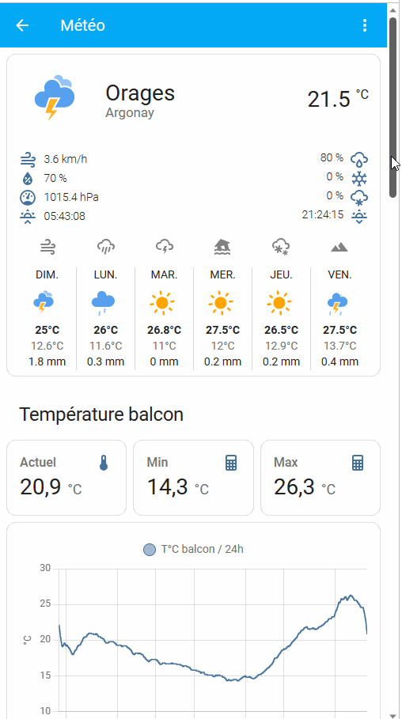
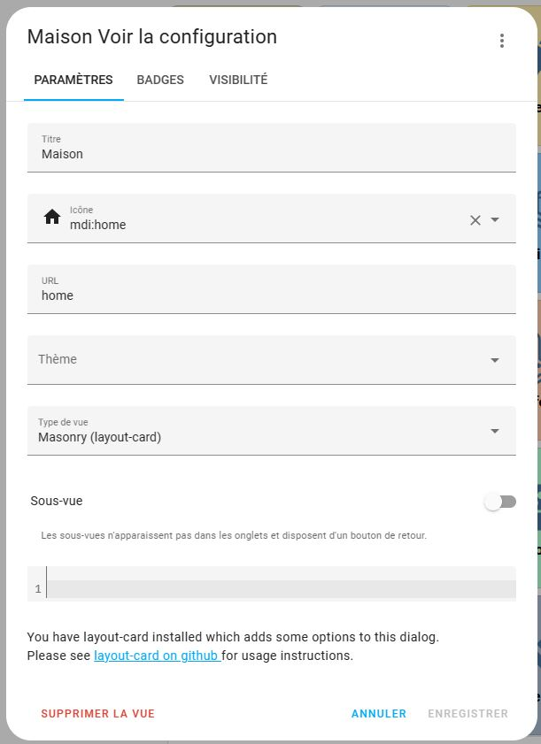
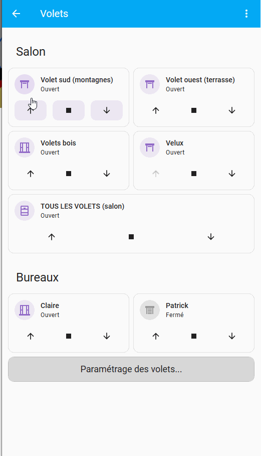
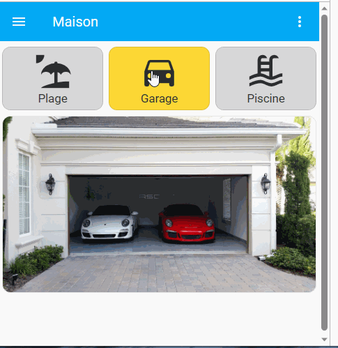

Cet article propose comment réaliser une interface conviviale pour mobile (iPhone, Android). 

L'idée est d'avoir une page d'accueil de menu en tuile, donnant accès aux différentes fonctions de son système domotique. Chaque groupe de fonctions est regroupé dans une sous-vue dédiée. Le menu du haut par défaut sera supprimé, la navigation étant assurée par la page principale en tuile, avec un bouton de retour sur les différentes vues.

## Quelques considérations d'UX Design

UX signifie Expérience utilisateur. L'idée est de réfléchir comme créer un système **convivial** et **intuitif** pour toute la famille. Il s'agit de répondre par exemple au fameux WAF (Wife Acceptance Factor).

> UX design doit ne pas être confondu avec UI design (User Interface) qui ne traite que de l'interface, les couleurs, les formes, etc.

Un bon système domotique **doit se faire oublier**, et on doit privilégier les **automatisations** qui rendent "intelligente" notre maison : les caméras se mettent à surveiller si on met l'alarme, le chauffage se déclenche quand on rentre ou aux bonnes heures, etc

Je reste persuadé que la maison doit pouvoir interagir avec les utilisateurs, en **envoyant des messages**, éventuellement avec des images, et **proposant des commandes contextuelles**. Cela peut être réalisé avec Telegram (voir [Dialogue avec Telegram](/blog/ha_integration_telegram/)).

On peut aussi mettre une tablette au centre de la maison avec une interface WAOU. J'adore ce que propose @griz ([mon dashboard](https://forum.hacf.fr/t/mon-dashboard-griz/4544)). Tiens, je crois me rappeler que c'est un UX designer d'ailleurs...

Rien n'empêche aussi de mettre des petits afficheurs type Nextion ou Sonof là où c'est utile (voir [Ecran tactile Nextion avec ESPHome](/blog/esphome-ecran-tactile-nextion/)).

Mais dans tous les cas, **le mobile est la "zappette" de votre système domotique**. C'est lui qui permet d'interagir avec votre maison, et l'interface doit être traitée avec le plus grand soin. La taille de l'écran fait que l'interface de la tablette n'est pas appropriée, et il est préférable d'en recréer une.

Côté UX Design, on va s'intéresser aux personnes qui utilisent le système (votre femme, les enfants, vous) et aux cas d'utilisation de chacun. On va structurer l'interface par grand sujet. Ayant pas mal d'éléments à traiter, j'ai préféré les séparer en 15 rubriques (voir chapitre suivant) : caméras, météo, Lumières, etc 15 vues ou groupe fonctionnel est probablement le maximum.

Ensuite, dans les vues accessibles par le menu en tuile, il est préférable d'afficher en premier ce qui est le plus utilisé.

Les éléments techniques (niveau des piles, monitoring du CPU, etc) ou réglages seront déportés et cachés dans des sous-vues de niveau 2, accessibles depuis les différentes sous-vues fonctionnelles.

> Les pires interfaces sont les tableaux de bord de 747, comme on en voit trop souvent, ou tout mélangé. Pensez-y et bannissez cela.

## Le menu en tuiles

Voici à quoi ressemble mon menu d'accueil.


Pour le créer, on va utiliser une grille avec des boutons. Ci-dessous le code avec les premiers éléments...

```yaml
type: grid
cards:
  - type: button
    tap_action:
      action: navigate
      navigation_path: /lovelace/cameras
    name: Caméras
    icon: argo:camera
    style: |
      ha-card {
        color: var(--text-menu-color);
        background: var(--camera-color);
        font-weight: bold;
      }
  - type: button
    icon: argo:meteo
    tap_action:
      action: navigate
      navigation_path: /lovelace/meteo
    name: Météo
    style: |
      ha-card {
        color: var(--text-menu-color);
        background: var(--meteo-color);
        font-weight: bold;
      }
  ......
```

Les **couleurs** ont été déportées dans un thème, mais vous pouvez mettre les codes couleur directement dans la grille. 

Ci-dessous différentes couleurs qui m'ont été proposées par une graphiste pour leur cohérence. 

```yaml
camera-color: '#CDC2EE'
meteo-color: '#BAE0F1'
lumieres-color: '#FDF4B7'
poules-color: '#EED7BD'
jardin-color: '#CDF0C1'
piscine-color: '#C9FFF3'
chauffage-color: '#FCCFDA'
volets-color: '#F1FFFA'
confort-color: '#FFDFAF'
solaire-color: '#FCFFAD'
robots-color: '#AFFFBE'
securite-color: '#FFB8B8'
medias-color: '#E8D7FF'
consos-color: '#C9FFE1'
system-color: '#D9FFFB'
```

Pour les **icônes**, vous pouvez utiliser des icônes *Material Design* (MDI) par défaut. Mais je vous conseille de créer vos propres icônes, ou récupérer des icônes tous faits, en suivant l'excellent tuto de @clemalex ([Ajouter ou créer des icones](https://forum.hacf.fr/t/ajouter-creer-des-icones/4190)).

## Créer les sous-vues

Voici en animation l'utilisation du menu est des différences sous-vues fonctionnelles.



Pour cela, on va créer étant de vues que l'on a de boutons (15 vues dans mon cas). Pour cela, modifier le tableau de bord, et dans la barre de menu appuyer sur + pour créer une nouvelle vue.

Renseigner le nom de la vue, mettez un icône, mais surtout :

* Renseigner une URL (ci-dessous) : elle sera à utiliser dans le menu tuile, dans le bouton qui appelle la vue
* Activer "sous-vue". Aussi, vous aurez en haut à gauche une flèche de retour permettant de revenir en arrière (vers le menu tuile).


Reste plus qu'à aller dans le menu et renseigner l'URL dans le code du bouton, puis tester :

```yaml
  - type: button
    icon: argo:meteo
    tap_action:
      action: navigate
      navigation_path: /lovelace/meteo
    name: Météo
    style: |
      ha-card {
        color: var(--text-menu-color);
        background: var(--meteo-color);
        font-weight: bold;
      }
```

Pour information, Lovelace est le nom de mon dashboard (nom historique....).

Forcément avec plus de 15 vues, vous ne voudrez pas laisser les icônes de la barre de menu. La navigation se fera maintenant par le menu tuile. Vous pouvez juste laisser "Maison" dans la barre du haut. Cela sera automatiquement fait en mettant toutes les vues à part le menu tuile en sous-vues.

## Maîtriser l'ordre des cartes dans les vues

Pour votre dashboard "mobile", vous voudrez avoir sur votre ordinateur les cartes comme elles s'affichent sur les mobiles, et surtout avec le bon ordre.

Pour cela, vous allez charger dans HACS / partie interface la [Layout Card](https://community.home-assistant.io/t/layout-card-take-control-of-where-your-cards-end-up/147805) : elle vous permet d'indiquer comment gérer vos cartes dans une vue. 

 Une fois installée, vous avez 2 nouveaux champs dans la configuration des vues : Type de vue et Nombre de colonnes. 

")

Mettre les sous-vues en **mode "Vertical"** et **max_cols à 1** comme indiqué dans l'image précédente.

Le layout du menu en tuile peut aussi être modifié pour le rendre plus performant : en spécifiant Masonry.



## Cacher les paramétrages dans des sous-vues niveau 2

Les sous-vues accessibles depuis le menu ne doivent contenir que des informations et fonctions **essentielles pour votre famille**. 

Aussi, si vous avez des informations secondaires ou utilisées que par vous : paramétrage des heures de fermeture ou ouverture des volets, niveaux des piles,  etc, je vous conseille de créer un bouton dans la sous-vue qui accède à une autre **sous-vue niveau 2** dédiée aux informations secondaires. Cela rendra l'interface plus claire.



## Utiliser des cartes conditionnelles

Enfin, si une carte doit contenir beaucoup d'informations, vous pouvez mettre en entête des boutons avec un affichage conditionnel en fonction du bouton sélectionné. Attention, la sélection sera valable pour tous les utilisateurs.

Illustration avec la sélection d'une caméra dans une maison de rêve (pas la mienne, c'est juste un exemple, dommage...).



Je n'irai pas dans le détail dans ce tuto et donne un rapide aperçu du fonctionnement :

On va créer un input_text qui contient le nom  de la caméra à afficher (plage, garage, piscine).

Les boutons mettent la bonne valeur dans l'input_text quand ils sont sélectionnés. La couleur change également. Voici le code des boutons (basé sur des custom:button-card, disponible sur HACS).

```yaml
type: grid
cards:
  - type: custom:button-card
    name: Plage
    entity: input_text.selection_camera
    show_icon: true
    color_type: card
    icon: mdi:beach
    color: var(--bouton-gris)
    state:
      - value: Plage
        color: var(--bouton-orange)
    tap_action:
      action: call-service
      service: script.selectionne_camera
      service_data:
        camera: Plage
  - type: custom:button-card
    name: Garage
    entity: input_text.selection_camera
    show_icon: true
    color_type: card
    icon: mdi:car
    color: var(--bouton-gris)
    state:
      - value: Garage
        color: var(--bouton-orange)
    tap_action:
      action: call-service
      service: script.selectionne_camera
      service_data:
        camera: Garage
  - type: custom:button-card
    name: Piscine
    entity: input_text.selection_camera
    show_icon: true
    icon: mdi:pool
    color_type: card
    color: var(--bouton-gris)
    state:
      - value: Piscine
        color: var(--bouton-orange)
    tap_action:
      action: call-service
      service: script.selectionne_camera
      service_data:
        camera: Piscine
columns: 3
square: false
```

Et enfin on va créer 3 cartes (une par caméra) avec un affichage conditionnel en fonction du contenu de l'input_text.

Voici le code d'une carte qui s'affiche si on clique sur plage : 

```yaml
type: conditional
conditions:
  - entity: input_text.selection_camera
    state: Plage
card:
  type: picture
  image: >-
    https://www.dreamingofmaldives.com/blog-des-maldives/wp-content/uploads/plage-de-reve-maldives.jpg
  hold_action:
    action: none

```

## Un dashboard pour mobile et un autre pour tablette.

Vous pouvez facilement créer un dashboard dédié à votre tablette et un dashboard dédié aux mobiles comme présenté ici.

Pour cela, vous créez un utilisateur "Tablette", puis un utilisateur par personne de la famille.

Dans l'application "compagnon", rendez-vous dans les paramètres de l'utilisateur : vous pouvez choisir le dashboard utilisé pour l'utilisateur connecté (tablette ou mobile).

## Conclusion

 Cette présentation n'est qu'une proposition d'implémentation, et chacun prendre ce qui l'arrange. Il est possible par exemple d'utiliser des éléments entités (dont je ne suis pas fan).

Bien entendu, les immenses possibilités de Home Assistant font qu'il y aura autant de type d'interface que d'utilisateurs. N'hésitez pas à proposer vos implémentations et faire vos retours.