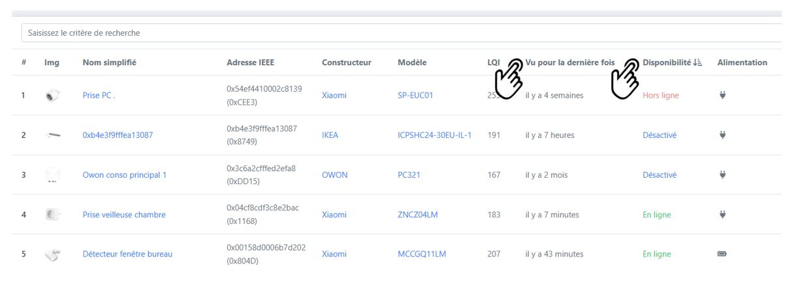
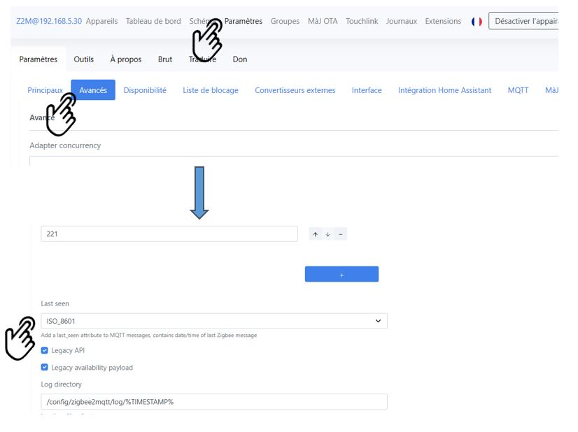
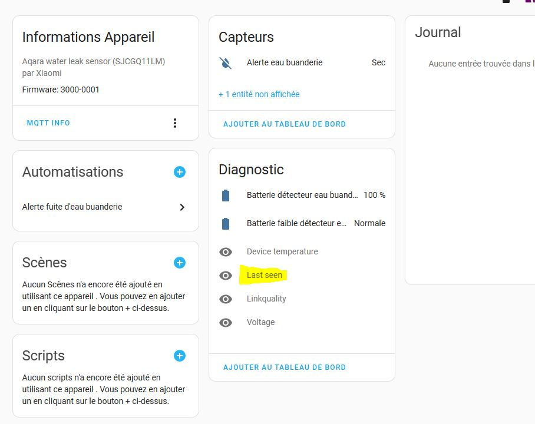

Une grande majorité des adeptes de Home Assistant ont actuellement intégré le protocole **Zigbee**. Cela permet d'intégrer des objets connectés à la fois **fiables** et **à bon prix**.

Or certains de ces objets connectés sont absolument **critiques** : sécurité (alarme, détecteur incendie), chauffage (capteur de température) pour ne citer qu'eux.
La question se pose alors d'être **averti quand un objet ne répond plus**, et de savoir **depuis quand** il ne répond pas.

Si on exclut Deconz qui est l'intégration propriétaire des clés types Conbee II, il existe principalement deux intégrations possibles du Zigbee : 

* **ZHA** : simple, spécifique à Home Assistant et très bien intégré.
* **Zigbee2MQTT** : non spécifique à Home Assistant, tourne dans un add-on et communique avec Home Assistant via un serveur MQTT.

> ZHA est facile a intégrer et ravira les personnes ne voulant pas s'embêter.
>
> Zigbee2MQTT a plus de paramètres de réglages que ZHA, une belle interface avec de puissants outils de gestion zigbee (maillage, mise à jour, paramètrage, etc), et surtout, supporte beaucoup plus de périphériques. Si on rajoute à cela l'indépendance à HA et l'interface MQTT, **beaucoup préfèreront Zigbee2MQTT (z2m ou z2mqtt) à ZHA**.

Quand un périphérique ne répond plus, ZHA met les entités en état indisponible (`unavailable`). 
Cela permet de le traiter fonctionnellement : par exemple envoyer une notification ou couper un thermostat dépendant d'une sonde plus disponible.

Un interrupteur pourra prendre trois états : `on`, `off` ou `unavailable`, ce qui permettra de **traiter fonctionnellement cet état** dans une automatisation.

**Mais**, par défaut, **Zigbee2MQTT laisse les périphériques dans le dernier état connu,** et de plus, n'affiche pas la disponibilité dans son interface. Le périphérique devient juste silencieux et ce mutisme est très gênant.
Un capteur de température pourra rester bloqué à la température d'il y a une semaine. C'est très problématique quand il est utilisé par un thermostat !!

Il est cependant possible de paramétrer Zigbee2MQTT pour y remédier et avoir le même comportement que celui de ZHA.

Une fois paramétré, vous aurez dans l'interface Zigbee2mqtt deux nouvelles colonnes : `Vu pour la dernière fois` et `disponibilité`.
Et ces **informations** seront **transmises** à **Home Assistant,** ce qui permettra de les exploiter.



## "Vu pour la dernière fois" ( last_seen )

Pour rajouter cette colonne, rendez-vous dans l'interface Zigbee2mqtt, puis `paramètres`, `avancés` faire défiler et mettez le paramètre `Last_seen` à `ISO_8601.`



Redémarrer l'add-on zigbee2mqtt : aller dans le sous-menu à droite de paramètres dans outils et cliquer sur le bouton rouge `redémarrer Zigbee2MQTT`. 

> Sous Home Assistant OS, vous pouvez aller dans les modules complémentaires pour redémarrer l'add-on.

Dans l'interface Zigbee2MQTT, vous avez maintenant une nouvelle colonne "Vu pour la dernière fois".

Redémarrer à présent Home Assistant, puis cliquer sur un appareil Zigbee : vous avez désormais une **nouvelle entité** **`last_seen`** (désactivée par défaut) qui affiche quand le périphérique a été vu pour la dernière fois.



## Affichage "Disponibilité"

Il va maintenant falloir éditer le fichier de configuration de Zigbee2mqtt (il se trouve sous le répertoire `\config\zigbee2mqtt`), et rajouter le mot clé `availability` et ses paramètres (`active`/ `passive`) comme présenté ci-dessous :

```yaml
homeassistant: true
mqtt:
  server: mqtt://192.168.XX.XX:1883
  user: mqtt
  password: XXXXXXXXX
serial:
  port: /dev/ttyACM0
  adapter: deconz
frontend:
  port: 8099
permit_join: true
availability:
  active:
    timeout: 20
  passive:
    timeout: 240
devices:
  '0x04cf8cdf3cxxxxxx':
    friendly_name: Prise chambre
```

Redémarrez Zigbee2MQTT : vous devriez maintenant avoir une nouvelle colonne "Disponibilité".

**POINT IMPORTANT**

Sans activer les indisponibilités, un device garde son dernier état initial même quand il est indisponible. Par exemple un capteur de température restera indéfiniment a son ancienne valeur, idem pour un switch.

En activant la gestion des indisponibilités dans Zigbee2MQTT, le capteur indisponible prendra dans Home Assistant l’état `unavailable`. Zigbee2MQTT se comportera alors comme ZHA, ce qui n’est pas le cas par défaut.

L’état `unavailable` permet alors dans Home Assistant un traitement fonctionnel comme l’envoie d’une notification d’alerte ou l’arrêt d’un thermostat dépendant d’un capteur de température.

## Paramétrage de l'indisponibilité

La question suivante est : quand un périphérique (un capteur par exemple) est marqué comme indisponible.

Il existe 2 types de périphériques : 

* **Actifs** : les périphériques généralement branchés au secteur qui retournent souvent leur état.
* **Passifs** : les capteurs habituellement sur piles, qui ne retournent que très occasionnellement leur état.

Pour chaque type de capteur, il est possible d'indiquer **au bout de combien de minutes** un périphérique est jugé indisponible.
Vous pouvez voir que dans le fichier, on a mis **20mn** pour les périphériques **actifs** et **360mn** (6 heures) pour les périphériques **passifs**.

En fonction de vos périphériques, l'idée est de trouver les meilleurs paramètres pour mettre assez haut pour toujours détecter les présences, mais assez bas pour avertir d'une indisponibilité.

## Forcer la désactivation

Vous pouvez indiquer à Zigbee2MQTT qu'un périphérique n'est plus actif et qu'il ne faut pas le surveiller (voir la première capture d'écran les deux périphériques avec le statut "désactivé").

Pour cela, éditer le fichier de configuration de Zigbee2MQTT, parcourez la liste des périphériques et retrouvez celui à désactiver.
Rajouter la propriété `availability : false`  dans la description du périphérique :

Exemple :

```yaml
  '0x3c6a2cfffed2efa8':
    friendly_name: Owon conso principal 1
    availability: false
```

``

## Conclusion

Voilà, vous pouvez **vérifier rapidement dans l'interface Zigbee2MQTT la disponibilité de vos périphériques**, et **affiner les règles de détection** d'une indisponibilité. 

Vous pouvez également **gérer cette indisponibilité dans Home Assistant comme un "cas fonctionnel"** : par exemple limiter le fonctionnement d'un chauffage qui se base sur une température plus valide.

Prochainement, je vous indiquerai comment, via un Blueprint, automatiser une alerte qui se déclenchera quand un de vos périphériques n'est plus disponible.