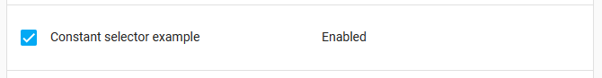

Home Assistant Core 2023.4 ! 🎉

Le printemps est là ! Et nous avons quelques belles nouvelles fonctionnalités pour vous permettre de jouer avec ce prochain week-end de Pâques ! 🐰

Je suis ravi de voir ces nouveaux dialogues entité arriver dans cette version. Ils sont magnifiques et fonctionnent exceptionnellement bien depuis l'application mobile. Il y a même un bonus supplémentaire avec les nouvelles fonctionnalités des cartes tile (tuiles) !

J'adore la nouvelle possibilité de créer ses propres macros de modèles Jinja2 dans cette version. C'est époustouflant ! Et le plus beau, c'est qu'elles sont facilement partageables ! J'ai hâte de voir ce que vous allez inventer !

Joyeuses Pâques ! 🐣 et profitez de cette release !

.../Frenck

## Nouvelles boîtes de dialogue pour les entités alarme, volets et ventilateur

[La version précédente](https://www.home-assistant.io/blog/2023/03/01/release-20233/#new-dialogs-for-lights-switches-and-siren-entities) introduit de nouvelles boîtes de dialogue entité pour les lumières, les interrupteurs et les sirènes. Il semble que beaucoup d'entre vous ont vraiment aimé !

Donc, cette version [@piitaya](https://github.com/piitaya) a persévéré, mettant en œuvre les conceptions de [@matthiasdebaat](https://github.com/matthiasdebaat), apportant la même nouvelle interface utilisateur, propre et dépouillée, dans les dialogues entités pour les panneaux de contrôle d'alarme, les volets et les ventilateurs !

### [](https://www.home-assistant.io/blog/2023/04/05/release-20234/#covers)Volets

Pour les volets, il existe de nombreuses variantes, portes, fenêtres, rideaux, stores, volets roulants, etc. En plus, certains peuvent être contrôlés jusqu'où ils sont ouverts / fermés et d'autres ne peuvent être qu'ouverts et fermés.

Ce n'est pas un problème pour les nouvelles boîtes de dialogue : elles s'adapteront aux capacités de votre volet.


Celle de gauche est intéressante, le curseur contrôle à quel niveau les stores sont baissés. Remarquez comment il se glisse depuis le haut ! Le curseur à côté contrôle l'inclinaison. Sympa !

### [](https://www.home-assistant.io/blog/2023/04/05/release-20234/#fans)Ventilateurs

L'interface affiche une boîte de dialogue de contrôle permettant de s'adapter aux possibilités du ventilateur que vous contrôlez, exactement comme pour les volets.


En fonction du nombre de vitesses dont dispose votre ventilateur, la boîte de dialogue s'ajuste automatiquement sur l'interface utilisateur. S'il a quatre étapes de vitesse ou moins, il affiche les boutons de vitesse comme sur la capture d'écran de gauche. Sinon, il utilisera le curseur affiché sur la capture d'écran la plus à droite.

### [](https://www.home-assistant.io/blog/2023/04/05/release-20234/#alarm-control-panels)Panneau de contrôle d'alarme

Enfin, les **cartes entités du panneau de contrôle d'alarme**. Ils sont un peu différents par rapport aux autres, car plus souvent, ils nécessitent que l'on saisisse un code pour armer ou désarmer l'alarme.


Voilà à quoi ressemble maintenant l'armement et le désarmement d'une alarme.

En cas de besoin, le clavier de code secret apparaîtra ! Une belle touche finale est l'animation très soignée qui est affichée pendant le processus d'armement et de désarmement de l'alarme.

## [](https://www.home-assistant.io/blog/2023/04/05/release-20234/#new-features-for-the-tile-card)Nouvelles fonctionnalités pour la carte Tuile (Tile)

La [Carte Tuile](https://www.home-assistant.io/dashboards/tile/) a deux nouvelles fonctionnalités : la vitesse du ventilateur et le mode d'alarme.

Les deux se ressemblent et sont similaires aux nouvelles boîtes de dialogue d'entité d'en haut, ce qui donne une apparence agréable et cohérente. Regardez : ne sont-ils pas beaux ?


Comme la nouvelle boîte de dialogue entité de ventilateur, la fonction de vitesse du ventilateur affichera les boutons s'il y a quatre vitesses ou moins, et dans tous les autres cas, il utilisera le curseur. Si le ventilateur ne peut être que "allumé" / "éteint", comme le ventilateur au milieu dans la capture d'écran ci-dessus, la tuile ordinaire sera utilisée.

La fonction de sélection du mode d'alarme permet de régler rapidement votre alarme dans les différents états. La fonctionnalité offre la possibilité de sélectionner les modes affichés sous forme de ligne de boutons.


Tout comme avec la nouvelle boîte de dialogue entité, le pavé de saisie de code apparaîtra quand la saisie de code est nécessaire et la même belle petite animation est présente. 🤩

## [](https://www.home-assistant.io/blog/2023/04/05/release-20234/#macros-for-your-templates)Macros pour vos modèles ("templates")

Si vous êtes un utilisateur avancé de Home Assistant, vous serez probablement familier avec le modéle de Home Assistant : **Jinja2**. Cela vous permet de faire des choses très puissantes dans vos modèles. Cependant, si vous en avez beaucoup, vous finissez souvent par répéter une logique similaire partout !

[@depoll](https://github.com/depoll) est venu à la rescousse ! Il a trouvé un moyen d'ajouter la capacité de définir de manière centralisée vos propres macros **Jinja2**, pour ensuite les importer et utiliser n'importe où dans Home Assistant ! 🤯

Pour soutenir cela, Home Assistant a maintenant un nouveau dossier `custom_templates`, où vous pouvez stocker vos macros. Par exemple, vous pouvez créer ce fichier `/config/custom_templates/tools.jinja`:

```yaml


Is the {{ state_attr(entity_id, 'friendly_name') }} on?
{{ (states(entity_id) == 'on') | iif('Yes', 'No') }}!


```

Cette macro `answer_question` posera et répondra à une question basée sur l'ID d'une entité. Vous pouvez désormais importer et utiliser cette macro n'importe où dans Home Assistant. Par exemple :

```yaml

{{ answer_question('light.kitchen') }}
```

Qui sortira :

```text
Is the kitchen light on?
Yes!
```

Une contribution fantastique ! Merci, [@depoll](https://github.com/depoll)!

[Lien vers la documentation des modèles](https://www.home-assistant.io/docs/configuration/templating/#reusing-templates)

## [](https://www.home-assistant.io/blog/2023/04/05/release-20234/#more-new-templating-features)De nouvelles fonctionnalités de modèles ("templates")

Comme si la réutilisation de vos macros n'était pas déjà suffisante, en voici plus pour la création de modèle dans cette version !

Merci, [@depoll](https://github.com/depoll), [@ehendrix23](https://github.com/ehendrix23), [@petro31](https://github.com/Petro31), et [@rokam](https://github.com/rokam), pour les incroyables ajouts ci-dessous ! ❤️

### [](https://www.home-assistant.io/blog/2023/04/05/release-20234/#adjusted-behavior-of-relative_time-and-today_at)Comportement plus pertinent de "relative time" et "today_at"

[@Petro31](https://github.com/Petro31) a ajusté le comportement des entités modèle à l'aide des fonctions spécifiques `relative_time` et `today_at` pour mettre à jour leur état une fois par minute. Sympa !

### [](https://www.home-assistant.io/blog/2023/04/05/release-20234/#new-is_hidden_entity-function)Nouvelle fonction "is_hidden_entity"

La toute nouvelle fontion `is_hidden_entity` a été ajoutée par [@depoll](https://github.com/depoll), qui peut indiquer si une entité a été marquée comme “cachée” ou non. Cette fonction marche également comme test. Cool!

Cet exemple renvoie une liste de toutes les entités de la cuisine qui ne sont pas cachées.

```yaml
{{ area_entities('kitchen') | reject('is_hidden_entity') | list }}
```

### [](https://www.home-assistant.io/blog/2023/04/05/release-20234/#new-areas-function)Nouvelles fonctions de zone

En parlant de zones, [@rokam](https://github.com/rokam) a ajouté une fonction `areas`, qui renvoie une liste de toutes les zones que vous avez !

Un exemple simpliste :

```yaml
{{ area_entities('kitchen') | reject('is_hidden_entity') | list }}
```

### [](https://www.home-assistant.io/blog/2023/04/05/release-20234/#added-break-and-continue-for-use-in-for-loops)Ajout de "break" et "continue" pour être utilisé dans les boucles

[@depoll](https://github.com/depoll) a rajouté le support de `break` et `continue` pour les boucles, qui permet de court-circuiter ces boucles, vous permettant de les rendre plus efficaces.

```yaml

    
        
    
        
    
    {{ value }}

```

## [](https://www.home-assistant.io/blog/2023/04/05/release-20234/#new-has_value-function)Nouvelle fonction "has_value"

Enfin, [@ehendrix23](https://github.com/ehendrix23) ajouté une fonction de modèle demandée pendant le “What the Heck?! ” : `has_value`. La fonction `has_value` peut aussi être utilisé pour tester et filtrer les entités actuellement dans un état `unavailable` ou `unknown`.

Vous pouvez utiliser cette condition, comme ceci :

```yaml

  The train leaves at {{ states('sensor.train_departure_time') }}

```

Ou, peut-être répertorier toutes les entités du salon qui n'ont actuellement aucune valeur :

```yaml
{{ area_entities('living_room') | reject('has_value') | list }}
```

## [](https://www.home-assistant.io/blog/2023/04/05/release-20234/#database-scalability)Évolutivité de la base de données

Au fur et à mesure que Home Assistant se développe et que vous ajoutez des appareils, cela signifie qu'il y a plus de données à garder en mémoire. Cette version inclut des avancées significatives dans la conception de la base de données de l'enregistreur pour aider Home Assistant à évoluer.

Cette version a un nouveau format de base de données qui réduit l'espace nécessaire pour stocker l'historique de vos appareils. Ce changement présente plusieurs avantages :

* Déduplication plus petite, moins d'utilisation du disque
* IO disque réduit (Améliorations de la durée de vie de la carte SD)
* Utilisation réduite du processeur 📉
* Démarrage plus rapide 🏎️
* Graphiques et journal de bord d'historique plus rapides
* Latence réduite dans tout le système, ce qui signifie moins d'attente à partir du moment où vous appuyez sur un bouton jusqu'à ce qu'une action termine 🚀
* Home Assistant conserve désormais l'historique lors du changement de nom des entités 🤘

Si vous accédez directement à la base de données, consultez [Data science portal](https://data.home-assistant.io/) et [Integration SQL](https://www.home-assistant.io/integrations/sql/) pour les exemples de requêtes.

La migration des données en arrière-plan peut prendre un certain temps, en fonction de la taille des données stockées. Pour s'assurer que Home Assistant conserve l'historique lorsqu'il renomme une entité, attendez 24 heures après la mise à jour avant de renommer.

## [](https://www.home-assistant.io/blog/2023/04/05/release-20234/#new-selector-capabilities)Évolutions des Sélecteurs ("selectors")

[](https://www.home-assistant.io/docs/blueprint/selectors)Les [Selectors](https://www.home-assistant.io/docs/blueprint/selectors) sont des entrées pour l'interface utilisateur qui sont utiles dans les [Blueprints](https://www.home-assistant.io/get-blueprints), par exemple. Un nouveau type de sélecteur a été ajouté par [@emontnemery](https://github.com/emontnemery) et [@piitaya](https://github.com/piitaya): Le **sélecteur constant**.

Le sélecteur constant fournit une entrée facultative, qui renvoie une valeur fixe ( la constante ) lorsqu'elle est activée, sinon ne fournit aucune valeur.

Exemple d'utilisation dans un blueprint :

```yaml
example:
  name: Constant selector example
  selector:
    constant:
      label: Enabled
      value: true
```

Ce qui se traduit par les éléments suivants :



Une fois coché, le sélecteur renvoie la valeur définie.

Les filtres de périphérique (devices) et d'entité sur les sélecteurs de zone, d'entité, de périphérique et de cible ont également été améliorés. Auparavant, vous pouviez filtrer avec un seul ensemble de conditions ; désormais, vous pouvez passer par une liste de filtres.

Si vous construisez des Blueprints, cela peut s'avérer très utile si un utilisateur doit pouvoir sélectionner un appareil parmi plusieurs.

Par exemple, ce sélecteur vous permet de sélectionner le capteur de batterie d'une télécommande Philips Hue RWL020 (US) ou RWL021 (EU) dans votre Blueprint.

```yaml
device:
  filter:
    - integration: deconz
      manufacturer: Philips
      model: RWL020
    - integration: deconz
      manufacturer: Philips
      model: RWL021
  entity:
    - domain: sensor
      device_class: battery
```

## [](https://www.home-assistant.io/blog/2023/04/05/release-20234/#translating-entities)Entités traductrices

Au cours des dernières versions, nous avons lentement étendu la prise en charge de la traduction à d'autres endroits dans Home Assistant. Cette version complète la prise en charge de la traduction des entités !

Cela inclut les noms des entités, leurs attributs et les traductions des valeurs des attributs. Ces traductions seront visibles sur vos tableaux de bord, dialogues, éditeurs d'automatisation, etc. Pratiquement tous les endroits qui les affichent.

Les intégrations doivent explicitement ajouter la prise en charge de ces traductions. Un certain nombre d'intégrations l'ont fait dans cette version, mais nous nous attendons à ce que de nombreuses autres suivent dans les prochaines versions.

## [](https://www.home-assistant.io/blog/2023/04/05/release-20234/#other-noteworthy-changes)Autres changements notables

Il y a bien plus de lapins de Pâques dans cette version ; voici quelques autres changements notables de cette version :

* [@ArturoGuerra](https://github.com/ArturoGuerra) a ajouté la prise en charge des verrous à [Matter](https://www.home-assistant.io/integrations/matter)! Sympa !
* La nouvelle boîte de dialogue d'entité lampe (a introduit la dernière version) prend désormais mieux en charge mode blanc. Merci, [@piitaya](https://github.com/piitaya) !
* [@emontnemery](https://github.com/emontnemery) a ajouté des classes de stockage d'énergie et de stockage de volume ; celles-ci permettront de différencier, par exemple, l'énergie consommée de l'énergie stockée dans une batterie.
* [@starkillerOG](https://github.com/starkillerOG) est très satisfait de l'intégration de Reolink. Il fournit maintenant des entités bouton, interrupteur, sirène, sélection, numéro et lumière pour toutes sortes de choses que les caméras et les sonnettes Reolink peuvent faire. Génial !
* Le [Lecteur multimédia universel](https://www.home-assistant.io/integrations/universal) prend dorénavant en charge la navigation dans les médias ! Merci, [@Drafteed](https://github.com/Drafteed) !
* L'intégration du [Superviseur](https://www.home-assistant.io/integrations/hassio) fournit désormais des capteurs contenant les statistiques du Home Assistant Core et du superviseur. Merci, [@ludeeus](https://github.com/ludeeus) !
* L'intégration de  [Spotify](https://www.home-assistant.io/integrations/spotify) prend à présent en charge les podcasts ! Sympa  [@BTMorton](https://github.com/BTMorton) !
* [LIVISI Smart Home](https://www.home-assistant.io/integrations/livisi) supporte à présent les climatiseurs, les interrupteurs (PSSO, ISS, et ISS2), et les capteurs de fenêtre (WDS). Merci @StefanIacobLivisi & @planbnet !
* [ESPHome](https://www.home-assistant.io/integrations/esphome) prend à présent en charge l'appairement des appareils Bluetooth. Beau travail [@bdraco](https://github.com/bdraco) & [@jagheterfredrik](https://github.com/jagheterfredrik) !
* [@MarkGodwin](https://github.com/MarkGodwin) a étendu l'intégration [TP-Link Omada](https://www.home-assistant.io/integrations/tplink_omada) pour prendre en charge la mise à jour des entités. Formidable !
* Tous les attributs des entités `sun.sun`  sont dorénavant également disponibles sous forme de capteurs, beaucoup plus facile à utiliser, merci [@gjohansson-ST](https://github.com/gjohansson-ST) !
* Les volets avec la classe des dispositifs de porte apparaissent à présent comme des portes réelles [HomeKit](https://www.home-assistant.io/integrations/homekit), bien [@Dexwell](https://github.com/Dexwell) !
* [@loongyh](https://github.com/loongyh) a fait quelque chose de similaire pour [Assistant Google](https://www.home-assistant.io/integrations/google_assistant). Les volets avec la classe apparaissent maintenant comme des fenêtres réelles. Merci !
* L'intégration [SQL](https://www.home-assistant.io/integrations/sql) prend désormais en charge les paramètres de l'appareil et les classes d'état, merci [@gjohansson-ST](https://github.com/gjohansson-ST) !
* [@teharris1](https://github.com/teharris1) a rajouté un support supplémentaire pour le nouvel appareil [Insteon](https://www.home-assistant.io/integrations/insteon) i3, cool !

## [](https://www.home-assistant.io/blog/2023/04/05/release-20234/#new-integrations)Nouvelles intégrations

Cette version ne contient pas de nouvelles intégrations, mais fournit quelques nouvelles intégrations virtuelles. Les intégrations virtuelles sont des éléments gérés par d'autres intégrations (existantes) afin de faciliter la recherche. 

Ces intégrations sont nouvelles :

* **[ESERA 1 fil](https://www.home-assistant.io/integrations/esera_onewire)** fourni par [1 fil](https://www.home-assistant.io/integrations/one), ajouté par [@jrieger](https://github.com/jrieger)
* **[HomeSeer](https://www.home-assistant.io/integrations/homeseer)** travaille avec [Z-Wave](https://www.home-assistant.io/integrations/zwave_js), ajouté par [@b-uwe](https://github.com/b-uwe)
* **[Quadra-Fire](https://www.home-assistant.io/integrations/quadrafire)** fourni par [IntelliFire](https://www.home-assistant.io/integrations/intellifire), ajouté par [@jeeftor](https://github.com/jeeftor)
* **[Castings du Vermont](https://www.home-assistant.io/integrations/vermont_castings)** fourni par [IntelliFire](https://www.home-assistant.io/integrations/intellifire), ajouté par [@jeeftor](https://github.com/jeeftor)

## [](https://www.home-assistant.io/blog/2023/04/05/release-20234/#integrations-now-available-to-set-up-from-the-ui)Intégrations désormais disponibles à configurer à partir de l'interface utilisateur

Les intégrations suivantes sont désormais disponibles via l'interface utilisateur de Home Assistant :

* **[EDL21](https://www.home-assistant.io/integrations/edl21)**, fait par [@StephanU](https://github.com/StephanU)
* **[Frontier Silicon](https://www.home-assistant.io/integrations/frontier_silicon)**, fait par [@wlcrs](https://github.com/wlcrs)
* **[Nextcloud](https://www.home-assistant.io/integrations/nextcloud)**, fait par [@mib1185](https://github.com/mib1185)
* **[Obihai](https://www.home-assistant.io/integrations/obihai)**, fait par [@ejpenney](https://github.com/allenejpenneyorter)