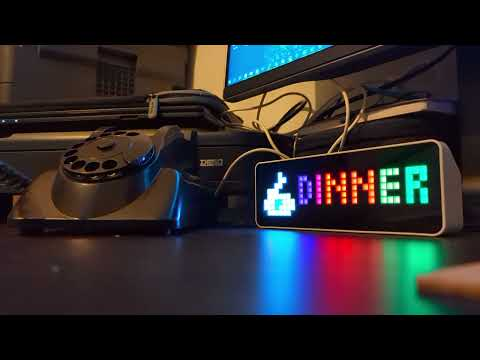

> Cet article est une traduction de [2023.5: Let's talk!](https://www.home-assistant.io/blog/2023/05/03/release-20235/) publié sur le site de Home Assistant.

**Home Assistant Core 2023.5 ! 🎉**

*Quelle magnifique version nous avons pour vous ce mois-ci ! Cette version est entièrement consacrée à la voix (enfin, presque entièrement), et je suis super excité à l'idée que nous puissions vous livrer toutes ces choses vraiment incroyables !*

*J'ai suivi les progrès de la construction de tout cela ce mois-ci, et sincèrement, j'ai été époustouflé plusieurs fois par semaine. Qu'est-ce qu'il y a là-dedans ? Eh bien, vous pouvez maintenant parler à Home Assistant ! 🤯*

*J'apprécie vraiment que tous ces éléments vocaux aient été conçus dans le respect de Home Assistant : pour être complètement configurables et extensibles. Vous avez maintenant des options au choix entièrement locales pour votre propre assistant vocal.*

*Cette version est pleine à craquer de belles choses ! Et nous n'en sommes même pas encore à la moitié de l'Année de la voix de Home Assistant...*

*Bonne lecture !*

*../Frenck*

## Maintenant, parle !

Notre objectif pour 2023 est de vous permettre de contrôler Home Assistant dans votre propre langue : c'est [l'année de la voix de Home Assistant](https://www.home-assistant.io/blog/2022/12/20/year-of-voice/) ! Après [le chapitre 1](https://www.home-assistant.io/blog/2023/01/26/year-of-the-voice-chapter-1/) en janvier, [nous avons annoncé le chapitre 2](https://www.home-assistant.io/blog/2023/04/27/year-of-the-voice-chapter-2/) de cette aventure passionnante !

Cette version contient tout ce qui a été annoncé (et plus encore) ! Cela signifie qu'à partir de cette version, vous pouvez commencer à parler à Home Assistant ! 🎙️

Voici un bref résumé de [tout ce qui a été annoncé](https://www.home-assistant.io/blog/2023/04/27/year-of-the-voice-chapter-2/), avec des liens vous permettant d'en savoir plus :

* [Composez votre propre assistant vocal à l'aide des nouveaux pipelines d'assistance](https://www.home-assistant.io/blog/2023/04/27/year-of-the-voice-chapter-2/#composing-voice-assistants)
* [Assistant vocal alimenté par Home Assistant Cloud](https://www.home-assistant.io/blog/2023/04/27/year-of-the-voice-chapter-2/#voice-assistant-powered-by-home-assistant-cloud)
* [Synthèse vocale entièrement locale à l'aide de Piper](https://www.home-assistant.io/blog/2023/04/27/year-of-the-voice-chapter-2/#piper-our-new-model-for-high-quality-local-text-to-speech)
* [Conversion parole-texte entièrement local à l'aide d'OpenAI Whisper](https://www.home-assistant.io/blog/2023/04/27/year-of-the-voice-chapter-2/#local-speech-to-text-with-openai-whisper)
* [Le protocole et l'intégration du Wyoming](https://www.home-assistant.io/blog/2023/04/27/year-of-the-voice-chapter-2/#wyoming-the-voice-assistant-glue)
* [Créez votre propre assistant vocal alimenté par ESPHome](https://www.home-assistant.io/blog/2023/04/27/year-of-the-voice-chapter-2/#esphome-powered-voice-assistants)
* [L'intégration Voice-over-IP, appelez Home Assistant ☎️](https://www.home-assistant.io/blog/2023/04/27/year-of-the-voice-chapter-2/#worlds-most-private-voice-assistant)

Pour vous aider à démarrer, nous nous sommes assurés que la documentation est parfaite, y compris des didacticiels de projet sympas pour démarrer votre propre parcours d'assistant vocal privé :

* [L'assistant vocal le plus privé au monde](https://www.home-assistant.io/projects/worlds-most-private-voice-assistant/)
* [Donner à votre assistant vocal une personnalité Super Mario en utilisant OpenAI](https://www.home-assistant.io/projects/worlds-most-private-voice-assistant/#give-your-voice-assistant-personality-using-the-openai-integration)
* [Installer un pipeline Assist local](https://www.home-assistant.io/docs/assist/voice_remote_local_assistant/)
* [Le petit assistant vocal basé sur ESPHome à 13$](https://www.home-assistant.io/projects/thirteen-usd-voice-remote/)

Si vous avez manqué la diffusion en direct de la semaine dernière, n'hésitez pas à la consulter. Elle regorge de démos en direct et d'explications détaillées de tout ce qui se trouve dans cette version. L'enregistrement du flux en direct :

<https://www.youtube.com/watch?v=Tk-pnm7FY7c>

## Gérez ce qui est exposé à vos assistants vocaux

Un tout nouvel élément de menu intéressant se trouve dans votre menu `Paramètres` `assistants vocaux` !

Ce nouveau groupe de paramètres vous donne accès à de nombreuses nouvelles fonctionnalités vocales fantastiques. Il fournit également un nouvel onglet **Exposer** où vous pouvez gérer les entités qui sont exposées à votre Assistant, Alexa et Google Assistant.

Il donne un aperçu des entités que vous avez exposées à vos assistants vocaux et vous permet d'en supprimer ou d'en ajouter facilement de nouvelles. En cliquant sur une entité dans cet écran, vous ferez apparaître les paramètres de l'assistant vocal pour cette entité, ce qui vous permettra d'activer ou de désactiver l'exposition de l'entité à un assistant vocal spécifique et de gérer les alias de l'entité.

Cela prend actuellement en charge notre [Assistant](<The $13 tiny ESPHome-based voice assistant>) Amazon Alexa et Google Assistant via Home Assistant Cloud.

## Paramétrage des entités amélioré.

Quelques améliorations ont été apportées à la boîte de dialogue de paramétrage des entités, afin de la rendre plus facile à utiliser et de lui donner un aspect plus épuré.

La boîte de dialogue de paramétrage des entités comportait une section avancée extensible, que vous pouviez développer pour accéder à des fonctionnalités telles que l'affichage / masquage / désactivation des entités, la modification de la zone, etc.

La section avancée a été supprimée et toutes ses fonctionnalités ont été réorganisées. Ainsi, aucune fonctionnalité n'a été perdue tout en offrant une interface beaucoup plus agréable.

Et puisque nous sommes dans l'année de la voix, vous remarquerez peut-être l'option **"Assistants vocaux"** dans la capture d'écran ci-dessus, qui s'affichera :

Cela vous permet de modifier rapidement les assistants vocaux auxquels l'entité est exposée, y compris ses alias, sans avoir à revenir au panneau des assistants vocaux dans l'écran principal des paramètres.

## Configurer les voyants de votre "Home Assistant Yellow"

Le boîtier de notre étonnant [Home Assistant Yellow](https://www.home-assistant.io/yellow) vous permet de voir la magnifique carte et les pièces qu'elle contient.

Cependant, les LED de la carte peuvent éclairer votre environnement lorsqu'il fait sombre de manière indésirable. Par exemple, lorsque vous dormez dans la même pièce que votre Home Assistant Yellow.

A partir de cette version, vous pouvez configurer (activer/désactiver) le disque, le "heartbeat" et les LEDs d'alimentation de votre Home Assistant Yellow en utilisant le bouton Configurer sur la page `Paramètres` >  `Matériel`.

## Options de déclenchement des webhooks

Les webhooks ont été étendus dans cette version. Nous prenons désormais en charge les webhooks qui utilisent la méthode **GET HTTP** !

Mais ce n'est pas tout. Grâce à [@esev](https://github.com/esev), nous avons maintenant de nouvelles fonctionnalités de sécurité pour nos déclencheurs de webhooks. Vous pouvez maintenant définir les méthodes HTTP avec lesquelles votre déclencheur de webhook fonctionne et la possibilité de limiter les webhooks pour qu'ils ne fonctionnent que sur votre réseau local.

## Nouveau pipeline "Assistant" et sélecteurs de langue

Si vous construisez des Blueprints d'automatisation ou de scripts, vous pouvez désormais utiliser deux nouveaux sélecteurs d'interface utilisateur avec vos Blueprints : un sélecteur de **pipeline "Assistant"** et un **sélecteur de langue**.

Le sélecteur de langue permet à un utilisateur de choisir parmi une liste de langues.

Vous pouvez, par exemple, exploiter cette possibilité dans un Blueprint de notification pour permettre le réglage d'une langue différente sur une notification de synthèse vocale.

[Vous trouverez plus d'informations dans la documentation de nos sélecteurs](https://www.home-assistant.io/docs/blueprint/selectors).

## Autres changements notables

Il y a beaucoup plus de choses dans cette version ; Voici quelques-uns des autres changements notables de cette version :

* [Le système d'exploitation Home Assistant v10 est sorti ! ](https://www.home-assistant.io/blog/2023/04/18/home-assistant-os-release-10/)L'ODROID M-1 est désormais pris en charge, la prise en charge des disques de données et la gestion de la mémoire ont été améliorées. Corrections de bogues et améliorations de la fiabilité pour Bluetooth et Thread.
* [Matter](https://www.home-assistant.io/integrations/matter) prend désormais en charge les volets, merci [@hidaris](https://github.com/hidaris) !
* Le processus de création de sauvegardes est désormais plus rapide 🚀, merci [@bdraco](https://github.com/bdraco) !
* @bdraco a également amélioré l'intégration [ONVIF](https://www.home-assistant.io/integrations/openai_conversation) , ce qui devrait améliorer la stabilité de l'intégration. Top !
* Vous pouvez désormais configurer plusieurs instances de l'intégration OpenAI Conversation avec, par exemple, différentes promps. Merci, [@balloob](https://github.com/balloob) !
* @rubenbea ajouté la prise en charge de l'orientation aux ventilateurs sous [MQTT](https://www.home-assistant.io/integrations/mqtt) !
* [BTHome](https://www.home-assistant.io/integrations/bthome) a ajouté la prise en charge des événements liés aux boutons et aux variateurs. Cela signifie qu'il prend en charge le tout nouveau [Shelly BLU Button1](https://www.shelly.cloud/en/products/shop/shelly-blu-button1?tracking=A7FsiPIfUWsFpnfKHa8SRyUYLXjr2hPq) ! Merci, [@Ernst79](https://github.com/Ernst79) !
* Le [superviseur](https://www.home-assistant.io/integrations/hassio) peut désormais créer des suggestions de réparation pour certains des problèmes qu'il a détectés sur votre système. Génial [@mdegat01](https://github.com/mdegat01) !
* [@mib1185](https://github.com/mib1185) a ajouté un service pour permettre le tri de la liste d'achats. Merci !
* [@depoll](https://github.com/depoll) a ajouté un attribut aux entités [Person ](https://www.home-assistant.io/integrations/person)qui liste les traqueurs d'appareils pour cette personne. Très utile pour les modèles ! Merci !
* L'intégration [NextDNS](https://www.home-assistant.io/integrations/nextdns) a ajouté tout un tas de nouvelles options de contrôle parental, merci [@bieniu](https://github.com/bieniu) !
* [Synology DSM](https://www.home-assistant.io/integrations/synology_dsm) peut désormais parcourir vos photos Synology dans le navigateur multimédia. Ajout cool, [@lodesmets](https://github.com/lodesmets) !
* [Simplepush](https://www.home-assistant.io/integrations/simplepush) prend désormais en charge les pièces jointes, grâce à [@tymm](https://github.com/tymm) !
* Certains capteurs de notification [Z-Wave](https://www.home-assistant.io/integrations/zwave_js) ne se mettent pas automatiquement en veille. Vous pouvez maintenant utiliser les nouveaux boutons de mise en veille des notifications pour les mettre en veille manuellement !

## Nouvelles intégrations

Nous accueillons les nouvelles intégrations suivantes dans cette version :

* **[Android TV Remote](https://www.home-assistant.io/integrations/androidtv_remote)**, ajouté par[ @tronikos](https://github.com/tronikos)\
  Lancez des applications et contrôlez votre appareil Android TV.
* **[RAPT Bluetooth](https://www.home-assistant.io/integrations/rapt_ble)**, ajouté par[ @sairon](https://github.com/sairon)\
  Intègre les hydromètres *RAPT Pill* dans Home Assistant.
* **[Voix sur IP](https://www.home-assistant.io/integrations/voip)**, ajoutée par[ @synesthesiam](https://github.com/synesthesiam)\
  Parler à[ Assist](https://www.home-assistant.io/docs/assist) à l'aide d'un téléphone analogique et d'un adaptateur VoIP.
* **[Wyoming](https://www.home-assistant.io/integrations/wyoming)**, ajouté par [@synesthesiam](https://github.com/synesthesiam)\
  Connectez-vous aux services vocaux supportant le protocole *Wyoming*.
* **[Roborock](https://www.home-assistant.io/integrations/roborock)**, ajouté par[ @Lash-L](https://github.com/Lash-L)\
  Contrôlez votre aspirateur RoboRock tout en gardant la prise en charge native de l'application Roborock.
* **[Anova](https://www.home-assistant.io/integrations/anova)**, ajouté par[ @Lash-L](https://github.com/Lash-L)\
  Controller *Anova sous vides* avec capacités Wi-Fi.

Cette version comporte également une **nouvelle intégration virtuelle**. Les intégrations virtuelles sont des modules qui sont gérés par d'autres intégrations (existantes) afin de faciliter la recherche. Celle-ci est nouvelle :

* **[Monessen](https://www.home-assistant.io/integrations/monessen)** fourni par [@Intellifire](https://www.home-assistant.io/integrations/intellifire) , ajouté par[ @jeeftor](https://github.com/jeeftor)

## Les intégrations sont maintenant disponibles pour être configurées à partir de l'interface utilisateur

Les intégrations suivantes sont désormais disponibles via l'interface utilisateur de Home Assistant :

* **[Brottsplatskartan](https://www.home-assistant.io/integrations/brottsplatskartan)** , réalisé par[ @gjohansson-ST](https://github.com/gjohansson-ST)
* **[qBittorrent](https://www.home-assistant.io/integrations/qbittorrent)** , réalisé par[ @ chrisx8](https://github.com/chrisx8)
* **[Snapcast](https://www.home-assistant.io/integrations/snapcast)** , réalisé par[ @luar123](https://github.com/luar123)
* **[Journée de travail](https://www.home-assistant.io/integrations/workday)** , réalisée par[ @gjohansson-ST](https://github.com/gjohansson-ST)

## Changements de rupture

**Accuweather**

Les capteurs `ozone` et l'attribut d'état `ozone`  de l'entité météo ont affiché des valeurs incorrectes et sont en cours de suppression. Si vous utilisez ces valeurs dans vos automatisations ou scripts, vous devez les mettre à jour.

([@bieniu](https://github.com/bieniu) - [\#91492](https://github.com/home-assistant/core/pull/91492)) ([documentation](https://www.home-assistant.io/integrations/accuweather))

**Android TV**

L'intégration "Android TV" a été renommée "Android Debug Bridge".

Ce changement de nom est dû au fait que c'est ce qu'il a réellement contrôlé/fourni. Avec l'ajout de l'intégration d'Android TV Remote dans cette version, nous voulions réduire toute confusion à venir.

([@tronikos](https://github.com/tronikos) - [\#90657](https://github.com/home-assistant/core/pull/90657)) ([documentation](https://www.home-assistant.io/integrations/androidtv))

**History**

Toutes les options de configuration YAML pour l'intégration de l'historique ont été supprimées, car elles n'étaient plus utilisées par le frontend.

([@bdraco](https://github.com/bdraco) - [\#90992](https://github.com/home-assistant/core/pull/90992)) ([documentation](https://www.home-assistant.io/integrations/history))

**HomeKit**

Les humidités cibles min/max pour les dispositifs de (dé)humidification exposés via HomeKit ont changé. L'interface HomeKit affiche désormais l'humidité relative réelle. Lorsque le curseur dans HomeKit passe au-dessus ou en dessous de l'humidité max/min définie, il sera ramené à l'humidité max/min autorisée.

([@stackia](https://github.com/stackia) - [\#90854](https://github.com/home-assistant/core/pull/90854)) ([documentation](https://www.home-assistant.io/integrations/homekit))

Par défaut, HomeKit écoute sur toutes les interfaces pour correspondre au comportement de Home Assistant. Pour limiter HomeKit à des interfaces réseau spécifiques, spécifiez une adresse dans `configuration.yaml.`

([@bdraco](https://github.com/bdraco) - [\#91520](https://github.com/home-assistant/core/pull/91520)) ([documentation](https://www.home-assistant.io/integrations/homekit))

**IMAP**

L'utilisation de l'événement `imap_content` pourrait perturber les utilisateurs qui souhaitent analyser les données de messages électroniques plus volumineux à partir de la partie tronquée. Seuls les 2048 premiers octets du corps du message (2 KiB) seront disponibles.

([@jbouwh](https://github.com/jbouwh) - [\#92066](https://github.com/home-assistant/core/pull/92066)) ([documentation](https://www.home-assistant.io/integrations/imap))

**Overkiz**

L'option de silence pour DynamicShutter a été supprimée car elle rendait l'entité cover non fonctionnelle si elle ne prenait pas en charge la fonction "muet". Cette fonctionnalité sera réintroduite dans une prochaine version.

([@iMicknl](https://github.com/iMicknl) - [\#91354](https://github.com/home-assistant/core/pull/91354)) ([documentation](https://www.home-assistant.io/integrations/overkiz))

**Reolink**

Pour les sonnettes Reolink, l'entité lumineuse `Status LED` est remplacée par une **entité de sélection** `Status LED`. L'état `off`correspond à la sélection `Auto`, et l'état `on`correspond à la sélection `Auto & always on at night`. Un état `Stay off` supplémentaire est désormais disponible.

([@starkillerOG](https://github.com/starkillerOG) - [\#90469](https://github.com/home-assistant/core/pull/90469)) ([documentation](https://www.home-assistant.io/integrations/reolink))

**Snapcast**

* Les groupes en sourdine avec diffusion en continu auront un état `idle`au lieu de `playing`.
* Les clients connectés n'auront plus d'état `on` mais utiliseront les mêmes états que les groupes : `idle` et `playing`.
* Les clients déconnectés ont un état `standby` au lieu de `off`car le serveur *Snapcast* accepte toujours les commandes.

([@luar123](https://github.com/luar123) - [\#77449](https://github.com/home-assistant/core/pull/77449)) ([documentation](https://www.home-assistant.io/integrations/snapcast))

**DSM de Synology**

La conversion d'unité pour tous les capteurs liés à la mémoire, au stockage et à l'utilisation du réseau a été passée de la base binaire (*1024*) à la base décimale (*1000*) pour être en ligne avec les unités de mesure utilisées (*eq. Mo = 1.000.000 octets*).

Vous devrez peut-être mettre à jour les unités enregistrées historiquement pour ces capteurs via la page de statistiques sous les outils de développement.

([@mib1185](https://github.com/mib1185) - [\#90633](https://github.com/home-assistant/core/pull/90633)) ([documentation](https://www.home-assistant.io/integrations/synology_dsm))

**Modèles**

L'argument `ensure_ascii` pour `to_json` dans les modèles Jinja est désormais défini par défaut sur False, ce qui nous permet d'utiliser un encodeur JSON plus rapide par défaut.

Cela ne devrait pas poser de problème pour la plupart des utilisateurs, car les analyseurs JSON acceptent généralement les entrées Unicode. Si vous avez toujours besoin d'encoder des caractères Unicode dans les chaînes JSON, définissez explicitement `ensure_ascii` à `True`pour rétablir l'ancien comportement.

([@depoll](https://github.com/depoll) - [\#91253](https://github.com/home-assistant/core/pull/90863))

**Réseau UniFi**

Le service précédent `set_doorbell_message` a été supprimé. Utilisez l'entité `text` pour l'écran LCD UniFi Protect à la place.

([@Kane610](https://github.com/Kane610) - [\#91188](https://github.com/home-assistant/core/pull/91188)) ([documentation](https://www.home-assistant.io/integrations/unifi))

**UniFi Protect**

Le `set_doorbell_message`service obsolète précédent a été supprimé. Utilisez plutôt l'entité de texte pour l'écran LCD UniFi Protect.

([@AngellusMortis](https://github.com/AngellusMortis) - [\#91523](https://github.com/home-assistant/core/pull/91523)) ([documentation](https://www.home-assistant.io/integrations/unifiprotect))

**Dispositifs universels ISY/IoX**

La configuration YAML précédemment obsolète de l'intégration Universal Devices ISY/IoX a été supprimée.

Universal Devices ISY/IoX est maintenant configuré via l'interface utilisateur. Toute configuration YAML existante a été importée dans les versions précédentes et peut désormais être supprimée en toute sécurité de vos fichiers de configuration YAML.

([@shbatm](https://github.com/shbatm) - [\#91575](https://github.com/home-assistant/core/pull/91575)) ([documentation](https://www.home-assistant.io/integrations/isy994))

L'unité de pourcentage intégrée `%` est maintenant utilisée pour l'humidité relative et l'humidité absolue au lieu des unités personnalisées `%RH` et `%AH`.

([@shbatm](https://github.com/shbatm) - [\#90863](https://github.com/home-assistant/core/pull/90863)) ([documentation](https://www.home-assistant.io/integrations/isy994))

Les services **ISY994** personnalisés suivants ont été supprimés :

* `reload`
* `cleanup_entities`
* `system_query`
* `set_ramp_rate`
* `set_on_level`
* `run_network_resource`
* `set_variable`

Ces services étaient auparavant obsolètes au profit des services intégrés et des entités `number`, `select` et `button`. Veuillez mettre à jour vos automatisations et tableaux de bord pour utiliser les nouvelles entités et/ou services intégrés si vous ne l'avez pas déjà fait.

([@shbatm](https://github.com/shbatm) - [\#91569](https://github.com/home-assistant/core/pull/91569)) ([documentation](https://www.home-assistant.io/integrations/isy994))

Les nœuds Crépuscule/Aube sur les capteurs de mouvement `Insteon`ont maintenant leurs états inversés pour afficher correctement « Lumière détectée » pendant la lumière du jour et « Pas de lumière » lorsque le capteur crépusculaire est actif.

Ceci est inversé par rapport au comportement précédent. Si vous comptez sur ce capteur dans vos automatisations, ils doivent être mis à jour.

([@shbatm](https://github.com/shbatm) - [\#92035](https://github.com/home-assistant/core/pull/92035)) ([documentation](https://www.home-assistant.io/integrations/isy994))

**Webhooks**

Deux nouvelles options de déclenchement des webhooks ont été ajoutées pour limiter la façon dont un webhook peut déclencher une automatisation. Une nouvelle option allowed_methods peut être utilisée pour contrôler les méthodes de requête HTTP qui peuvent activer le déclencheur (`GET`, `HEAD`, `POST`et `PUT`). L'option local_only est utilisée pour permettre aux appareils situés en dehors de votre réseau local d'activer le déclencheur.

Auparavant, tous les déclencheurs de webhook pouvaient être activés par les méthodes `HEAD`, `POST`et `PUT`à partir de n'importe quel appareil (local ou sur internet). Avec les nouvelles options, seuls `POST`et `PUT` sont activés par défaut.

Dans Home Assistant Core 2023.7, tout déclencheur webhook qui ne définit pas `local_only` à `false` ne peut être activé que par des appareils sur le même réseau que Home Assistant.

Cliquez sur l'icône en forme de roue dentée à côté de l'ID du webhook pour mettre à jour vos déclencheurs de webhook. Sélectionnez ensuite une valeur appropriée pour l'option Uniquement accessible depuis le réseau local. Il est nécessaire de désélectionner l'option pour que le bouton Enregistrer apparaisse. Puis re-sélectionnez l'option si elle doit être activée. L'avertissement de réparation disparaîtra ainsi.

Consultez la [documentation du déclencheur de webhook](https://www.home-assistant.io/docs/automation/trigger/#webhook-trigger) pour une description des nouvelles options. Et veuillez consulter la nouvelle section [Webhook Security](https://www.home-assistant.io/docs/automation/trigger/#webhook-security) pour connaître les meilleures pratiques lors de l'utilisation des déclencheurs webhook.

([@esev](https://github.com/esev) - [\#66494](https://github.com/home-assistant/core/pull/66494)) ([documentation](https://www.home-assistant.io/integrations/webhook))

**Z-Wave**

**Avec cette version, vous devrez mettre à jour votre instance `zwave-js-server`.** Vous devez utiliser `zwave-js-server`1.28.0 ou supérieur (schéma 28).

* Si vous utilisez le module complémentaire `Z-Wave JS`, vous avez besoin d'au moins la version `0.1.79`.
* Si vous utilisez le module complémentaire `Z-Wave JS UI`, vous avez besoin d'au moins la version `1.11.2`.
* Si vous utilisez le conteneur Docker `Z-Wave JS UI`, vous avez besoin d'au moins la version `8.14.2`.
* Si vous exécutez votre propre conteneur Docker ou une autre méthode d'installation, vous devrez mettre à jour votre instance  `zwave-js-server` vers au moins vers `1.28.0`.

([@raman325](https://github.com/raman325) - [\#91989](https://github.com/home-assistant/core/pull/91989)) ([documentation](https://www.home-assistant.io/integrations/zwave_js))

Si vous êtes un développeur d'intégrations personnalisées et que vous souhaitez en savoir plus sur les modifications radicales et les nouvelles fonctionnalités disponibles pour votre intégration : assurez-vous de suivre notre [blog des développeurs](https://developers.home-assistant.io/blog/). Les éléments suivants sont les plus notables pour cette version :

* [Nouvelles limites pour les modules complémentaires de superviseur](https://developers.home-assistant.io/blog/2023/04/13/new_limits_for_add_ons)

## Dites leur adieu

Les intégrations suivantes ne sont également plus disponibles à partir de cette version :

* **Le coronavirus (COVID-19)** a été supprimé. Les données ne sont plus fournies par le fournisseur source. ([@emontnemery](https://github.com/emontnemery) - [\#90934](https://github.com/home-assistant/core/pull/90934))
* **Xbox Live** était auparavant obsolète et a maintenant été supprimé. L' [intégration Xbox](https://www.home-assistant.io/integrations/xbox) est toujours disponible. ([@MartinHjelmare](https://github.com/MartinHjelmare) - [\#90592](https://github.com/home-assistant/core/pull/90592))

## Toutes les modifications

Bien sûr, il y a beaucoup plus de choses dans cette version. Vous pouvez trouver une liste de toutes les modifications apportées ici : [Journal complet des modifications pour Home Assistant Core 2023.5](https://www.home-assistant.io/changelogs/core-2023.5)