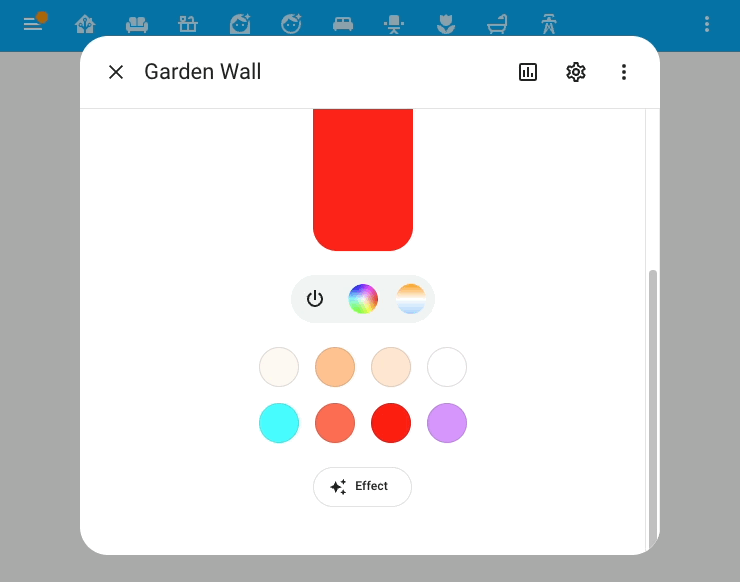
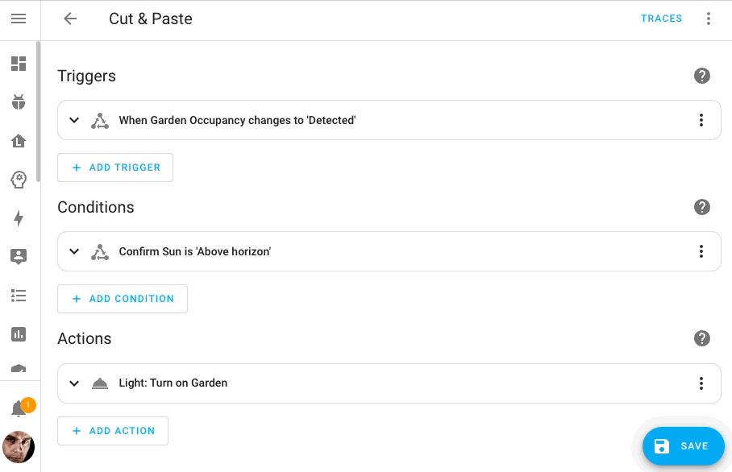

***Home Assistant Core 2023.6 ! 🎉***

_Préparez-vous à une version classique, à l'ancienne et bourrée de nouveautés ! 🤯_

_Je suis enthousiaste par tant de choses ajoutées dans cette version qu'il est difficile de choisir ma préférée 😅 Cette version à tout._

_Pouvoir utiliser et sauvegarder directement la configuration de mon Home Assistant sur mon réseau de stockage est absolument incroyable ! Mais j'apprécie aussi beaucoup le nouveau tableau de bord et les nouvelles pages d'intégration._

_La fonctionnalité qui a grandement amélioré le facteur d'approbation de Home Assistant dans mon foyer est sans aucun doute l'ajout des nouvelles couleurs favorites dans les boîtes de dialogue des lumières de couleur 🎨_

_Bonne lecture !_

_../Frenck_

## Connectez et utilisez votre système de stockage en réseau existant

Avez-vous un système de stockage en réseau chez vous ? Comme un NAS QNAP ou Synology ? Cette version ajoute la possibilité d'ajouter et d'utiliser ce stockage avec Home Assistant !

Cette fonctionnalité, très demandée, est maintenant disponible lorsque vous utilisez le système d'exploitation Home Assistant. Dans le menu `Paramètres` > `Système` > `Stockage`, vous pouvez désormais trouver un tout nouvel ensemble de contrôles pour vous connecter à votre stockage et l'utiliser, par exemple, pour utiliser votre partage de réseau comme source de média dans Home Assistant.

Mieux encore, vous pouvez l'utiliser comme cible pour vos sauvegardes, de sorte que lorsque Home Assistant crée une sauvegarde pour vous, il la stocke directement sur votre stockage réseau.

Plusieurs stockages réseau sont également pris en charge ; si vous le souhaitez, vous pouvez facilement en ajouter d'autres.

## Tableau de bord et pages des intégrations.

Le tableau de bord des intégrations a fait l'objet d'une refonte majeure !

La version précédente du tableau de bord des intégrations posait quelques problèmes de convivialité. Par exemple, si vous utilisez ESPHome avec de nombreux appareils, vous êtes certainement familier avec le défilement ennuyeux de cette petite carte. Ou encore, les messages d'erreur qui s'étirent sur ces cartes et perturbent toute la page.

Cette version apporte un tout nouveau tableau de bord des intégrations qui résout la plupart de ces problèmes, dans le but d'offrir une expérience plus propre et plus cohérente.

Les intégrations basées sur des appareils, comme ESPHome, sont combinées : plus de défilement. Une intégration défaillante n'étire plus la mise en page et ne la fait plus "sauter" lors des tentatives. Les intégrations personnalisées et les intégrations reposant sur le cloud sont désormais indiquées de manière plus visible.

En sélectionnant l'icône en forme de roue dentée sur la carte d'intégration, vous accéderez à une toute nouvelle page d'intégration, affichant toutes les informations relatives à l'intégration :

Dans l'exemple ci-dessus, la page d'intégration ESPHome affiche tous les appareils dont dispose cette intégration. Toutes les informations et les options, qui se trouvaient auparavant dans le tableau de bord de l'intégration, sont dorénavant disponibles ici.

Ces nouvelles pages d'intégration sont utiles à d'autres endroits dans Home Assistant. Par exemple, les pages sur les appareils peuvent maintenant renvoyer directement à l'intégration qui les a fournies.

## Amélioration de la boîte de dialogue de l'entité Lumières: couleurs préférées

Récemment, nous avons introduit de nouveaux contrôles dans la boîte de dialogue de l'entité lumière, et cette version ajoute la luminosité actuelle, de nouveaux contrôles, et la gestion des couleurs préférées ! 🎨

Chaque lumière (ou groupe de lumières) possède son propre jeu de couleurs. Ces couleurs peuvent être ajoutées, modifiées, supprimées et réorganisées par glisser-déposer. Pour passer en mode édition, sélectionnez et maintenez l'une des couleurs :

## Ajouté à la boîte de dialogue de l'entité la dernière modification

À la demande générale, l'information sur la date de la dernière modification d'une entité a été ajoutée aux nouvelles boîtes de dialogue d'information sur les entités.

De plus, @piitaya (HACF Power) a fait un ajout surprise très sympa ! Vous pouvez cliquer sur cette date pour alterner entre le format relatif et le format absolu !

## Informations connexes

Quelle automatisation utilise ce Blueprint ? Et bien, Home Assistant peut maintenant vous le dire ! Sur la page `Paramètres` > `Automatisations & Scènes` > Blueprints, sélectionnez le menu à trois points sur n'importe quel blueprint pour découvrir quelles automatisations utilisent ce blueprint.

De plus, si vous essayez accidentellement de supprimer un blueprint qui est encore utilisé, Home Assistant vous empêchera de le supprimer et vous indiquera les automatisations qui l'utilisent encore.

Attendez, il y a encore plus de choses à ce propos ! Les éléments connexes de la boîte de dialogue d'information sur l'entité ont également été améliorés. L'ancienne liste de liens a disparu, et une vue plus moderne de tous les éléments liés à une entité est maintenant affichée :

Remarquez le lien vers la nouvelle page d'intégration ici aussi !

## Support du copier-coller dans l'éditeur d'automatisation

Une contribution étonnante de @karwosts dans cette version qui ajoute des capacités de couper, copier et coller aux éditeurs d'automatisation et de scripts !

Vous pouvez maintenant copier et coller n'importe quel déclencheur, condition et action à différents endroits de votre automatisation et même le coller dans une autre automatisation !

## Python 3.11 et améliorations significatives des performances

Cette version est livrée avec Python 3.11 ! Au cas où vous vous poseriez la question, qu'est-ce que c'est ? Eh bien, Python est le langage dans lequel est écrit le cœur de Home Assistant.

Pourquoi est-ce important ? Il est vraiment plus rapide ! 🚀

Si vous utilisez le système d'exploitation Home Assistant ou le type d'installation Home Assistant Container : vous n'aurez rien à faire, car nous gérons la mise à niveau vers Python 3.11 pour vous.

Et ce n'est pas tout en termes de performances. Nous avons également mis à jour des éléments internes, notamment une nouvelle version de SQLite qui devrait être plus rapide. Oh ! et, bien sûr, @bdraco a été un peu partout pour optimiser beaucoup (beaucoup beaucoup) de chose.

On peut s'attendre à ce que cette version soit beaucoup plus rapide (ou moins consommatrice) de ressources à l'exécution.

## Matter 1.1

L'implémentation de Matter dans Home Assistant est maintenant basée sur la version 1.1 du standard Matter. Cela apporte une tonne de corrections de stabilité et d'améliorations, mais malheureusement, pas de nouvelles fonctionnalités.

Grâce à @Diegorro98, nous avons maintenant un support pour les volets inclinables ! En outre, cette version de Home Assistant est livrée avec plusieurs corrections de bugs génériques et des optimisations ; nous avons réussi à tirer quelques performances supplémentaires pour rendre les mises à jour de l'état de vos appareils Matter rapides comme l'éclair 🚀.

Toutes ces améliorations de la stabilité de la pile Matter et de notre implémentation ne sont pas passées inaperçues :

[Youtube : This ACTUALLY Works Now!?](https://youtu.be/PsNdR-m5pwE)

## Mises à jour Z-Wave

Il y a eu pas mal de progrès sur le Z-Wave dans Home Assistant.

Grâce à @raman325, l'intégration a atteint le niveau platine 🏆 sur notre échelle de qualité. Cela signifie que l'intégration fait à présent les choses parfaitement et selon les meilleures pratiques, ce qui devrait signifier une meilleure expérience utilisateur en général.

Avez-vous déjà allumé une lampe Z-Wave à partir de l'interface utilisateur de Home Assistant pour voir le bouton s'éteindre après quelques secondes, puis se rallumer quelques secondes plus tard ? Ce problème de longue date (qui a même reçu le surnom de flip/flop) pour certains dispositifs, qui sont lents à réagir à leur état, a finalement été résolu.

Pour ceux d'entre vous qui aiment tout automatiser, vous pouvez maintenant automatiser non seulement l'état du périphérique Z-Wave mais aussi sa configuration. Nous avons ajouté des entités de paramètres de configuration de périphérique, de sorte que presque tous les paramètres de périphérique Z-Wave sont maintenant disponibles en tant qu'entité.

Nous avons également ajouté des entités pour les statistiques de connexion des périphériques, que vous pouvez utiliser pour, par exemple, créer une notification si un périphérique génère plus d'un certain nombre de messages perdus. Si vous souhaitez suivre un appareil qui se comporte mal, vous pouvez activer ces capteurs pour afficher l'historique des performances de connexion.

En arrière-plan, @AlCalzone travaille sans relâche sur le pilote Z-Wave JS, qui est la base de notre intégration Z-Wave. Entre autres choses, certains appareils sont désormais plus rapides à interroger lors de l'ajout, et d'avantage d'appareils peuvent être configurés.

## Nouvelles entités ! Date, heure, date/heure

Nous accueillons trois nouveaux types d'entités dans cette version : `date`, `heure` et `datetime`.

Ces entités permettent aux intégrations de fournir des contrôles de saisie de date, d'heure ou de date/heure à partir de l'interface utilisateur. Elles sont très similaires au `helpers` `datetime` mais sont disponibles pour les intégrations.

Ils sont si nouveaux qu'aucune intégration ne les utilise encore, mais vous pouvez vous attendre à ce qu'ils soient bientôt utilisés dans des intégrations (custom) !

Merci de les avoir créées @raman325 !

## Autres changements notables

Il y a beaucoup plus de belles surprises dans cette version ; voici quelques-uns des autres changements notables de cette version :

- Lors de l'utilisation de services dans l'interface utilisateur (comme dans l'éditeur d'automatisation), seuls les options et paramètres disponibles pour les appareils et entités cibles sélectionnés seront affichés. Cela rend l'interface utilisateur beaucoup plus propre ! Merci, @emontnemery et @bramkragten !
- L'intégration de Roborock (introduite dans la version précédente) a reçu beaucoup d'attention et fournit maintenant une large gamme de nouvelles entités. Merci @Lash-L !
- L'intégration de Android TV Remote fournit maintenant une entité de lecteur multimédia aussi ! Bien joué, @Drafteed !
- KNX fournit à présent son propre panneau, vous permettant de télécharger votre fichier de projet KNX, et offre un moniteur de groupe pour les diagnostics de bus en direct. Les informations du projet sont également utilisées pour les déclenchements d'appareils. Incroyable @marvin-w et @farmio !
- @bdraco a ajouté l'option de désactiver les “Webhooks” pour ONVIF dans le cas où votre caméra ne respecte pas entièrement les spécifications.
- La variable "actions” est désormais également disponible dans les éditeurs d'automatisation et de script dans l'interface utilisateur. Merci, @piitaya
- Le tableau de bord du module complémentaire dispose désormais d'une barre de recherche. Utile, @bramkragten !
- La TV Samsung dispose maintenant d'une entité de télécommande, vous permettant d'envoyer les touches de la télécommande directement à votre TV ! Merci @peitschie !
- Les États dans les outils de développement utilisent à présent l'ID de l'entité dans le sélecteur d'ID de l'entité. Merci, @bramkragten !
- @gjohansson-ST a ajouté un service pour modifier un assistant de minuterie, @frenck a fait quelque chose de similaire et a ajouté un service pour définir la valeur d'un assistant de compteur.
- L'intégration AccuWeather fournit à présent des capteurs pour les conditions météorologiques et les valeurs d'irradiation solaire. Merci, @bieniu
- Vous pouvez à présent mettre à jour votre QNAP QSW directement depuis Home Assistant. Sympa @Noltari !
- Le BMW Connected Drive vous permet maintenant d'activer/désactiver la climatisation et de nouvelles entités liées à la charge de votre voiture. Merci, @rikroe et @cpoulsen !

## Nouvelles intégrations

Nous accueillons les nouvelles intégrations suivantes dans cette version :

- [**Airzone Cloud**](https://www.home-assistant.io/integrations/airzone_cloud), ajouté par @Noltari : contrôle du climat pour vos climatiseurs Aidoo, Easyzone, ou Flexa.
- [**Date**](https://www.home-assistant.io/integrations/date), [**Time**](https://www.home-assistant.io/integrations/time), and [**Date/Time**](https://www.home-assistant.io/integrations/date_time), ajouté par @raman325 : Nouveaux types d'entités qui permettent aux intégrations de fournir des contrôles de la date et de l'heure.
- [**Electra Smart**](https://www.home-assistant.io/integrations/electrasmart), ajouté par @jafar-atili : contrôlez votre climatiseur Electra Air depuis Home Assistant.
- [**Google Generative AI Conversation**](https://www.home-assistant.io/integrations/google_generative_ai_conversation), ajouté par @tronikos : un agent conversationnel alimenté par Google Generative AI.
- [**JVC Projector**](https://www.home-assistant.io/integrations/jvc_projector), ajouté par @SteveEasley : vous pouvez désormais automatiser votre projecteur JVC contrôlable en réseau.
- [**YouTube**](https://www.home-assistant.io/integrations/youtube), ajouté par @joostlek : ajoutez vos chaînes YouTube préférées en tant que capteurs.
Cette version contient également une nouvelle intégration virtuelle. Les intégrations virtuelles sont des stubs qui sont gérés par d'autres intégrations (existantes) pour faciliter la recherche. Celle-ci est nouvelle :
- [**Piper**](https://www.home-assistant.io/integrations/piper) provided by [Wyoming](https://www.home-assistant.io/integrations/wyoming), added by [@frenck](https://github.com/frenck)
- [**Whisper**](https://www.home-assistant.io/integrations/whisper) provided by [Wyoming](https://www.home-assistant.io/integrations/wyoming), added by [@frenck](https://github.com/frenck)
- [**Yale Home**](https://www.home-assistant.io/integrations/yale_home) provided by [August](https://www.home-assistant.io/integrations/august), added by [@bdraco](https://github.com/bdraco)

## Intégrations désormais disponibles à partir de l'interface utilisateur

Les intégrations suivantes sont désormais disponibles via l'interface utilisateur de Home Assistant :

- [**Deutscher Wetterdienst (DWD) Weather Warnings**](https://www.home-assistant.io/integrations/dwd_weather_warnings), fait par [@andarotajo](https://github.com/andarotajo)
- [**GeoJSON**](https://www.home-assistant.io/integrations/geo_json_events), fait par [@exxamalte](https://github.com/exxamalte)
- [**Last.fm**](https://www.home-assistant.io/integrations/lastfm), fait par [@joostlek](https://github.com/joostlek)
- [**Philips Dynalite**](https://www.home-assistant.io/integrations/dynalite), fait par [@ziv1234](https://github.com/ziv1234)

## Breaking Changes

Pour les “Breaking Change” c'est par [ici ](https://www.home-assistant.io/blog/2023/06/07/release-20236/#breaking-changes)(non traduits).
