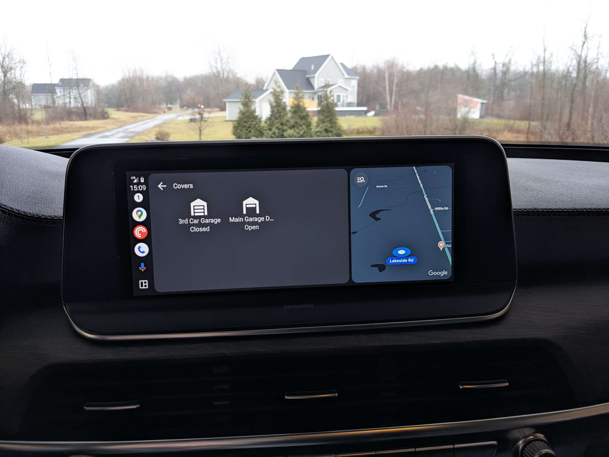
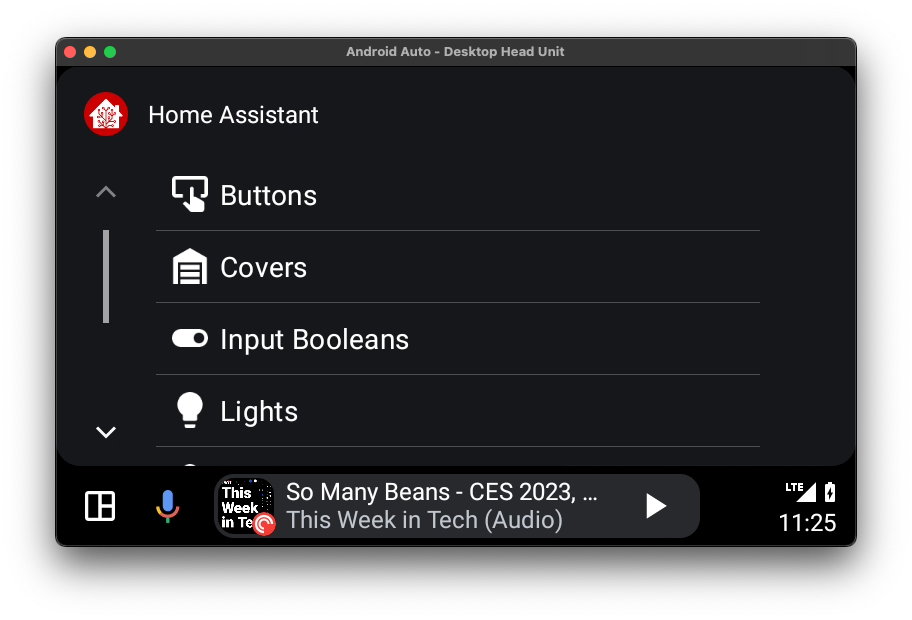
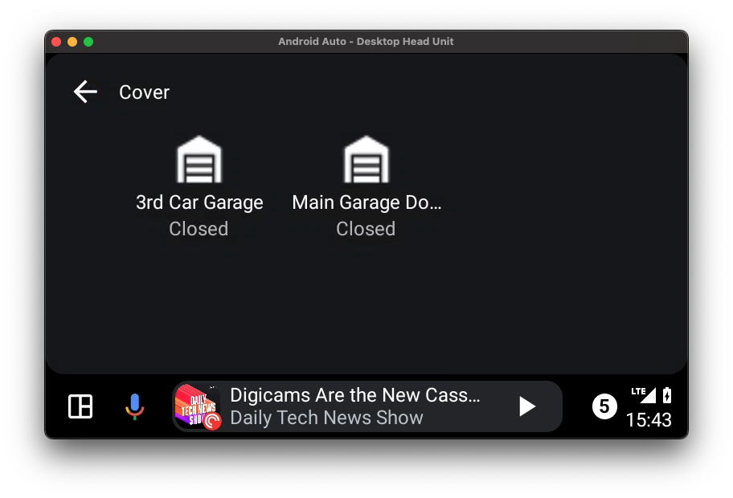
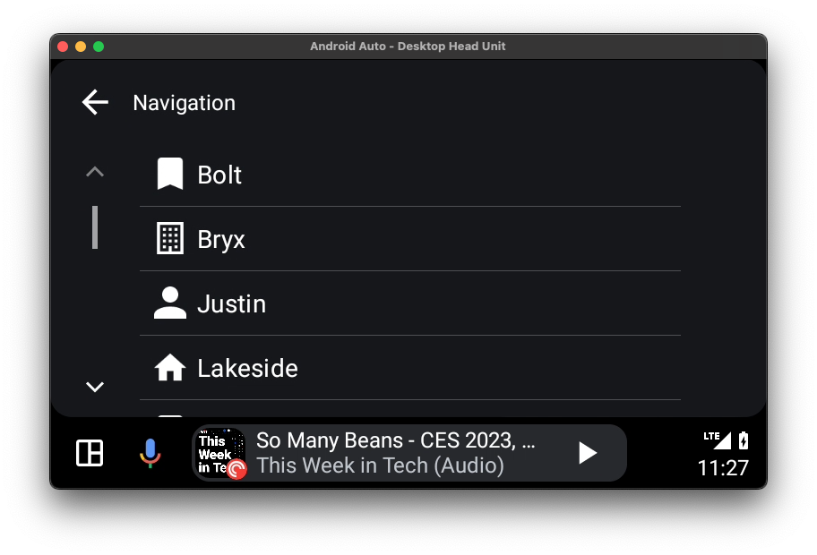
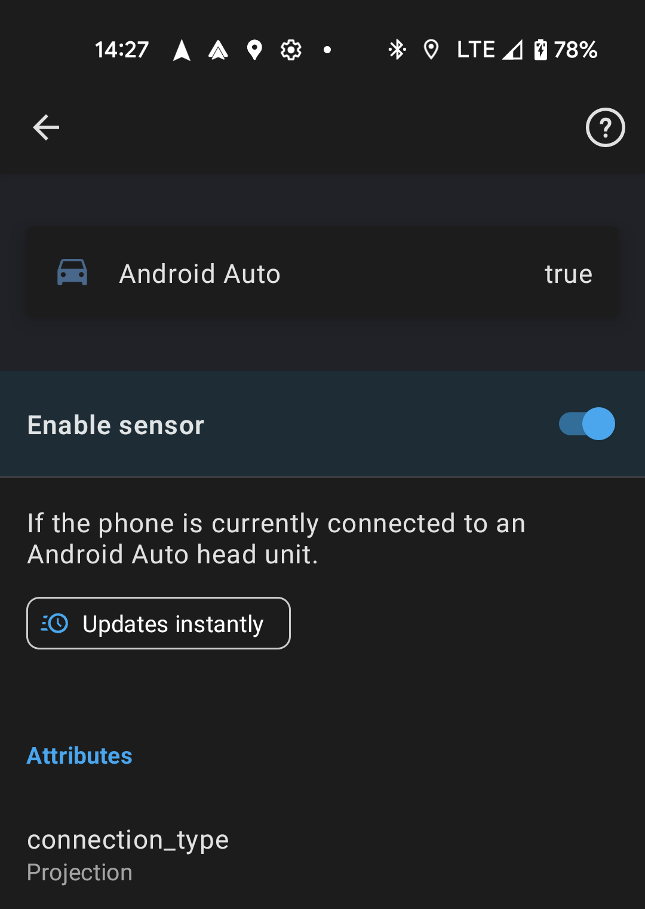

> **Cet article est une traduction de [Home Assistant coming for your car!](https://www.home-assistant.io/blog/2023/01/20/android-auto/) publié sur le site de Home Assistant.**

Aujourd'hui, nous vous annonçons que le développement d'[Android Auto](https://www.android.com/auto) a commencé. En décembre, Google a publié une [mise à jour](https://developer.android.com/docs/quality-guidelines/car-app-quality?category=iot#dec-22) d'Android Auto et accepte enfin les applications IoT dans le Play Store. Comme vous l'avez deviné, l'équipe a voulu ajouter des fonctionnalités immédiatement. Découvrez les nouvelles fonctionnalités que l'équipe a déjà commencé à ajouter !\
\
Ces fonctionnalités sont actuellement disponibles dans notre [canal bêta](https://play.google.com/apps/testing/io.homeassistant.companion.android) et seront mises à disposition dans le canal stable dans les deux prochaines semaines.



Une fois que vous aurez lancé l'application, vous aurez un accès facile à des dispositifs tels que votre porte de garage, vos lumières, vos serrures et même vos scènes.

En tapant sur une catégorie, vous pouvez voir ses entités et leur état (avec des mises à jour instantanées !). Des commandes tactiles simples permettent également d'ouvrir la porte du garage avant de sortir.

En plus de sélectionner un domaine, vous pouvez également naviguer vers tout ce qui a un emplacement dans Home Assistant, comme les personnes, les appareils ou les capteurs.

Nous avons également ajouté un nouveau capteur binaire qui vous permet d'automatiser lorsque vous êtes dans la voiture et que vous êtes connecté. Il existe également un attribut supplémentaire pour le type de connexion.

Un grand merci à [Jbassett](https://github.com/JBassett) et [jpelgrom](https://github.com/jpelgrom) pour leurs contributions à la nouvelle application Android Auto. Nous attendons avec impatience les améliorations continues de cette nouvelle expérience.