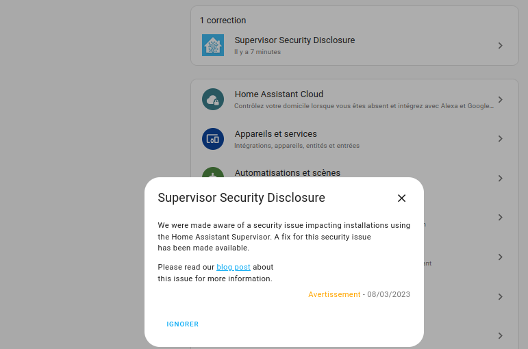

Nous avons été informés d'un problème de sécurité qui a un impact sur les installations utilisant le superviseur. Un correctif pour cette question de sécurité a été lancé. 

**À tous les utilisateurs** de Home Assistant concernés, effectué la mise à jour par l'intermédiaire du système de mise à jour automatique du Superviseur.

Vous pouvez vérifier que vous avez reçu la mise à jour sur la [page Assistant de maison](https://my.home-assistant.io/redirect/info) et vérifier que vous exécutez au moins la version 2023.03.1 du Superviseur.

## Version affectée

La question de la sécurité a affecté les types d'installation Home Assistant supervisé. Il s'agit notamment d'installations fonctionnant sur le Home Assistant Blue et Home Assistant Yellow.

Les deux autres types d'installation, Home Assistant Container (Docker) et Les services d'assistant d'accueil (domaine Python-Usine) n'ont pas été touchés.

## Crédits

La question de la sécurité a été constatée par [Joseph Surin](https://www.linkedin.com/in/joseph-surin/) à partir [d'elttam](https://www.elttam.com/). Merci beaucoup d'avoir porté cette question à notre attention.

## À propos de la faille

Le Superviseur est une application qui fait partie intégrante de Home Assistant OS et Supervised. Le superviseur est responsable de la gestion du système. Le problème permet à un attaquant de contourner à distance l'authentification et l'interaction directe avec l'API du Superviseur. Cela donne l'accès aux mises à jour et à la gestion des add-ons et des sauvegardes. Notre analyse montre que cette faille est dans Home Assistant depuis l'introduction du Superviseur en 2017.

Nous avons publié [l'avis de sécurité CVE-2023-27482 sur GitHub](https://github.com/home-assistant/core/security/advisories/GHSA-2j8f-h4mr-qr25).

## FAQ

- - -

### Cette vulnérabilité a-t-elle été utilisée à mauvais escient ?

Nous ne savons pas. Nous n'avons entendu aucune information faisant état de personnes piratées.

### Y a-t-il une solution de contournement ?

Dans le cas où l'on n'est pas en mesure de mettre à jour le superviseur, il est demandé de ne pas exposer votre instance Home Assistant sur Internet.