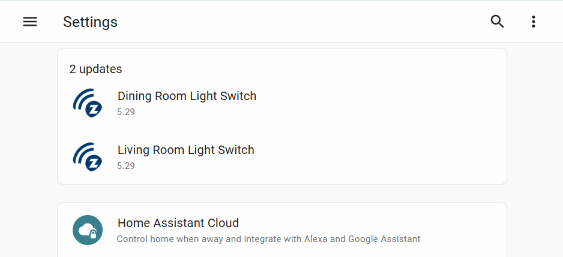
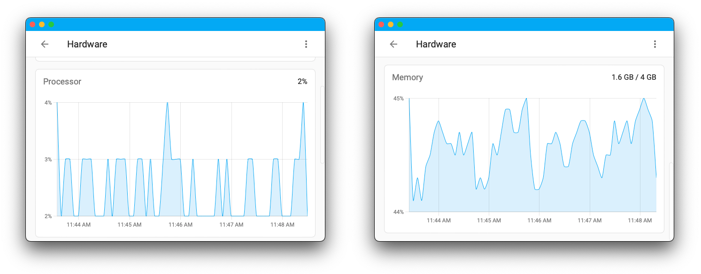

> Traduction du [sujet officiel](https://www.home-assistant.io/blog/2022/09/07/release-20229/) 

Home Assistant Core 2022.9 ! 🎂

Si vous ne le savez pas encore, ce mois-ci, c'est l'anniversaire de Home Assistant ! 🎉🎉 Le 17 septembre 2013, [Paulus Schoutsen](https://twitter.com/balloob) a effectué le premier commit pour Home Assistant qui a déclenché une boule de neige de passionnés de domotique désireux de contribuer au projet open-source. 

9 ans plus tard, Home Assistant est activement utilisé par plus de 500 000 personnes et croît chaque jour. 
Nabu Casa a également 4 ans ce mois-ci. 4 ans d'existence et une nouvelle employée à plein temps 🍄. Ce mois-ci, il semble que tout le monde était dans l'esprit de l'anniversaire, car nous avons une version bien remplie !

Le moteur d'automatisation est une grande raison pour laquelle Home Assistant a tant d'utilisateurs. Donc, dans l'esprit de [rationaliser les expériences](https://www.home-assistant.io/blog/2022/01/19/streamlining-experiences/), nous avons pensé qu'une refonte était nécessaire. Vous remarquerez d'importantes améliorations de l'aspect et de la convivialité de l'éditeur d'automatismes qui, selon nous, amélioreront grandement son utilisation. Je sais que je vois une énorme différence !

Je sais que tout le monde s'attend à ce que ce soit [@frenck](https://github.com/frenck) qui rédige ces notes de mise à jour, mais il a pris des vacances bien méritées ! Et maintenant, vous êtes coincés avec moi. Zack 😀. J'espère que vous apprécierez cette version et tout ce qu'elle contient !

* Zack

N'oubliez pas de rejoindre notre fête de lancement [en direct sur YouTube aujourd'hui à 12:00 PDT / 21:00 CET !](https://www.youtube.com/watch?v=UTltO1-d56s)

## Paul Bottein rejoint Nabu Casa. @piitaya

Nous sommes heureux d'annoncer le nouveau membre de l'équipe Nabu Casa, Paul Bottein.

Paul est surtout connu pour ses cartes Mushroom et quelques ajouts au frontend de Home Assistant comme l'Icon Picker. Paul est un développeur incroyable et son expertise dans la conception de tableaux de bord apportera beaucoup au frontend de Home Assistant.

Bienvenue à bord et nous sommes impatients de voir ce que Paul va apporter à Home Assistant !

## Rationalisation des automatismes

Nous avons estimé qu'il y avait un certain nombre d'améliorations à apporter afin de mieux rationaliser la création d'automatismes. C'est pourquoi, dans cette version, nous nous sommes penchés sur certains des principaux problèmes d'expérience utilisateur. 
Les améliorations apportées au nouvel éditeur d'automatisation sont axées sur la lisibilité et la facilité d'utilisation. L'édition des automatismes sur votre téléphone sera également beaucoup plus facile !

Tout d'abord, vous remarquerez le changement le plus important : des cartes pliantes pour les déclencheurs, les conditions et les actions. Ce changement vous permet de vous concentrer sur ce que vous êtes en train de faire au lieu d'avoir tout ouvert en même temps. 
Lorsque vous ouvrez votre automatisation pour la première fois dans l'éditeur, vous verrez toutes les cartes réduites avec une explication générée automatiquement de ce que fait cette section. Cela vous permet de choisir facilement la section que vous souhaitez modifier et de vous concentrer sur celle-ci.

Ensuite, quelques éléments et options ont été déplacés. Vous pouvez voir la plupart d'entre eux dans le menu de débordement en haut à droite. 
Par exemple, si vous souhaitez renommer ou mettre à jour la description de votre automatisation, vous pouvez le faire via le menu de débordement &gt; Renommer. 
En déplaçant ces éléments vers le menu de débordement, vous vous assurez que la page principale de l'éditeur est utilisée pour les principales fonctions de votre automatisation.

Enfin, et ce n'est pas le moins important, Frenck a ajouté quelques fonctionnalités demandées depuis longtemps aux formulaires d'automatisation, \*\*l'Autocomplétion des valeurs d'état et d'attribut !\*\* Maintenant, si vous ajoutez un déclencheur d'état, vous pouvez choisir dans une liste d'états connus pour ce type de dispositif. Ces états sont également tous traduits dans votre langue. Désormais, il n'est plus nécessaire de se rappeler ou de trouver les états possibles ou de formater l'état à saisir. Choisissez simplement un état dans la liste déroulante et laissez vos soucis s'envoler !

\## Nouvelle aide : Programme hebdomadaire
Avez-vous déjà voulu exécuter une automatisation basée sur un calendrier à la même heure chaque semaine ou chaque jour ? Eh bien, c'est fait ! Grâce à l'ajout de l'assistant Planification, vous pouvez dorénavant créer facilement ces planifications afin de créer des automatisations et des horaires plus cohérents.

## Bluetooth partout

Dans la dernière version, nous avons présenté l'intégration Bluetooth. Cette version, elle est en feu 🔥 Non seulement nous prenons en charge plusieurs adaptateurs Bluetooth, mais nous prenons également en charge les appareils ESPHome qui agissent comme des [proxies Bluetooth](https://esphome.io/components/bluetooth_proxy.html) pour votre maison. 

**Attendez quoi ? !**

Oui 😎. Vous pouvez maintenant étendre considérablement la portée Bluetooth de Home Assistant en utilisant des appareils ESP32 ordinaires. Aucun matériel supplémentaire n'est nécessaire.

Pour obtenir un proxy opérationnel, rendez-vous sur le \[site Web de l'installateur de proxy Bluetooth](https://esphome.github.io/bluetooth-proxies/) et installez-en un directement depuis votre navigateur.

Les proxys Bluetooth sont actuellement limités à la transmission de données passives. Les connexions actives seront disponibles dans une prochaine version. Les intégrations Bluetooth dans Home Assistant utiliseront de manière transparente les proxys Bluetooth sans aucun codage supplémentaire !

La plupart des intégrations prennent maintenant en charge l'utilisation de l'adaptateur avec le meilleur signal pour connecter les appareils qui ont besoin d'une connexion active. Les câbles d'extension, les prolongateurs USB-Ethernet ou USB-IP couplés à un adaptateur Bluetooth supplémentaire peuvent étendre considérablement la portée de votre connexion active.

Et ce n'est pas tout ! Outre les neuf nouvelles marques prises en charge, une nouvelle norme ouverte est également prise en charge : [BTHome](https://bthome.io/) de [@Ernst79](https://github.com/Ernst79). Elle est automatiquement découverte par Home Assistant, les appareils peuvent fonctionner plus d'un an sur une seule batterie et elle prend en charge le cryptage des données.

Enfin, supposons que vous utilisez le système d'exploitation de Home Assistant. Dans ce cas, nous vous recommandons de passer à la version 9 ou à une version ultérieure dès sa sortie, car elle est dotée d'un courtier D-Bus plus rapide et d'un micrologiciel Bluetooth plus récent qui peut améliorer considérablement les performances Bluetooth.

Merci à [@bdraco](https://github.com/bdraco), [@Ernst79](https://github.com/Ernst79), [@JesseRockz](https://github.com/jesserockz), [@jc2k](https://github.com/jc2k) pour tout le travail difficile, incroyable et épique 🙏.

## Les mises à jour du firmware Z-Wave sont maintenant en ligne

Dans la version 2022.7, nous avons ajouté un support pour la mise à jour du firmware des appareils Z-Wave, mais le problème était que vous aviez besoin des fichiers du firmware du fabricant pour effectuer la mise à jour. \[@AlCalzone](https://github.com/alcalzone) n'était pas satisfait de cette approche et a commencé à travailler sur une meilleure solution. Cette meilleure solution est arrivée avec l'introduction du service de mise à jour du micrologiciel de Z-Wave JS ! Pour les fabricants pris en charge, Z-Wave JS peut maintenant détecter, télécharger et installer automatiquement une mise à jour du micrologiciel si elle est disponible pour votre appareil. Cela se fera de la même manière que la mise à jour actuelle de Home Assistant. Vous verrez une notification dans votre menu de paramètres et vous pouvez mettre à jour directement à partir de là. Merci \[@raman325](https://github.com/raman325)

Pour l'instant, seuls les produits Jasco sont pris en charge. Nabu Casa a discuté avec d'autres fabricants pour que davantage d'appareils soient pris en charge. 
Pour que nos utilisateurs puissent profiter de cette fonctionnalité, nous avons ajouté des entités de mise à jour pour vos appareils qui vérifieront une fois par jour les nouvelles mises à jour du firmware. 
Génial !

## Sauvegarde et restauration de Zigbee + migration

L'intégration de la domotique Zigbee (ZHA) prend désormais en charge les sauvegardes du réseau et la migration entre les coordinateurs Zigbee. 
Les sauvegardes sont effectuées automatiquement mais peuvent aussi être créées manuellement à partir de la page de configuration. 
Après avoir restauré une sauvegarde de Home Assistant, vous pouvez reconfigurer ZHA et migrer vers un nouveau coordinateur Zigbee sans perdre vos paramètres ou les appareils qui étaient connectés. Cela peut s'avérer utile si votre radio actuelle tombe en panne ou si une nouvelle radio vers laquelle vous souhaitez migrer est disponible.

## Utilisation du processeur et de la mémoire

La page Matériel vient de devenir beaucoup plus intéressante. 
Vous pouvez consulter des statistiques en direct sur l'utilisation de votre mémoire et de votre processeur lorsque vous chargez la page Matériel dans votre menu système. Ces statistiques représentent l'ensemble de votre instance de Home Assistant, ce qui vous donne un aperçu de la façon dont votre matériel gère vos tâches quotidiennes. 
Il n'y aura pas d'historique, mais 5 minutes de données en temps réel seront affichées lorsque vous chargerez la page.

## Autres changements notables.

Il y a beaucoup plus de jus dans cette version ; voici quelques-uns des autres changements notables de cette version :

* Le dialogue d'informations supplémentaires sur les entités a été fusionné avec les paramètres des entités. Merci @balloob
* Vous pouvez maintenant activer le contrôle local de votre dispositif Awair Element. Merci @zachberger
* MiFlora supporte maintenant l'interrogation du capteur de batterie. Merci @bdraco
* Les serrures August sont désormais prises en charge par l'intégration Bluetooth de Yale Access. Merci @bdraco
* Beaucoup plus d'adaptateurs Bluetooth sont maintenant supportés pour l'intégration Bluetooth. Merci @bdraco
* L'intégration SwitchBot prend désormais en charge les ampoules de couleur et les bandes lumineuses. Merci @bdraco
* Les tableaux Automations, Scripts et Scènes ont reçu un nouveau menu de débordement qui permettra d'effectuer plus d'actions directement à partir du sélecteur. Merci @bramkragten et @piitaya
* Vous pouvez désormais réorganiser les éléments d'automatisation par glisser-déposer. Merci @piitaya
* Des icônes ont été ajoutées à davantage de menus dans l'interface utilisateur. Merci @frenck
* Les déclencheurs d'automatisation peuvent maintenant être aliasés. Merci @frenck

### Nouvelles intégrations

Nous accueillons les nouvelles intégrations suivantes dans cette version :

* BlueMaestro, ajouté par @bdraco
* BThome, ajouté par @Ernst79
* Ecowitt, ajouté par @pvizeli
* Escea, ajoutée par @lazdavila
* Téléchargement de fichiers, ajouté par @balloob
* Fully Kiosk Browser, ajouté par @cgarwood
* JustNimbus, ajouté par @kvanzuijlen
* LED BLE, ajouté par @bdraco
* Melnor Bluetooth, ajouté par @vanstinator
* PrusaLink, ajouté par @balloob
* Qingping, ajouté par @bdraco
* Schedule, ajouté par @frenck
* SensorPro, ajouté par @bdraco
* ThermoBeacon, ajouté par @bdraco
* ThermoPro, ajouté par @bdraco
* Yale Access Bluetooth, ajouté par @bdraco

### Intégrations maintenant disponibles pour être configurées à partir de l'interface utilisateur

Les intégrations suivantes sont maintenant disponibles via l'interface utilisateur de Home Assistant :

* Android IP Webcam, ajouté par @engrbm87
* LaMetric, réalisé par @frenck
* Open Exchange Rates, réalisé par @MartinHjelmare
* Pushover, réalisé par @engrbm87
* Volvo On Call, réalisé par @y34hbuddy

### Intégrations maintenant disponibles pour être configurées à partir de l'interface utilisateur

Les intégrations suivantes sont maintenant disponibles via l'interface utilisateur de Home Assistant :

* Android IP Webcam, ajouté par @engrbm87
* LaMetric, réalisé par @frenck
* Open Exchange Rates, réalisé par @MartinHjelmare
* Pushover, réalisé par @engrbm87
* Volvo On Call, réalisé par @y34hbuddy

## Version 2022.9.1 - Septembre 8

* Montre la progression pour l'entité zwave_js.update (@raman325 - #77905) (zwave_js docs)
* Correction de la typo de la méthode len pour la lumière Osram (@Vaskivskyi - #78008) (osramlightify docs)
* Ajout d'une valeur ID aux diagnostics des périphériques zwave_js (@raman325 - #78015) (zwave_js docs)
* Fixe le matériel émulé par défaut de zwave_js dans le flux d'options (@MartinHjelmare - #78024) (zwave_js docs)
* Extraction du dispositif lametric du coordinateur dans notify (@ludeeus - #78027) (lametric docs)
* Passage de velbus-aio à 2022.9.1 (@Cereal2nd - #78039) (documentation velbus)
* Correction de la ré-interview du périphérique zwave_js (@MartinHjelmare - #78046) (docs zwave_js)
* Passage de bluetooth-adapters à 0.3.5 (@bdraco - #78052) (docs bluetooth)
* Passage de bluetooth-auto-recovery à 0.3.2 (@bdraco - #78063) (docs bluetooth)
* Correction d'un bug avec les contrôleurs RainMachine de 1ère génération et les appels API inconnus (@bachya - #78070) (docs rainmachine)
* Passage de pylitterbot à 2022.9.1 (@natekspencer - #78071) (docs litterrobot)
* Permet au flux de configuration OpenWeatherMap de tester en utilisant l'ancienne API de passer (@jbouwh - #78074) (docs openweathermap)
* Correction des capteurs distants Ecobee qui ne se mettent pas à jour (@rlippmann - #78035) (ecobee docs)

## Version 2022.9.2 - Septembre 11

* Correction du rechargement des entrées de configuration MQTT (@jbouwh - #76089) (docs mqtt)
* Effacement du sujet de découverte MQTT lorsqu'une entité désactivée est supprimée (@jbouwh - #77757) (mqtt docs)
* Amélioration des messages d'avertissement sur les modes reçus invalides (@jbouwh - #77909) (mqtt docs)
* Gère les marques supportées manquantes (@balloob - #78090) (websocket_api docs)
* Correction de l'écriture trop fréquente de l'état de switchbot (@bdraco - #78094) (docs switchbot)
* Fixe la lumière LIFX qui s'allume en s'éteignant (@amelchio - #78095) (lifx docs)
* Correction de l'entité zwave_js update (@raman325 - #78116) (zwave_js docs)
* Amélioration des contrôles de collision unique_id dans entity_platform (@emontnemery - #78132)
* Autorise les nombres non entiers dans le flux de configuration des capteurs de seuil (@emontnemery - #78137) (threshold docs)
* Passage de bluetooth-adapters à 0.3.6 (@bdraco - #78138) (docs bluetooth)
* Ajout des chaînes manquantes pour les erreurs dans le flux de configuration amberelectric (@Vaskivskyi - #78140) (docs amberelectric)
* Passage de aioecowitt à 2022.09.1 (@pvizeli - #78142) (ecowitt docs)
* Ajout du capteur d'humidité manquant à xiaomi_ble (@Jc2k - #78160) (xiaomi_ble docs)
* Passage de pySwitchbot à 0.19.1 (@bdraco - #78168) (docs switchbot)
* Passage de aiohomekit à 1.5.3 (@bdraco - #78170) (docs homekit_controller)
* Correction de la saisie de ecowitt (@balloob - #78171) (ecowitt docs)
* Correction de l'envoi de notification à plusieurs cibles dans Pushover (@engrbm87 - #78111) (pushover docs)
* Ajout de dépendances à ecowitt (@pvizeli - #78187) (ecowitt docs)
* Passage de led-ble à 0.8.3 (@bdraco - #78188) (led_ble docs)
* Correction de switchbot qui ne s'installe pas lorsqu'il est déjà connecté au démarrage (@bdraco - #78198) (switchbot docs)
* Correction de Yale Access Bluetooth qui ne s'installe pas lorsqu'il est déjà connecté au démarrage (@bdraco - #78199) (yalexs_ble docs)
* Amélioration des dépendances de ZHA (@puddly - #78201) (zha docs)
* Fermeture des connexions switchbot périmées au moment de l'installation (@bdraco - #78202) (docs switchbot)
* Passage de aiohomekit en 1.5.4 pour gérer les connexions stales de ble au démarrage (@bdraco - #78203) (homekit_controller docs)
* Intégration Landis+Gyr : augmentation du délai d'attente et ajout de la journalisation de débogage (@vpathuis - #78025) (docs landisgyr_heat_meter)
* Passage de Bluetooth-adapters à 0.4.1 (@bdraco - #78205) (docs bluetooth)
* Passage de regenmaschine à 2022.09.1 (@bachya - #78210) (docs rainmachine)
* Passage de led_ble à 0.8.5 (@bdraco - #78215) (docs led_ble)
* Passage de pysensibo à 1.0.20 (@gjohansson-ST - #78222) (docs sensibo)
* Passage de PySwitchbot à 0.19.5 (@bdraco - #78224) (docs switchbot)
* Passage de yalexs-ble à 1.8.1 (@bdraco - #78225) (docs yalexs_ble)
* Passage de led-ble à 0.9.1 (@bdraco - #78226) (led_ble docs)
* Passage de aiohomekit à 1.5.6 (@bdraco - #78228) (homekit_controller docs)

## Release 2022.9.3 - 13 Septembre

* Amélioration de la configuration du service pour le rendre plus robuste lors de l'exécution de plusieurs instances de deCONZ (@Kane610 - #77621) (docs deconz)
* Passage de blinkpy à 0.19.2 (@Vaskivskyi - #78097) (docs blink)
* Passage de PyViCare à 2.17.0 (@TheJulianJES - #78232) (docs vicare)
* Correction d'une dépendance manquante pour dbus_next (@d-walsh - #78235) (docs bluetooth)
* Passage de bluetooth-auto-recovery à 0.3.3 (@bdraco - #78245) (docs bluetooth)
* Passage de aiodiscover à 1.4.13 (@bdraco - #78253) (documentation dhcp)
* Passage de pySwitchbot à 0.19.6 (@bdraco - #78304) (docs switchbot)
* Rendre le sélecteur yalexs_ble plus spécifique (@bdraco - #78307) (yalexs_ble docs)
* Correction des ampoules sengled dans ZHA (@dmulcahey - #78315) (zha docs)
* Correction du calcul du coût du gaz pour le gaz mesuré en ft3 (@emontnemery - #78327) (energy docs)
* Passage de bleak à 0.17.0 (@bdraco - #78333) (docs bluetooth)
* Suppression de l'initial lors du chargement de input_number depuis le stockage (@emontnemery - #78354) (docs input_number)
* Ne permet pas la mise à jour partielle des paramètres de input_number (@emontnemery - #78356) (docs input_number)
* Passage de PySwitchbot à 0.19.8 (@bdraco - #78361) (docs switchbot)
* Passage de yalexs-ble à 1.9.0 (@bdraco - #78362) (docs yalexs_ble)
* Passage de xiaomi-ble à 0.9.3 (@bdraco - #78301) (xiaomi_ble docs)
* Passage de xiaomi-ble à 0.10.0 (@bdraco - #78365) (xiaomi_ble docs)
* Passage de led-ble à 0.10.0 (@bdraco - #78367) (led_ble docs)
* Passage de aiohomekit à 1.5.7 (@bdraco - #78369) (homekit_controller docs)
* Ne pas autoriser la mise à jour partielle des paramètres du compteur (@emontnemery - #78371) (documentation du compteur)
* Ne pas autoriser la mise à jour partielle des paramètres input_boolean (@emontnemery - #78372) (docs input_boolean)
* Ne pas autoriser la mise à jour partielle des paramètres input_datetime (@emontnemery - #78373) (docs input_datetime)
* Ne pas autoriser la mise à jour partielle des paramètres de l'input_button (@emontnemery - #78374) (docs input_button)
* Ne pas autoriser la mise à jour partielle des paramètres de l'input_select (@emontnemery - #78376) (docs input_select)
* Ne pas autoriser la mise à jour partielle des paramètres input_text (@emontnemery - #78377) (docs input_text)
* Ne pas autoriser la mise à jour partielle des paramètres du timer (@emontnemery - #78378) (timer docs)
* Désenregistrement du webhook EcoWitt lors du déchargement (@pvizeli - #78388) (ecowitt docs)
* Fixe le test du journal du système (@bdraco - #78391) (system_log docs)
* Correction de la mise en cache du workflow CI (@cdce8p - #78398)
* Mise à jour du frontend vers 20220907.1 (@bramkragten - #78404) (docs frontend)
* Passage de govee-ble à 0.17.3 (@bdraco - #78405) (docs govee_ble)

## Version 2022.9.4 - Septembre 14

* Mise à jour de frontend vers 20220907.2 (@bramkragten - #78431) (docs frontend)

## Breaking Changes

Vous trouverez ci-dessous une liste des changements de dernière minute pour cette version, par sujet ou par intégration. Cliquez sur l'un d'entre eux pour en savoir plus sur le changement de rupture pour cet élément spécifique.

*[Plus de details sur le sujet officiel](https://www.home-assistant.io/blog/2022/09/07/release-20229/#breaking-changes)*

* BMW Connected Drive
* HomeKit
* International Space Station (ISS)
* Litter-Robot
* MQTT
* Open Exchange Rates
* Roku
* SMS notifications via GSM-modem
* Utility Meter
* Z-Wave
